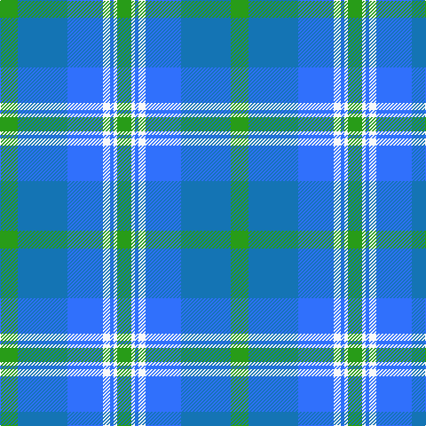

In pattern [GBBWBWG](/patterns/gbbwbwg/).

This was sourced from tartans-authority.  It is a [7 stripes tartan](/stripes/stripes7/).

Original link http://www.tartansauthority.com/tartan-ferret/display/4777/

## Thread count
G/20 Ba56 B40 W8 B4 W4 G/16

## Palette
Each colour and its ΔE from the base-6 reference it is a variant of.

| Colour | Shade | Base | ΔE (OKLab) |
|---|---|---|---|
| B | <code style="background-color:#3070FC;">#3070FC</code> `#3070FC` | B <code style="background-color:#2C4084;">#2C4084</code> | 0.22 |
| Ba | <code style="background-color:#1474B4;">#1474B4</code> `#1474B4` | B <code style="background-color:#2C4084;">#2C4084</code> | 0.15 |
| G | <code style="background-color:#289C18;">#289C18</code> `#289C18` | G <code style="background-color:#006400;">#006400</code> | 0.18 |
| W | <code style="background-color:#F8F8F8;">#F8F8F8</code> `#F8F8F8` | W <code style="background-color:#F4F4F0;">#F4F4F0</code> | 0.01 |

# Sample pattern

## Nearest tartans

The nearest existing variants by ΔTartan distance.

1. [Afternoon Tea / Mint Tea](/setts/s6/w15y98b72ba25b8ya15-b003c64-ba1474b4-wffffff-y48a4c0-yaf8e38c/) — ΔT 1.42
1. [Newall (Personal)](/setts/s7/b60ba30w8g24w18b16w6-b1474b4-ba003c64-g285800-we8ccb8/) — ΔT 1.48
1. [Afternoon Tea / Earl Grey](/setts/s6/r15b98ba72y25ba8w15-b3682af-ba003c64-re87878-wf0e0c8-yc4bc68/) — ΔT 1.59
1. [Highlands Country Club](/setts/s7/g20b60ba44w8ba4w4ga16-b304080-ba5480b0-g008000-ga003000-we0e0e0/) — ΔT 1.59
1. [Rhode Island, State of](/setts/s7/b8ba56b22w4b4g28y4-b14283c-ba1474b4-g408060-we0e0e0-ye8c000/) — ΔT 1.63
1. [MacThomas](/setts/s7/b10r6b64k32g64ra6g10-b1474b4-g1b835d-k101010-rcb15ab-rabb62ce/) — ΔT 1.68
1. [Halesowen (District)](/setts/s8/w18b6y6b48ba48y4ba4y4-b1474b4-ba2c2c80-we0e0e0-ye8c000/) — ΔT 1.71
1. [Gorman Blue (Personal)](/setts/s8/w8b2y4b44ba40w4ba8w4-b5c8ca8-ba3850c8-we0e0e0-ybc8c00/) — ΔT 1.71
1. [Highlands Country Club Corporate Tartan Tartan Number: 687. Earliest known date: 1984 Weft uses a dark green. See products available Copyright © Blair Urquhart, Comrie, 2015](/setts/s7/g20b60ba44w8ba4w4ga16-b2c2c80-ba5c8ca8-g006818-ga003820-we0e0e0/) — ΔT 1.72
1. [Ben Lomond (Fashion)](/setts/s8/k8b8k8b60g60k8g8w8-b2888c4-g408060-k101010-we0e0e0/) — ΔT 1.72

## Neighbour map

Every grey dot is one of 15726 variants placed by the first two principal components of the ΔTartan feature space (44% of its variance). Red is this tartan; blue dots are its nearest — click one to open its page.

<svg viewBox="0 0 640 380" role="img" style="max-width:100%;height:auto;border:1px solid #e0e0e0;border-radius:4px;display:block" xmlns="http://www.w3.org/2000/svg"><image href="/nn/cloud.v1.png" width="640" height="380"/><a href="/setts/s6/w15y98b72ba25b8ya15-b003c64-ba1474b4-wffffff-y48a4c0-yaf8e38c/"><circle cx="188.8" cy="179.3" r="4" fill="#3465a4"><title>Afternoon Tea / Mint Tea</title></circle></a><a href="/setts/s7/b60ba30w8g24w18b16w6-b1474b4-ba003c64-g285800-we8ccb8/"><circle cx="212.4" cy="212.7" r="4" fill="#3465a4"><title>Newall (Personal)</title></circle></a><a href="/setts/s6/r15b98ba72y25ba8w15-b3682af-ba003c64-re87878-wf0e0c8-yc4bc68/"><circle cx="204.3" cy="183.4" r="4" fill="#3465a4"><title>Afternoon Tea / Earl Grey</title></circle></a><a href="/setts/s7/g20b60ba44w8ba4w4ga16-b304080-ba5480b0-g008000-ga003000-we0e0e0/"><circle cx="193.7" cy="173.9" r="4" fill="#3465a4"><title>Highlands Country Club</title></circle></a><a href="/setts/s7/b8ba56b22w4b4g28y4-b14283c-ba1474b4-g408060-we0e0e0-ye8c000/"><circle cx="241.5" cy="176.4" r="4" fill="#3465a4"><title>Rhode Island, State of</title></circle></a><a href="/setts/s7/b10r6b64k32g64ra6g10-b1474b4-g1b835d-k101010-rcb15ab-rabb62ce/"><circle cx="207.3" cy="193.9" r="4" fill="#3465a4"><title>MacThomas</title></circle></a><a href="/setts/s8/w18b6y6b48ba48y4ba4y4-b1474b4-ba2c2c80-we0e0e0-ye8c000/"><circle cx="206.5" cy="166.9" r="4" fill="#3465a4"><title>Halesowen (District)</title></circle></a><a href="/setts/s8/w8b2y4b44ba40w4ba8w4-b5c8ca8-ba3850c8-we0e0e0-ybc8c00/"><circle cx="293.2" cy="156.4" r="4" fill="#3465a4"><title>Gorman Blue (Personal)</title></circle></a><a href="/setts/s7/g20b60ba44w8ba4w4ga16-b2c2c80-ba5c8ca8-g006818-ga003820-we0e0e0/"><circle cx="186.6" cy="170.4" r="4" fill="#3465a4"><title>Highlands Country Club Corporate Tartan Tartan Number: 687. Earliest known date: 1984 Weft uses a dark green. See products available Copyright © Blair Urquhart, Comrie, 2015</title></circle></a><a href="/setts/s8/k8b8k8b60g60k8g8w8-b2888c4-g408060-k101010-we0e0e0/"><circle cx="228.8" cy="199.8" r="4" fill="#3465a4"><title>Ben Lomond (Fashion)</title></circle></a><circle cx="206.5" cy="194.9" r="5" fill="#c00000"/></svg>

ID: /setts/s7/g20b56ba40w8ba4w4g16-b1474b4-ba3070fc-g289c18-wf8f8f8/
