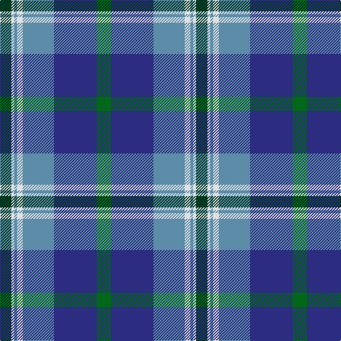

In pattern [GBBWBWG](/patterns/gbbwbwg/).

This was sourced from house-of-tartan.  It is a [7 stripes tartan](/stripes/stripes7/).

Original link http://www.house-of-tartan.scotland.net/house/TartanViewjs.asp?colr=Def&tnam=687

## Thread count
DG/16 LN4 B4 LN8 B44 DB60 G/20

## Palette
Each colour and its ΔE from the base-6 reference it is a variant of.

| Colour | Shade | Base | ΔE (OKLab) |
|---|---|---|---|
| B | <code style="background-color:#5C8CA8;">#5C8CA8</code> `#5C8CA8` | B <code style="background-color:#2C4084;">#2C4084</code> | 0.23 |
| DB | <code style="background-color:#2C2C80;">#2C2C80</code> `#2C2C80` | B <code style="background-color:#2C4084;">#2C4084</code> | 0.05 |
| DG | <code style="background-color:#003820;">#003820</code> `#003820` | G <code style="background-color:#006400;">#006400</code> | 0.16 |
| G | <code style="background-color:#006818;">#006818</code> `#006818` | G <code style="background-color:#006400;">#006400</code> | 0.02 |
| LN | <code style="background-color:#E0E0E0;">#E0E0E0</code> `#E0E0E0` | W <code style="background-color:#F4F4F0;">#F4F4F0</code> | 0.06 |

# Sample pattern

## Nearest tartans

The nearest existing variants by ΔTartan distance.

1. [Highlands Country Club](/setts/s7/g20b60ba44w8ba4w4ga16-b304080-ba5480b0-g008000-ga003000-we0e0e0/) — ΔT 0.39
1. [Icelandair](/setts/s7/b6ba48k22b40w4b10y6-b2c4084-ba2888c4-k101010-wffffff-yd87c00/) — ΔT 0.83
1. [MacCord / McCord (Personal)](/setts/s7/g12r4b2r6b32ga40w4-b202060-g285800-ga048888-rc80000-we0e0e0/) — ΔT 0.87
1. [Banff and Buchan District Tartan Tartan Number: 2150. Earliest known date: 1992 This tartan has been designed for the District of Banff and Buchan. It is based on the sett of the Ogilvy Tartan which originates from this district. The colours are taken from the surrounding landscape - the blues of the mountains and the sea, also of the sky, with touches of white. The yellow is reminiscent of the cornfields. (J.Roberts) The tartan is produced by Macnaughtons of Pitlochry. See products available Copyright © Blair Urquhart, Comrie, 2015](/setts/s8/b52w4b6ba30bb52ba4bb6y8-b202060-ba2c2c80-bb5c8ca8-we0e0e0-ye8c000/) — ΔT 0.88
1. [Afternoon Tea / Earl Grey](/setts/s6/r15b98ba72y25ba8w15-b3682af-ba003c64-re87878-wf0e0c8-yc4bc68/) — ΔT 0.88
1. [Rhode Island, State of](/setts/s7/b8ba56b22w4b4g28y4-b14283c-ba1474b4-g408060-we0e0e0-ye8c000/) — ΔT 1.00
1. [Soroptimist International (Corporate](/setts/s6/w4k2r20k12b24y4-b1870a4-k101010-r9c68a4-we0e0e0-ybc8c00/) — ΔT 1.06
1. [F.I.A.T.A. Congress of 1990](/setts/s7/g48b32ba16y8r4y4ba24-b3474fc-ba000064-g004c00-r8c0000-yc89800/) — ΔT 1.07
1. [MacThomas](/setts/s7/b10r6b64k32g64ra6g10-b1474b4-g1b835d-k101010-rcb15ab-rabb62ce/) — ΔT 1.08
1. [Loch Ness (Fashion)](/setts/s7/r4b4r4b42y22k34w4-b5c8ca8-k00002c-rc80000-w98c8e8-y48a4c0/) — ΔT 1.08

## Neighbour map

Every grey dot is one of 15726 variants placed by the first two principal components of the ΔTartan feature space (44% of its variance). Red is this tartan; blue dots are its nearest — click one to open its page.

<svg viewBox="0 0 640 380" role="img" style="max-width:100%;height:auto;border:1px solid #e0e0e0;border-radius:4px;display:block" xmlns="http://www.w3.org/2000/svg"><image href="/nn/cloud.v1.png" width="640" height="380"/><a href="/setts/s7/g20b60ba44w8ba4w4ga16-b304080-ba5480b0-g008000-ga003000-we0e0e0/"><circle cx="193.7" cy="173.9" r="4" fill="#3465a4"><title>Highlands Country Club</title></circle></a><a href="/setts/s7/b6ba48k22b40w4b10y6-b2c4084-ba2888c4-k101010-wffffff-yd87c00/"><circle cx="202.1" cy="184.1" r="4" fill="#3465a4"><title>Icelandair</title></circle></a><a href="/setts/s7/g12r4b2r6b32ga40w4-b202060-g285800-ga048888-rc80000-we0e0e0/"><circle cx="221.6" cy="154.2" r="4" fill="#3465a4"><title>MacCord / McCord (Personal)</title></circle></a><a href="/setts/s8/b52w4b6ba30bb52ba4bb6y8-b202060-ba2c2c80-bb5c8ca8-we0e0e0-ye8c000/"><circle cx="190.8" cy="164.6" r="4" fill="#3465a4"><title>Banff and Buchan District Tartan Tartan Number: 2150. Earliest known date: 1992 This tartan has been designed for the District of Banff and Buchan. It is based on the sett of the Ogilvy Tartan which originates from this district. The colours are taken from the surrounding landscape - the blues of the mountains and the sea, also of the sky, with touches of white. The yellow is reminiscent of the cornfields. (J.Roberts) The tartan is produced by Macnaughtons of Pitlochry. See products available Copyright © Blair Urquhart, Comrie, 2015</title></circle></a><a href="/setts/s6/r15b98ba72y25ba8w15-b3682af-ba003c64-re87878-wf0e0c8-yc4bc68/"><circle cx="204.3" cy="183.4" r="4" fill="#3465a4"><title>Afternoon Tea / Earl Grey</title></circle></a><a href="/setts/s7/b8ba56b22w4b4g28y4-b14283c-ba1474b4-g408060-we0e0e0-ye8c000/"><circle cx="241.5" cy="176.4" r="4" fill="#3465a4"><title>Rhode Island, State of</title></circle></a><a href="/setts/s6/w4k2r20k12b24y4-b1870a4-k101010-r9c68a4-we0e0e0-ybc8c00/"><circle cx="160.4" cy="186.7" r="4" fill="#3465a4"><title>Soroptimist International (Corporate</title></circle></a><a href="/setts/s7/g48b32ba16y8r4y4ba24-b3474fc-ba000064-g004c00-r8c0000-yc89800/"><circle cx="143.6" cy="186.1" r="4" fill="#3465a4"><title>F.I.A.T.A. Congress of 1990</title></circle></a><a href="/setts/s7/b10r6b64k32g64ra6g10-b1474b4-g1b835d-k101010-rcb15ab-rabb62ce/"><circle cx="207.3" cy="193.9" r="4" fill="#3465a4"><title>MacThomas</title></circle></a><a href="/setts/s7/r4b4r4b42y22k34w4-b5c8ca8-k00002c-rc80000-w98c8e8-y48a4c0/"><circle cx="165.0" cy="169.1" r="4" fill="#3465a4"><title>Loch Ness (Fashion)</title></circle></a><circle cx="186.6" cy="170.4" r="5" fill="#c00000"/></svg>

ID: /setts/s7/g20b60ba44w8ba4w4ga16-b2c2c80-ba5c8ca8-g006818-ga003820-we0e0e0/
