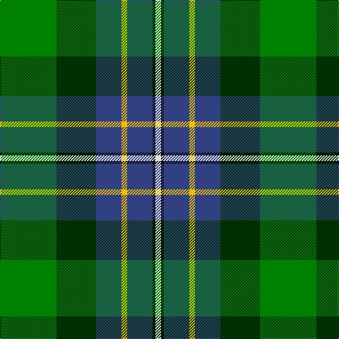

This page is one **sett** — a single exact thread-count. It belongs to the [tartan](/tartans/g20dg14b9y2b9k1ln2/)
(the same proportion at any scale), whose colour order is pattern [GGBYBKW](/stripes/ggbybkw/).

Sourced from weddslist.  It is a [7 stripe tartan](/stripes/stripes7/).

Original link http://www.weddslist.com/cgi-bin/tartans/pg.pl?source=sts

## Thread count
G/80 DG56 B36 Y8 B36 K4 LN/8

## Palette
Each colour and the base-6 reference it is a variant of.

| Colour | Shade | Base |
|---|---|---|
| B | <code style="background-color:#304080;">#304080</code> `oklch(39.4% 0.109 270.2)` <small>#304080</small> | B <code style="background-color:#2A418A;">#2A418A</code> |
| DG | <code style="background-color:#003000;">#003000</code> `oklch(26.8% 0.091 142.5)` <small>#003000</small> | G <code style="background-color:#006100;">#006100</code> |
| G | <code style="background-color:#008000;">#008000</code> `oklch(52.0% 0.177 142.5)` <small>#008000</small> | G <code style="background-color:#006100;">#006100</code> |
| K | <code style="background-color:#000000;">#000000</code> `oklch(0.0% 0.000 0.0)` <small>#000000</small> | K <code style="background-color:#000000;">#000000</code> |
| LN | <code style="background-color:#E0E0E0;">#E0E0E0</code> `oklch(90.7% 0.000 89.9)` <small>#E0E0E0</small> | W <code style="background-color:#F7F7F7;">#F7F7F7</code> |
| Y | <code style="background-color:#F0C000;">#F0C000</code> `oklch(82.7% 0.169 90.5)` <small>#F0C000</small> | Y <code style="background-color:#F2BF00;">#F2BF00</code> |

# Sample pattern

## Nearest tartans

The nearest existing variants by ΔTartan distance, with this tartan at the top so the swatches line up against it.

ΔTartan

Tartan

Sett

—

<a href="/ttd/edit/#slug=g20dg14db9ly2db9k1w2~x4">Hughes</a> <a class="nn-out" href="/setts/s7/g20dg14db9ly2db9k1w2~x4/" title="open its dictionary page">↗</a>

0.73

<a href="/ttd/edit/#slug=g36dg24b18ly4b18k2w5~x2">Hughes (Inverbervie) (Personal)</a> <a class="nn-out" href="/setts/s7/g36dg24b18ly4b18k2w5~x2/" title="open its dictionary page">↗</a>

1.00

<a href="/ttd/edit/#slug=w1r2b16k14g15k3ly1~x2">Macneil of Barra - Chief (Personal)</a> <a class="nn-out" href="/setts/s7/w1r2b16k14g15k3ly1~x2/" title="open its dictionary page">↗</a>

1.02

<a href="/ttd/edit/#slug=g3dp4g23k10r2k10t18k1w3~x2">Birch Family Tartan Tartan Number: 2157. Earliest known date: 1993 The Birch family tartan was designed and produced by Mr Robin Birch of Connell Reid kiltmaker, Blairgowrie. The new sett has been recorded by the Scottish Tartans Society. See products available Copyright © Blair Urquhart, Comrie, 2015</a> <a class="nn-out" href="/setts/s9/g3dp4g23k10r2k10t18k1w3~x2/" title="open its dictionary page">↗</a>

1.10

<a href="/ttd/edit/#slug=t34r3t8db4t8k24g34k2w6">Hogg Dress (Name)</a> <a class="nn-out" href="/setts/s9/t34r3t8db4t8k24g34k2w6/" title="open its dictionary page">↗</a>

1.11

<a href="/ttd/edit/#slug=r4lb1y6g25k8db15lb2~x2">Jones (Name)</a> <a class="nn-out" href="/setts/s7/r4lb1y6g25k8db15lb2~x2/" title="open its dictionary page">↗</a>

1.12

<a href="/ttd/edit/#slug=t6db17p4db2k11g33ly4~x2">East Lothian</a> <a class="nn-out" href="/setts/s7/t6db17p4db2k11g33ly4~x2/" title="open its dictionary page">↗</a>

1.18

<a href="/ttd/edit/#slug=db4db4dg16g16db4db4ly1~x4">Unidentified, Waistcoat</a> <a class="nn-out" href="/setts/s7/db4db4dg16g16db4db4ly1~x4/" title="open its dictionary page">↗</a>

1.19

<a href="/ttd/edit/#slug=g18g6dy3w1dy3w1t6db6~x2">Iroquois Falls Centenary (Commem.)</a> <a class="nn-out" href="/setts/s8/g18g6dy3w1dy3w1t6db6~x2/" title="open its dictionary page">↗</a>

1.23

<a href="/ttd/edit/#slug=r3k11g29k28g19ly2db1~x2">PMMC</a> <a class="nn-out" href="/setts/s7/r3k11g29k28g19ly2db1~x2/" title="open its dictionary page">↗</a>

1.24

<a href="/ttd/edit/#slug=r3k11dg29k28g19ly2b1~x2">PMMC</a> <a class="nn-out" href="/setts/s7/r3k11dg29k28g19ly2b1~x2/" title="open its dictionary page">↗</a>

## Neighbour map

Every grey dot is one of 14299 variants placed by the first two principal components of the ΔTartan feature space (44% of its variance). Red is this tartan; blue dots are its nearest — click one to open its page.

<svg viewBox="0 0 640 380" role="img" style="max-width:100%;height:auto;border:1px solid #e0e0e0;border-radius:4px;display:block" xmlns="http://www.w3.org/2000/svg"><image href="/nn/cloud.v1.png" width="640" height="380"/><a href="/setts/s7/g36dg24b18ly4b18k2w5~x2/"><circle cx="153.2" cy="169.6" r="4" fill="#3465a4"><title>Hughes (Inverbervie) (Personal)</title></circle></a><a href="/setts/s7/w1r2b16k14g15k3ly1~x2/"><circle cx="152.3" cy="155.8" r="4" fill="#3465a4"><title>Macneil of Barra - Chief (Personal)</title></circle></a><a href="/setts/s9/g3dp4g23k10r2k10t18k1w3~x2/"><circle cx="160.9" cy="128.5" r="4" fill="#3465a4"><title>Birch Family Tartan Tartan Number: 2157. Earliest known date: 1993 The Birch family tartan was designed and produced by Mr Robin Birch of Connell Reid kiltmaker, Blairgowrie. The new sett has been recorded by the Scottish Tartans Society. See products available Copyright © Blair Urquhart, Comrie, 2015</title></circle></a><a href="/setts/s9/t34r3t8db4t8k24g34k2w6/"><circle cx="181.6" cy="141.7" r="4" fill="#3465a4"><title>Hogg Dress (Name)</title></circle></a><a href="/setts/s7/r4lb1y6g25k8db15lb2~x2/"><circle cx="209.6" cy="147.1" r="4" fill="#3465a4"><title>Jones (Name)</title></circle></a><a href="/setts/s7/t6db17p4db2k11g33ly4~x2/"><circle cx="170.7" cy="144.5" r="4" fill="#3465a4"><title>East Lothian</title></circle></a><a href="/setts/s7/db4db4dg16g16db4db4ly1~x4/"><circle cx="175.8" cy="191.9" r="4" fill="#3465a4"><title>Unidentified, Waistcoat</title></circle></a><a href="/setts/s8/g18g6dy3w1dy3w1t6db6~x2/"><circle cx="189.3" cy="154.4" r="4" fill="#3465a4"><title>Iroquois Falls Centenary (Commem.)</title></circle></a><a href="/setts/s7/r3k11g29k28g19ly2db1~x2/"><circle cx="212.5" cy="141.8" r="4" fill="#3465a4"><title>PMMC</title></circle></a><a href="/setts/s7/r3k11dg29k28g19ly2b1~x2/"><circle cx="212.8" cy="141.8" r="4" fill="#3465a4"><title>PMMC</title></circle></a><circle cx="167.1" cy="160.1" r="5" fill="#c00000"/></svg>

ID: /setts/s7/g20dg14db9ly2db9k1w2~x4/
