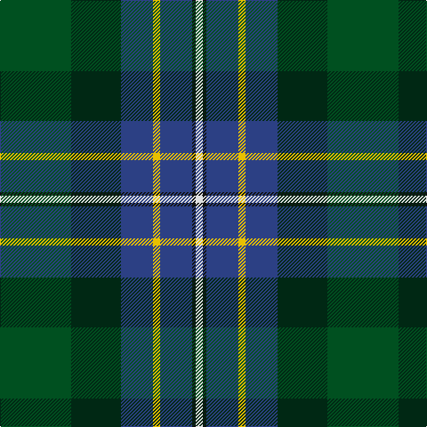

In pattern [GGBYBKW](/patterns/ggbybkw/).

This was sourced from register-of-tartans.  It is a [7 stripes tartan](/stripes/stripes7/).

Original link https://www.tartanregister.gov.uk/tartanDetails.aspx?ref=1779

## Register references

External register numbers recorded for this tartan.

- Scottish Register of Tartans: [1779](https://www.tartanregister.gov.uk/tartanDetails.aspx?ref=1779)
- Scottish Tartans World Register: 2599

## Thread count
G/80 DG56 B36 Y8 B36 K4 LN/8

## Palette
Each colour and its ΔE from the base-6 reference it is a variant of.

| Colour | Shade | Base | ΔE (OKLab) |
|---|---|---|---|
| B | <code style="background-color:#2C4084;">#2C4084</code> `#2C4084` | B <code style="background-color:#2A418A;">#2A418A</code> | 0.01 |
| DG | <code style="background-color:#002814;">#002814</code> `#002814` | G <code style="background-color:#006100;">#006100</code> | 0.20 |
| G | <code style="background-color:#005020;">#005020</code> `#005020` | G <code style="background-color:#006100;">#006100</code> | 0.07 |
| K | <code style="background-color:#101010;">#101010</code> `#101010` | K <code style="background-color:#000000;">#000000</code> | 0.17 |
| LN | <code style="background-color:#E0E0E0;">#E0E0E0</code> `#E0E0E0` | W <code style="background-color:#F7F7F7;">#F7F7F7</code> | 0.07 |
| Y | <code style="background-color:#E8C000;">#E8C000</code> `#E8C000` | Y <code style="background-color:#F2BF00;">#F2BF00</code> | 0.02 |

# Sample pattern

## Nearest tartans

The nearest existing variants by ΔTartan distance.

1. [Highland Wedding (Fashion)](/setts/s8/r9b8r8g52w2k32b44ba4~b003c64-ba1474b4-g006818-k101010-rc80000-we0e0e0/) — ΔT 0.92
1. [Jones Personal Tartan Tartan Number: 2476. Earliest known date: 1997 Designed by Peter MacDonald for Mrs Ros Jones, Aros, Isle of Mull and intended for all of the name Jones. Produced to raise money for National and International Charities. Registered Design Number :- 602573 See products available Copyright © Blair Urquhart, Comrie, 2015](/setts/s7/r4w1g6ga25k8b15w2~b202060-g5c6428-ga007460-k101010-ra01420-wc0c0c0~x2/) — ΔT 0.94
1. [Jones (Name)](/setts/s7/r4w1g6ga25k8b15w2~b2c2c80-g5c6428-ga006818-k101010-rc80000-wc0c0c0~x2/) — ΔT 1.08
1. [Whitson (Name)](/setts/s9/w4k1g19y1k19b13r2b4r2~b0c585c-g3c6040-k101010-r880000-wc0c0c0-yd09800~x4/) — ΔT 1.11
1. [Christian Hunting (Personal)](/setts/s7/r3g2b27k19g27ba2y3~b2c2c80-ba780078-g006818-k101010-rc80000-ye8c000~x2/) — ΔT 1.20
1. [MacNeil - 1840 (Chief's sett)](/setts/s7/w2r3b33k33g33k6y2~b2c2c80-g006818-k101010-rc80000-wfcfcfc-ye8c000~x2/) — ΔT 1.24
1. [Porteous Family Tartan Tartan Number: 1264. Earliest known date: 1978 Designed for the Porteous Family Association, and submitted to the Monitoring Committee of the Scottish Tartan Society by Captain Barry Porteous who was president of the association at that time. See products available Copyright © Blair Urquhart, Comrie, 2015](/setts/s6/k1y1b8g10ba7w1~b2c2c80-ba1c4874-g006818-k101010-we0e0e0-ye8c000~x2/) — ΔT 1.24
1. [Colquhoun](/setts/s7/b4k2b16w1k8g24r4~b2c4084-g005020-k101010-rdc0000-we0e0e0~x2/) — ΔT 1.24
1. [Cowie](/setts/s6/r3b24k7ba11g11y2~b003c64-ba2c2c80-g006818-k101010-rc80000-ye8c000~x2/) — ΔT 1.28
1. [Cailleach (Fashion)](/setts/s9/k30b20k10b5w2b10g20r2g10~b3c505c-g007440-k101010-rc80000-we0e0e0/) — ΔT 1.28

## Neighbour map

Every grey dot is one of 15726 variants placed by the first two principal components of the ΔTartan feature space (44% of its variance). Red is this tartan; blue dots are its nearest — click one to open its page.

<svg viewBox="0 0 640 380" role="img" style="max-width:100%;height:auto;border:1px solid #e0e0e0;border-radius:4px;display:block" xmlns="http://www.w3.org/2000/svg"><image href="/nn/cloud.v1.png" width="640" height="380"/><a href="/setts/s8/r9b8r8g52w2k32b44ba4~b003c64-ba1474b4-g006818-k101010-rc80000-we0e0e0/"><circle cx="190.5" cy="137.2" r="4" fill="#3465a4"><title>Highland Wedding (Fashion)</title></circle></a><a href="/setts/s7/r4w1g6ga25k8b15w2~b202060-g5c6428-ga007460-k101010-ra01420-wc0c0c0~x2/"><circle cx="212.5" cy="144.0" r="4" fill="#3465a4"><title>Jones Personal Tartan Tartan Number: 2476. Earliest known date: 1997 Designed by Peter MacDonald for Mrs Ros Jones, Aros, Isle of Mull and intended for all of the name Jones. Produced to raise money for National and International Charities. Registered Design Number :- 602573 See products available Copyright © Blair Urquhart, Comrie, 2015</title></circle></a><a href="/setts/s7/r4w1g6ga25k8b15w2~b2c2c80-g5c6428-ga006818-k101010-rc80000-wc0c0c0~x2/"><circle cx="206.7" cy="141.5" r="4" fill="#3465a4"><title>Jones (Name)</title></circle></a><a href="/setts/s9/w4k1g19y1k19b13r2b4r2~b0c585c-g3c6040-k101010-r880000-wc0c0c0-yd09800~x4/"><circle cx="172.5" cy="137.7" r="4" fill="#3465a4"><title>Whitson (Name)</title></circle></a><a href="/setts/s7/r3g2b27k19g27ba2y3~b2c2c80-ba780078-g006818-k101010-rc80000-ye8c000~x2/"><circle cx="171.6" cy="161.6" r="4" fill="#3465a4"><title>Christian Hunting (Personal)</title></circle></a><a href="/setts/s7/w2r3b33k33g33k6y2~b2c2c80-g006818-k101010-rc80000-wfcfcfc-ye8c000~x2/"><circle cx="178.9" cy="155.8" r="4" fill="#3465a4"><title>MacNeil - 1840 (Chief's sett)</title></circle></a><a href="/setts/s6/k1y1b8g10ba7w1~b2c2c80-ba1c4874-g006818-k101010-we0e0e0-ye8c000~x2/"><circle cx="161.5" cy="194.2" r="4" fill="#3465a4"><title>Porteous Family Tartan Tartan Number: 1264. Earliest known date: 1978 Designed for the Porteous Family Association, and submitted to the Monitoring Committee of the Scottish Tartan Society by Captain Barry Porteous who was president of the association at that time. See products available Copyright © Blair Urquhart, Comrie, 2015</title></circle></a><a href="/setts/s7/b4k2b16w1k8g24r4~b2c4084-g005020-k101010-rdc0000-we0e0e0~x2/"><circle cx="262.6" cy="168.4" r="4" fill="#3465a4"><title>Colquhoun</title></circle></a><a href="/setts/s6/r3b24k7ba11g11y2~b003c64-ba2c2c80-g006818-k101010-rc80000-ye8c000~x2/"><circle cx="194.1" cy="199.1" r="4" fill="#3465a4"><title>Cowie</title></circle></a><a href="/setts/s9/k30b20k10b5w2b10g20r2g10~b3c505c-g007440-k101010-rc80000-we0e0e0/"><circle cx="203.9" cy="188.9" r="4" fill="#3465a4"><title>Cailleach (Fashion)</title></circle></a><circle cx="192.8" cy="168.4" r="5" fill="#c00000"/></svg>

ID: /setts/s7/g20ga14b9y2b9k1w2~b2c4084-g005020-ga002814-k101010-we0e0e0-ye8c000~x4/
