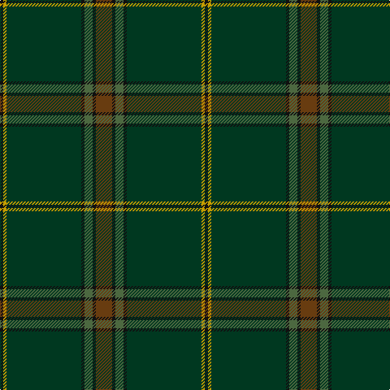

In pattern [GKGKGYK](/patterns/gkgkgyk/).

This was sourced from register-of-tartans.  It is a [7 stripes tartan](/stripes/stripes7/).

Original link https://www.tartanregister.gov.uk/tartanDetails.aspx?ref=10829

## Thread count
K/4 DY4 DG92 K4 G10 K4 T/20

## Palette
Each colour and its ΔE from the base-6 reference it is a variant of.

| Colour | Shade | Base | ΔE (OKLab) |
|---|---|---|---|
| DG | <code style="background-color:#003820;">#003820</code> `#003820` | G <code style="background-color:#006100;">#006100</code> | 0.15 |
| DY | <code style="background-color:#C49C00;">#C49C00</code> `#C49C00` | Y <code style="background-color:#F2BF00;">#F2BF00</code> | 0.12 |
| G | <code style="background-color:#4C6840;">#4C6840</code> `#4C6840` | G <code style="background-color:#006100;">#006100</code> | 0.10 |
| K | <code style="background-color:#101010;">#101010</code> `#101010` | K <code style="background-color:#000000;">#000000</code> | 0.17 |
| T | <code style="background-color:#683C10;">#683C10</code> `#683C10` | G <code style="background-color:#006100;">#006100</code> | 0.16 |

# Sample pattern

## Nearest tartans

The nearest existing variants by ΔTartan distance.

1. [Huntsman](/setts/s8/g6ga6g8k8gb28k6g82gc4-g5c6428-ga604000-gb603800-gc408060-k101010/) — ΔT 1.47
1. [Green Swamp Youth Campers](/setts/s6/k16r4k26y4g96b12-b2c2c80-g003820-k101010-rc80000-ye8c000/) — ΔT 1.53
1. [Verdon](/setts/s10/b144k12g12ga4g12k12b16g24k4ga8-b1c1c1c-g285800-ga289c18-k101010/) — ΔT 1.63
1. [McGovern (2016)](/setts/s5/b124r8g20ga6gb42-b061d37-g452700-ga2a230c-gb004f15-r9e411f/) — ΔT 1.70
1. [Del Forno Wolf (Personal)](/setts/s8/g76b16ba6bb8b24y2g8b2-b5c5c5c-ba1474b4-bb2c2c80-g006818-ybc8c00/) — ΔT 1.86
1. [Ata?, H.M. & I.C. (Personal)](/setts/s8/k18g10w2g30ka4g2ka88r2-g003820-k00002c-ka101010-rc80000-we0e0e0/) — ΔT 1.95
1. [Letham Hunting](/setts/s15/b4k2g12ka8k2ka10k4g60k4ba8k2ka8g12k2b4-b481148-ba1f2056-g074611-k101010-ka051304/) — ΔT 1.95
1. [Nolan (Personal)](/setts/s5/b16g38ga84y6r2-b480800-g006818-ga003820-ra00000-ybc8c00/) — ΔT 1.97
1. [Haddrell (2013)](/setts/s7/r4b8g36ba4g4ba82w4-b1870a4-ba505050-g808080-rc80000-we0e0e0/) — ΔT 2.00
1. [Unidentified, Toy Bear](/setts/s8/g94y4g10y4g8k30b38r4-b141e46-g003c14-k101010-rdc0000-ye8c000/) — ΔT 2.00

## Neighbour map

Every grey dot is one of 15726 variants placed by the first two principal components of the ΔTartan feature space (44% of its variance). Red is this tartan; blue dots are its nearest — click one to open its page.

<svg viewBox="0 0 640 380" role="img" style="max-width:100%;height:auto;border:1px solid #e0e0e0;border-radius:4px;display:block" xmlns="http://www.w3.org/2000/svg"><image href="/nn/cloud.v1.png" width="640" height="380"/><a href="/setts/s8/g6ga6g8k8gb28k6g82gc4-g5c6428-ga604000-gb603800-gc408060-k101010/"><circle cx="496.7" cy="181.5" r="4" fill="#3465a4"><title>Huntsman</title></circle></a><a href="/setts/s6/k16r4k26y4g96b12-b2c2c80-g003820-k101010-rc80000-ye8c000/"><circle cx="434.0" cy="183.8" r="4" fill="#3465a4"><title>Green Swamp Youth Campers</title></circle></a><a href="/setts/s10/b144k12g12ga4g12k12b16g24k4ga8-b1c1c1c-g285800-ga289c18-k101010/"><circle cx="507.6" cy="149.1" r="4" fill="#3465a4"><title>Verdon</title></circle></a><a href="/setts/s5/b124r8g20ga6gb42-b061d37-g452700-ga2a230c-gb004f15-r9e411f/"><circle cx="468.0" cy="221.4" r="4" fill="#3465a4"><title>McGovern (2016)</title></circle></a><a href="/setts/s8/g76b16ba6bb8b24y2g8b2-b5c5c5c-ba1474b4-bb2c2c80-g006818-ybc8c00/"><circle cx="483.9" cy="168.0" r="4" fill="#3465a4"><title>Del Forno Wolf (Personal)</title></circle></a><a href="/setts/s8/k18g10w2g30ka4g2ka88r2-g003820-k00002c-ka101010-rc80000-we0e0e0/"><circle cx="482.9" cy="157.4" r="4" fill="#3465a4"><title>Ata?, H.M. &amp; I.C. (Personal)</title></circle></a><a href="/setts/s15/b4k2g12ka8k2ka10k4g60k4ba8k2ka8g12k2b4-b481148-ba1f2056-g074611-k101010-ka051304/"><circle cx="455.0" cy="143.4" r="4" fill="#3465a4"><title>Letham Hunting</title></circle></a><a href="/setts/s5/b16g38ga84y6r2-b480800-g006818-ga003820-ra00000-ybc8c00/"><circle cx="435.7" cy="186.9" r="4" fill="#3465a4"><title>Nolan (Personal)</title></circle></a><a href="/setts/s7/r4b8g36ba4g4ba82w4-b1870a4-ba505050-g808080-rc80000-we0e0e0/"><circle cx="456.6" cy="172.0" r="4" fill="#3465a4"><title>Haddrell (2013)</title></circle></a><a href="/setts/s8/g94y4g10y4g8k30b38r4-b141e46-g003c14-k101010-rdc0000-ye8c000/"><circle cx="387.2" cy="164.2" r="4" fill="#3465a4"><title>Unidentified, Toy Bear</title></circle></a><circle cx="505.2" cy="176.5" r="5" fill="#c00000"/></svg>

ID: /setts/s7/g20k4ga10k4gb92y4k4-g683c10-ga4c6840-gb003820-k101010-yc49c00/
