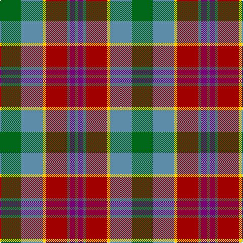

In pattern [BBBRYBG](/patterns/bbbrybg/).

This was sourced from tartans-authority.  It is a [7 stripes tartan](/stripes/stripes7/).

Original link http://www.tartansauthority.com/tartan-ferret/display/11033/

## Thread count
G/42 B42 Y6 DR42 N6 P10 N/6

## Palette
Each colour and its ΔE from the base-6 reference it is a variant of.

| Colour | Shade | Base | ΔE (OKLab) |
|---|---|---|---|
| B | <code style="background-color:#5C8CA8;">#5C8CA8</code> `#5C8CA8` | B <code style="background-color:#2A418A;">#2A418A</code> | 0.23 |
| DR | <code style="background-color:#A00000;">#A00000</code> `#A00000` | R <code style="background-color:#CC0000;">#CC0000</code> | 0.09 |
| G | <code style="background-color:#006818;">#006818</code> `#006818` | G <code style="background-color:#006100;">#006100</code> | 0.02 |
| N | <code style="background-color:#5C5C5C;">#5C5C5C</code> `#5C5C5C` | B <code style="background-color:#2A418A;">#2A418A</code> | 0.15 |
| P | <code style="background-color:#780078;">#780078</code> `#780078` | B <code style="background-color:#2A418A;">#2A418A</code> | 0.17 |
| Y | <code style="background-color:#FCCC00;">#FCCC00</code> `#FCCC00` | Y <code style="background-color:#F2BF00;">#F2BF00</code> | 0.04 |

# Sample pattern

## Nearest tartans

The nearest existing variants by ΔTartan distance.

1. [Falardeau-Murphy (Canada) (Personal)](/setts/s7/g21b21y3r21ba3bb5ba3~b5f749c-ba14283c-bb5a008c-g004c00-r960028-yffe600~x2/) — ΔT 0.79
1. [Christmas Hill Game Farm](/setts/s7/g5y20r3ga13g13b3w3~b500050-g4c3400-ga004828-ra00000-w00ccd0-ya08858~x2/) — ΔT 0.83
1. [Crossbill](/setts/s7/k2r15g15ga15ra2ga3y2~g604000-ga00643c-k101010-r9c68a4-rac80000-ye8c000~x2/) — ΔT 0.84
1. [Leitrim, County](/setts/s10/w3b18w4k3w4r13w3ba18b2y3~b4c3428-ba5c5c5c-k101010-rb84c00-wa8ace8-yec8048~x2/) — ΔT 1.09
1. [Derry Family (Personal)](/setts/s9/w6b36y12g19ga6r6ga6r28ga4~b2888c4-g289c18-ga006818-rc80000-we0e0e0-ybc8c00/) — ΔT 1.11
1. [Christmas Hill Game Farm (Corporate)](/setts/s7/g5y20r3ga13g13b3gb3~b141440-g4c3400-ga004828-gb006464-ra00000-ya08858~x2/) — ΔT 1.11
1. [Derry Family (Olney, Buckinghamshire) (Personal)](/setts/s9/w6b36y12g19ga6r6ga6r28ga4~b5e71a0-g49543f-ga343f23-rbf1a33-wffffff-yccb78e/) — ΔT 1.13
1. [Adamson (Personal)](/setts/s9/r1g7b3ga1ra3ga1b3ga7w1~b2c2c80-g604000-ga006818-rc80000-ra888888-we0e0e0~x4/) — ΔT 1.16
1. [Royal Pharmaceutical Society](/setts/s9/g3r2ga19r6ga2r6y14ra4w2~g604000-ga003820-r888888-ra901c38-we0e0e0-ya08858~x2/) — ΔT 1.19
1. [Brittany National Walking](/setts/s9/b4g27y8k4y8k4y8r11ya3~b2888c4-g604000-k101010-rb03000-ya08858-yae8c000~x2/) — ΔT 1.20

## Neighbour map

Every grey dot is one of 15726 variants placed by the first two principal components of the ΔTartan feature space (44% of its variance). Red is this tartan; blue dots are its nearest — click one to open its page.

<svg viewBox="0 0 640 380" role="img" style="max-width:100%;height:auto;border:1px solid #e0e0e0;border-radius:4px;display:block" xmlns="http://www.w3.org/2000/svg"><image href="/nn/cloud.v1.png" width="640" height="380"/><a href="/setts/s7/g21b21y3r21ba3bb5ba3~b5f749c-ba14283c-bb5a008c-g004c00-r960028-yffe600~x2/"><circle cx="102.5" cy="186.4" r="4" fill="#3465a4"><title>Falardeau-Murphy (Canada) (Personal)</title></circle></a><a href="/setts/s7/g5y20r3ga13g13b3w3~b500050-g4c3400-ga004828-ra00000-w00ccd0-ya08858~x2/"><circle cx="132.7" cy="200.1" r="4" fill="#3465a4"><title>Christmas Hill Game Farm</title></circle></a><a href="/setts/s7/k2r15g15ga15ra2ga3y2~g604000-ga00643c-k101010-r9c68a4-rac80000-ye8c000~x2/"><circle cx="161.5" cy="193.1" r="4" fill="#3465a4"><title>Crossbill</title></circle></a><a href="/setts/s10/w3b18w4k3w4r13w3ba18b2y3~b4c3428-ba5c5c5c-k101010-rb84c00-wa8ace8-yec8048~x2/"><circle cx="112.6" cy="151.3" r="4" fill="#3465a4"><title>Leitrim, County</title></circle></a><a href="/setts/s9/w6b36y12g19ga6r6ga6r28ga4~b2888c4-g289c18-ga006818-rc80000-we0e0e0-ybc8c00/"><circle cx="94.0" cy="157.2" r="4" fill="#3465a4"><title>Derry Family (Personal)</title></circle></a><a href="/setts/s7/g5y20r3ga13g13b3gb3~b141440-g4c3400-ga004828-gb006464-ra00000-ya08858~x2/"><circle cx="147.2" cy="207.5" r="4" fill="#3465a4"><title>Christmas Hill Game Farm (Corporate)</title></circle></a><a href="/setts/s9/w6b36y12g19ga6r6ga6r28ga4~b5e71a0-g49543f-ga343f23-rbf1a33-wffffff-yccb78e/"><circle cx="106.2" cy="158.2" r="4" fill="#3465a4"><title>Derry Family (Olney, Buckinghamshire) (Personal)</title></circle></a><a href="/setts/s9/r1g7b3ga1ra3ga1b3ga7w1~b2c2c80-g604000-ga006818-rc80000-ra888888-we0e0e0~x4/"><circle cx="127.4" cy="188.5" r="4" fill="#3465a4"><title>Adamson (Personal)</title></circle></a><a href="/setts/s9/g3r2ga19r6ga2r6y14ra4w2~g604000-ga003820-r888888-ra901c38-we0e0e0-ya08858~x2/"><circle cx="149.5" cy="159.3" r="4" fill="#3465a4"><title>Royal Pharmaceutical Society</title></circle></a><a href="/setts/s9/b4g27y8k4y8k4y8r11ya3~b2888c4-g604000-k101010-rb03000-ya08858-yae8c000~x2/"><circle cx="151.1" cy="164.8" r="4" fill="#3465a4"><title>Brittany National Walking</title></circle></a><circle cx="110.1" cy="187.5" r="5" fill="#c00000"/></svg>

ID: /setts/s7/g21b21y3r21ba3bb5ba3~b5c8ca8-ba5c5c5c-bb780078-g006818-ra00000-yfccc00~x2/
