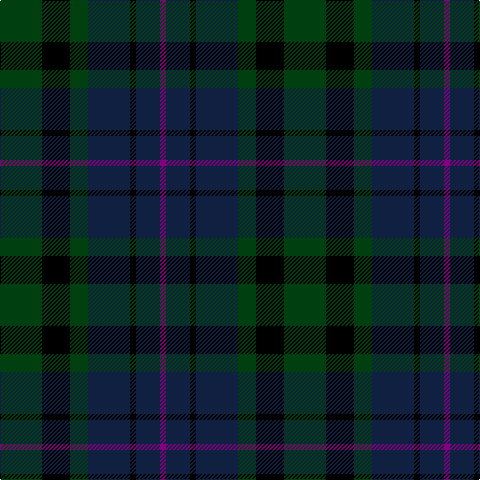

In pattern [BBKBGKG](/patterns/bbkbgkg/).

This was sourced from weddslist.  It is a [7 stripes tartan](/stripes/stripes7/).

Original link http://www.weddslist.com/cgi-bin/tartans/pg.pl?source=sts

## Thread count
DG/42 K28 DG18 DB42 K6 DB24 P/6

## Palette
Each colour and its ΔE from the base-6 reference it is a variant of.

| Colour | Shade | Base | ΔE (OKLab) |
|---|---|---|---|
| DB | <code style="background-color:#102040;">#102040</code> `#102040` | B <code style="background-color:#2A418A;">#2A418A</code> | 0.16 |
| DG | <code style="background-color:#004010;">#004010</code> `#004010` | G <code style="background-color:#006100;">#006100</code> | 0.11 |
| K | <code style="background-color:#000000;">#000000</code> `#000000` | K <code style="background-color:#000000;">#000000</code> | 0.00 |
| P | <code style="background-color:#800080;">#800080</code> `#800080` | B <code style="background-color:#2A418A;">#2A418A</code> | 0.17 |

# Sample pattern

## Nearest tartans

The nearest existing variants by ΔTartan distance.

1. [MacCallum #2](/setts/s7/k6g6r1g6k6b6k1~b2c4084-g005020-k101010-rdc0000~x2/) — ΔT 0.83
1. [Wilson's No 108](/setts/s8/k7g7k1g7k7b1ba7k1~b3c82af-ba5a008c-g005020-k101010~x4/) — ΔT 0.84
1. [Ferguson of Balquhidder #3](/setts/s6/k3b12r2k12g12k3~b2c4084-g005020-k101010-rdc0000~x2/) — ΔT 0.86
1. [MacIntyre](/setts/s7/k12g12k2g12k12b12ba3~b2c4084-ba3c82af-g005020-k101010~x2/) — ΔT 0.95
1. [Unidentified No 115](/setts/s8/b10k6ba1g6k1g6ba1k6~b2c4084-ba3c82af-g005020-k101010~x2/) — ΔT 1.15
1. [Fletcher Clan Tartan Tartan Number: 257. Earliest known date: 1906 Sometimes known as Fletcher of Saltoun, but commonly worn by all the Scottish Fletchers regardless family origins. According to legend, "Is e Clann-an-leisdeir a thog a cued smuid thug goil air uisge 'an Urcha." (It was the Fletcher clan that first raised smoke and boiled their water in Glen Orchy.) See products available Copyright © Blair Urquhart, Comrie, 2015](/setts/s7/b6k1b6k8r1g8k2~b2c2c80-g006818-k101010-rc80000~x2/) — ΔT 1.18
1. [Murray #3](/setts/s6/b2k2b12k8g11r2~b2c4084-g005020-k101010-rdc0000~x2/) — ΔT 1.20
1. [Campbell, Sir Walter Scott](/setts/s6/k2g8b2k9ba7k2~b2c4084-ba5a008c-g005020-k101010~x2/) — ΔT 1.22
1. [Rainford (Personal)](/setts/s9/k12b10k3w4k3b10k12g12k2~b141e46-g003c14-k101010-w82f5fa~x2/) — ΔT 1.22
1. [Scotsman](/setts/s7/g21k14g9b21k3b12ba3~b2c2c80-ba780078-g006818-k101010~x2/) — ΔT 1.25

## Neighbour map

Every grey dot is one of 15726 variants placed by the first two principal components of the ΔTartan feature space (44% of its variance). Red is this tartan; blue dots are its nearest — click one to open its page.

<svg viewBox="0 0 640 380" role="img" style="max-width:100%;height:auto;border:1px solid #e0e0e0;border-radius:4px;display:block" xmlns="http://www.w3.org/2000/svg"><image href="/nn/cloud.v1.png" width="640" height="380"/><a href="/setts/s7/k6g6r1g6k6b6k1~b2c4084-g005020-k101010-rdc0000~x2/"><circle cx="218.1" cy="288.5" r="4" fill="#3465a4"><title>MacCallum #2</title></circle></a><a href="/setts/s8/k7g7k1g7k7b1ba7k1~b3c82af-ba5a008c-g005020-k101010~x4/"><circle cx="232.1" cy="258.4" r="4" fill="#3465a4"><title>Wilson's No 108</title></circle></a><a href="/setts/s6/k3b12r2k12g12k3~b2c4084-g005020-k101010-rdc0000~x2/"><circle cx="222.3" cy="273.1" r="4" fill="#3465a4"><title>Ferguson of Balquhidder #3</title></circle></a><a href="/setts/s7/k12g12k2g12k12b12ba3~b2c4084-ba3c82af-g005020-k101010~x2/"><circle cx="209.7" cy="293.9" r="4" fill="#3465a4"><title>MacIntyre</title></circle></a><a href="/setts/s8/b10k6ba1g6k1g6ba1k6~b2c4084-ba3c82af-g005020-k101010~x2/"><circle cx="220.6" cy="244.1" r="4" fill="#3465a4"><title>Unidentified No 115</title></circle></a><a href="/setts/s7/b6k1b6k8r1g8k2~b2c2c80-g006818-k101010-rc80000~x2/"><circle cx="206.7" cy="250.6" r="4" fill="#3465a4"><title>Fletcher Clan Tartan Tartan Number: 257. Earliest known date: 1906 Sometimes known as Fletcher of Saltoun, but commonly worn by all the Scottish Fletchers regardless family origins. According to legend, &quot;Is e Clann-an-leisdeir a thog a cued smuid thug goil air uisge 'an Urcha.&quot; (It was the Fletcher clan that first raised smoke and boiled their water in Glen Orchy.) See products available Copyright © Blair Urquhart, Comrie, 2015</title></circle></a><a href="/setts/s6/b2k2b12k8g11r2~b2c4084-g005020-k101010-rdc0000~x2/"><circle cx="214.5" cy="265.0" r="4" fill="#3465a4"><title>Murray #3</title></circle></a><a href="/setts/s6/k2g8b2k9ba7k2~b2c4084-ba5a008c-g005020-k101010~x2/"><circle cx="221.3" cy="286.5" r="4" fill="#3465a4"><title>Campbell, Sir Walter Scott</title></circle></a><a href="/setts/s9/k12b10k3w4k3b10k12g12k2~b141e46-g003c14-k101010-w82f5fa~x2/"><circle cx="223.1" cy="267.2" r="4" fill="#3465a4"><title>Rainford (Personal)</title></circle></a><a href="/setts/s7/g21k14g9b21k3b12ba3~b2c2c80-ba780078-g006818-k101010~x2/"><circle cx="207.5" cy="262.6" r="4" fill="#3465a4"><title>Scotsman</title></circle></a><circle cx="228.5" cy="275.6" r="5" fill="#c00000"/></svg>

ID: /setts/s7/g21k14g9b21k3b12ba3~b102040-ba800080-g004010-k000000~x2/
