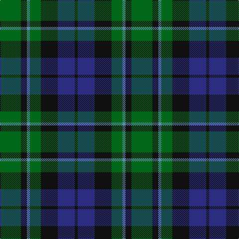

**Bands:** [KBKGBKG](/stripes/kbkgbkg/) · **Stripes:** [K DB K G T K G](/stripes/stripes7/) K DB K G T K G

This was sourced from register-of-tartans.  It is a [7 band tartan](/bands/bands7/).

Original link https://www.tartanregister.gov.uk/tartanDetails.aspx?ref=2306

## Attestations

This cloth appears in 2 source records; the oldest owns this page.

- 01/01/1832 — MacCallum (register-of-tartans, [record](https://www.tartanregister.gov.uk/tartanDetails.aspx?ref=2306))
- pre 1832 — MacCallum (Clan) (tartans-authority, [record](http://www.tartansauthority.com/tartan-ferret/display/767/))

## Register references

External register numbers recorded for this tartan.

- Scottish Register of Tartans: [2306](https://www.tartanregister.gov.uk/tartanDetails.aspx?ref=2306)
- Scottish Tartans Authority (ITI): 767
- Scottish Tartans World Register: 767

## Variants

Other setts woven to the same stripe pattern.

- [MacCallum](/setts/s7/g8k2t1g4k6db6k1~x2/)

## Thread count
G/42 K12 B6 G22 K34 DB34 K/6

## Palette
Each colour and its ΔE from the base-6 reference it is a variant of.

| Colour | Shade | Base | ΔE (OKLab) |
|---|---|---|---|
| B | <code style="background-color:#5C8CA8;">#5C8CA8</code> `#5C8CA8` | B <code style="background-color:#2A418A;">#2A418A</code> | 0.23 |
| DB | <code style="background-color:#2C2C80;">#2C2C80</code> `#2C2C80` | B <code style="background-color:#2A418A;">#2A418A</code> | 0.06 |
| G | <code style="background-color:#006818;">#006818</code> `#006818` | G <code style="background-color:#006100;">#006100</code> | 0.02 |
| K | <code style="background-color:#101010;">#101010</code> `#101010` | K <code style="background-color:#000000;">#000000</code> | 0.17 |

# Sample pattern

## Nearest tartans

The nearest existing variants by ΔTartan distance.

1. [Blaylock Annandale (Name)](/setts/s7/g24db6t3k6db12k15g4~x2/) — ΔT 0.46
1. [MacKay (Bonner)](/setts/s6/dg1db5dg1k5dg6ly1~x2/) — ΔT 0.61
1. [Callum Beg (Fashion)](/setts/s6/g1db6k6g6r1g1~x6/) — ΔT 0.73
1. [Abercrombie](/setts/s9/db7k2db2k2db2k7g7w1g7~x4/) — ΔT 0.75
1. [Graham of Menteith (Clan)](/setts/s6/g8t1g1k6db6k1~x4/) — ΔT 0.75
1. [Redland](/setts/s6/g52lb7g9k35db35k7/) — ΔT 0.78
1. [Gallamore](/setts/s6/k3db14r2k14g14k3~x2/) — ΔT 0.79
1. [Scotsman](/setts/s7/g21k14g9db21k3db12dp3~x2/) — ΔT 0.80
1. [Coburg](/setts/s6/g18t2g4k14dp12k3~x2/) — ΔT 0.82
1. [Graham of Montrose](/setts/s6/k4dg19k16w2db15dg4~x2/) — ΔT 0.82

## Neighbour map

Every grey dot is one of 14299 variants placed by the first two principal components of the ΔTartan feature space (44% of its variance). Red is this tartan; blue dots are its nearest — click one to open its page.

<svg viewBox="0 0 640 380" role="img" style="max-width:100%;height:auto;border:1px solid #e0e0e0;border-radius:4px;display:block" xmlns="http://www.w3.org/2000/svg"><image href="/nn/cloud.v1.png" width="640" height="380"/><a href="/setts/s7/g24db6t3k6db12k15g4~x2/"><circle cx="212.8" cy="248.1" r="4" fill="#3465a4"><title>Blaylock Annandale (Name)</title></circle></a><a href="/setts/s6/dg1db5dg1k5dg6ly1~x2/"><circle cx="212.9" cy="265.6" r="4" fill="#3465a4"><title>MacKay (Bonner)</title></circle></a><a href="/setts/s6/g1db6k6g6r1g1~x6/"><circle cx="197.7" cy="260.1" r="4" fill="#3465a4"><title>Callum Beg (Fashion)</title></circle></a><a href="/setts/s9/db7k2db2k2db2k7g7w1g7~x4/"><circle cx="179.1" cy="242.8" r="4" fill="#3465a4"><title>Abercrombie</title></circle></a><a href="/setts/s6/g8t1g1k6db6k1~x4/"><circle cx="218.0" cy="248.8" r="4" fill="#3465a4"><title>Graham of Menteith (Clan)</title></circle></a><a href="/setts/s6/g52lb7g9k35db35k7/"><circle cx="207.6" cy="246.5" r="4" fill="#3465a4"><title>Redland</title></circle></a><a href="/setts/s6/k3db14r2k14g14k3~x2/"><circle cx="214.2" cy="260.7" r="4" fill="#3465a4"><title>Gallamore</title></circle></a><a href="/setts/s7/g21k14g9db21k3db12dp3~x2/"><circle cx="210.7" cy="268.8" r="4" fill="#3465a4"><title>Scotsman</title></circle></a><a href="/setts/s6/g18t2g4k14dp12k3~x2/"><circle cx="229.5" cy="248.4" r="4" fill="#3465a4"><title>Coburg</title></circle></a><a href="/setts/s6/k4dg19k16w2db15dg4~x2/"><circle cx="222.9" cy="254.1" r="4" fill="#3465a4"><title>Graham of Montrose</title></circle></a><circle cx="205.9" cy="262.1" r="5" fill="#c00000"/></svg>

ID: /setts/s7/g21k6t3g11k17db17k3~x2/
