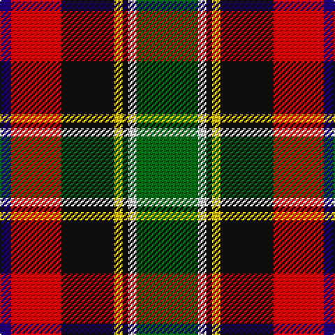

**Bands:** [BRKYKWG](/stripes/brkykwg/) · **Stripes:** [DB R K LY K W G](/stripes/stripes7/) DB R K LY K W G

This was sourced from register-of-tartans.  It is a [7 band tartan](/bands/bands7/).

Original link https://www.tartanregister.gov.uk/tartanDetails.aspx?ref=3669

## Attestations

This cloth appears in 2 source records; the oldest owns this page.

- 01/01/1999 — Scotch House 2000 Dress (register-of-tartans, [record](https://www.tartanregister.gov.uk/tartanDetails.aspx?ref=3669))
- 1999 — Scotch House 2000 Dress (Fashion) (tartans-authority, [record](http://www.tartansauthority.com/tartan-ferret/display/2635/))

## Register references

External register numbers recorded for this tartan.

- Scottish Register of Tartans: [3669](https://www.tartanregister.gov.uk/tartanDetails.aspx?ref=3669)
- Scottish Tartans Authority (ITI): 2635
- Scottish Tartans World Register: 2635

## Thread count
DB/8 R36 K38 Y6 K4 LN6 G/44

## Palette
Each colour and its ΔE from the base-6 reference it is a variant of.

| Colour | Shade | Base | ΔE (OKLab) |
|---|---|---|---|
| DB | <code style="background-color:#1C0070;">#1C0070</code> `#1C0070` | B <code style="background-color:#2A418A;">#2A418A</code> | 0.14 |
| G | <code style="background-color:#006818;">#006818</code> `#006818` | G <code style="background-color:#006100;">#006100</code> | 0.02 |
| K | <code style="background-color:#101010;">#101010</code> `#101010` | K <code style="background-color:#000000;">#000000</code> | 0.17 |
| LN | <code style="background-color:#E0E0E0;">#E0E0E0</code> `#E0E0E0` | W <code style="background-color:#F7F7F7;">#F7F7F7</code> | 0.07 |
| R | <code style="background-color:#C80000;">#C80000</code> `#C80000` | R <code style="background-color:#CC0000;">#CC0000</code> | 0.01 |
| Y | <code style="background-color:#E8C000;">#E8C000</code> `#E8C000` | Y <code style="background-color:#F2BF00;">#F2BF00</code> | 0.02 |

# Sample pattern

## Nearest tartans

The nearest existing variants by ΔTartan distance.

1. [Scotch House 2000, dress](/setts/s7/dg22w3k2ly3k19r18g4~x2/) — ΔT 0.83
1. [Hackett Hunting (Personal)](/setts/s8/k20lo4r4lo20y20lb5y2g2~x2/) — ΔT 0.86
1. [Comyn/Cumming](/setts/s9/r4w1r4dg10ly1k10t4k2t4~x4/) — ΔT 0.90
1. [Barbour](/setts/s7/r3k20w2dy11o21ly2o2~x2/) — ΔT 0.97
1. [Comyn, Cumming](/setts/s9/r4w1r4g10ly1k10t4k2t4~x4/) — ΔT 1.03
1. [South Africa 1994 (Fashion)](/setts/s7/k20ly4db13w4g30w4r13~x2/) — ΔT 1.04
1. [McMuldroch (2014)](/setts/s10/g19k18r18ly2w2dp2ly2w2r8dp3~x2/) — ΔT 1.05
1. [Barbour - Classic](/setts/s7/o4ly2o21dy11w2k20r3~x2/) — ΔT 1.05
1. [Barbour Corporate Tartan Tartan Number: 2489. Earliest known date: 1998 For the linings of Barbour's famous wax jackets. Tartan designed by Kinloch Anderson of Edinburgh. See products available Copyright © Blair Urquhart, Comrie, 2015](/setts/s7/y4ly2y21do11w2k20r3~x2/) — ΔT 1.08
1. [National (1934), The](/setts/s9/w2db3r6k8g12lo1db4k2w2~x2/) — ΔT 1.08

## Neighbour map

Every grey dot is one of 14313 variants placed by the first two principal components of the ΔTartan feature space (44% of its variance). Red is this tartan; blue dots are its nearest — click one to open its page.

<svg viewBox="0 0 640 380" role="img" style="max-width:100%;height:auto;border:1px solid #e0e0e0;border-radius:4px;display:block" xmlns="http://www.w3.org/2000/svg"><image href="/nn/cloud.v1.png" width="640" height="380"/><a href="/setts/s7/dg22w3k2ly3k19r18g4~x2/"><circle cx="100.9" cy="155.0" r="4" fill="#3465a4"><title>Scotch House 2000, dress</title></circle></a><a href="/setts/s8/k20lo4r4lo20y20lb5y2g2~x2/"><circle cx="117.6" cy="159.0" r="4" fill="#3465a4"><title>Hackett Hunting (Personal)</title></circle></a><a href="/setts/s9/r4w1r4dg10ly1k10t4k2t4~x4/"><circle cx="86.1" cy="162.5" r="4" fill="#3465a4"><title>Comyn/Cumming</title></circle></a><a href="/setts/s7/r3k20w2dy11o21ly2o2~x2/"><circle cx="167.3" cy="156.0" r="4" fill="#3465a4"><title>Barbour</title></circle></a><a href="/setts/s9/r4w1r4g10ly1k10t4k2t4~x4/"><circle cx="64.8" cy="154.5" r="4" fill="#3465a4"><title>Comyn, Cumming</title></circle></a><a href="/setts/s7/k20ly4db13w4g30w4r13~x2/"><circle cx="79.7" cy="179.2" r="4" fill="#3465a4"><title>South Africa 1994 (Fashion)</title></circle></a><a href="/setts/s10/g19k18r18ly2w2dp2ly2w2r8dp3~x2/"><circle cx="119.3" cy="133.6" r="4" fill="#3465a4"><title>McMuldroch (2014)</title></circle></a><a href="/setts/s7/o4ly2o21dy11w2k20r3~x2/"><circle cx="172.7" cy="160.5" r="4" fill="#3465a4"><title>Barbour - Classic</title></circle></a><a href="/setts/s7/y4ly2y21do11w2k20r3~x2/"><circle cx="176.2" cy="168.5" r="4" fill="#3465a4"><title>Barbour Corporate Tartan Tartan Number: 2489. Earliest known date: 1998 For the linings of Barbour's famous wax jackets. Tartan designed by Kinloch Anderson of Edinburgh. See products available Copyright © Blair Urquhart, Comrie, 2015</title></circle></a><a href="/setts/s9/w2db3r6k8g12lo1db4k2w2~x2/"><circle cx="74.8" cy="145.7" r="4" fill="#3465a4"><title>National (1934), The</title></circle></a><circle cx="112.7" cy="158.1" r="5" fill="#c00000"/></svg>

ID: /setts/s7/g22w3k2ly3k19r18db4~x2/
