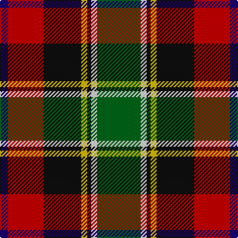

In pattern [BRKYKWG](/patterns/brkykwg/).

This was sourced from register-of-tartans.  It is a [7 stripes tartan](/stripes/stripes7/).

Original link https://www.tartanregister.gov.uk/tartanDetails.aspx?ref=3669

## Attestations

This cloth appears in 2 source records; the oldest owns this page.

- 01/01/1999 — Scotch House 2000 Dress (register-of-tartans, [record](https://www.tartanregister.gov.uk/tartanDetails.aspx?ref=3669))
- 1999 — Scotch House 2000 Dress (Fashion) (tartans-authority, [record](http://www.tartansauthority.com/tartan-ferret/display/2635/))

## Thread count
DB/8 R36 K38 Y6 K4 LN6 G/44

## Palette
Each colour and its ΔE from the base-6 reference it is a variant of.

| Colour | Shade | Base | ΔE (OKLab) |
|---|---|---|---|
| DB | <code style="background-color:#1C0070;">#1C0070</code> `#1C0070` | B <code style="background-color:#2A418A;">#2A418A</code> | 0.14 |
| G | <code style="background-color:#006818;">#006818</code> `#006818` | G <code style="background-color:#006100;">#006100</code> | 0.02 |
| K | <code style="background-color:#101010;">#101010</code> `#101010` | K <code style="background-color:#000000;">#000000</code> | 0.17 |
| LN | <code style="background-color:#E0E0E0;">#E0E0E0</code> `#E0E0E0` | W <code style="background-color:#F7F7F7;">#F7F7F7</code> | 0.07 |
| R | <code style="background-color:#C80000;">#C80000</code> `#C80000` | R <code style="background-color:#CC0000;">#CC0000</code> | 0.01 |
| Y | <code style="background-color:#E8C000;">#E8C000</code> `#E8C000` | Y <code style="background-color:#F2BF00;">#F2BF00</code> | 0.02 |

# Sample pattern

## Nearest tartans

The nearest existing variants by ΔTartan distance.

1. [Scotch House 2000, dress](/setts/s7/g22w3k2y3k19r18ga4x2~g004010-ga30a010-k000000-rc00000-we0e0e0-yf0c000/) — ΔT 0.83
1. [Hackett Hunting (Personal)](/setts/s8/k20y4r4y20g20w5g2ga2x2~g5c6428-ga006818-k101010-rc80000-we8ccb8-ya08858/) — ΔT 0.86
1. [Comyn/Cumming](/setts/s9/b4k2b4k10y1g10r4w1r4x4~b3c82af-g005020-k101010-rdc0000-we0e0e0-ye8c000/) — ΔT 0.90
1. [Barbour](/setts/s7/r3k20w2g11ra21y2ra2x2~g642400-k101010-rc80000-ra946434-wfcfcfc-ye8c000/) — ΔT 0.97
1. [National Trade Tartan Tartan Number: 1775. Earliest known date: 1934 This sett was designed by the National Association of Scottish Woollen Manufacturers in 1934. (STS archives) Some 60 years later (1994) a new 'National' tartan has been developed. See 'Scottish National' and 'Scottish National Dress'. See products available Copyright © Blair Urquhart, Comrie, 2015](/setts/s9/w2b3r6k8g12y1b4k2w2x2~b2c2c80-g006818-k101010-rc80000-we0e0e0-ye8c000/) — ΔT 0.99
1. [Comyn, Cumming](/setts/s9/b4k2b4k10y1g10r4w1r4x4~b5480b0-g008000-k000000-rc00000-we0e0e0-yf0c000/) — ΔT 1.03
1. [South Africa 1994 (Fashion)](/setts/s7/k20y4b13w4g30w4r13x2~b2c2c80-g006818-k101010-rc80000-we0e0e0-ye8c000/) — ΔT 1.04
1. [McMuldroch (2014)](/setts/s10/g19k18r18y2w2b2y2w2r8b3x2~b780078-g006818-k101010-ra00000-wfcfcfc-yfccc00/) — ΔT 1.05
1. [Barbour - Classic](/setts/s7/r4y2r21g11w2k20ra3x2~g642400-k101010-r946434-rac80000-wfcfcfc-ye8c000/) — ΔT 1.05
1. [Kilgour](/setts/s8/b6k3g14k3r14k3b6y1x4~b304080-g008000-k000000-rc00000-yf0c000/) — ΔT 1.07

## Neighbour map

Every grey dot is one of 15726 variants placed by the first two principal components of the ΔTartan feature space (44% of its variance). Red is this tartan; blue dots are its nearest — click one to open its page.

<svg viewBox="0 0 640 380" role="img" style="max-width:100%;height:auto;border:1px solid #e0e0e0;border-radius:4px;display:block" xmlns="http://www.w3.org/2000/svg"><image href="/nn/cloud.v1.png" width="640" height="380"/><a href="/setts/s7/g22w3k2y3k19r18ga4x2~g004010-ga30a010-k000000-rc00000-we0e0e0-yf0c000/"><circle cx="98.1" cy="155.6" r="4" fill="#3465a4"><title>Scotch House 2000, dress</title></circle></a><a href="/setts/s8/k20y4r4y20g20w5g2ga2x2~g5c6428-ga006818-k101010-rc80000-we8ccb8-ya08858/"><circle cx="115.2" cy="156.4" r="4" fill="#3465a4"><title>Hackett Hunting (Personal)</title></circle></a><a href="/setts/s9/b4k2b4k10y1g10r4w1r4x4~b3c82af-g005020-k101010-rdc0000-we0e0e0-ye8c000/"><circle cx="83.3" cy="160.3" r="4" fill="#3465a4"><title>Comyn/Cumming</title></circle></a><a href="/setts/s7/r3k20w2g11ra21y2ra2x2~g642400-k101010-rc80000-ra946434-wfcfcfc-ye8c000/"><circle cx="165.4" cy="155.2" r="4" fill="#3465a4"><title>Barbour</title></circle></a><a href="/setts/s9/w2b3r6k8g12y1b4k2w2x2~b2c2c80-g006818-k101010-rc80000-we0e0e0-ye8c000/"><circle cx="78.3" cy="146.8" r="4" fill="#3465a4"><title>National Trade Tartan Tartan Number: 1775. Earliest known date: 1934 This sett was designed by the National Association of Scottish Woollen Manufacturers in 1934. (STS archives) Some 60 years later (1994) a new 'National' tartan has been developed. See 'Scottish National' and 'Scottish National Dress'. See products available Copyright © Blair Urquhart, Comrie, 2015</title></circle></a><a href="/setts/s9/b4k2b4k10y1g10r4w1r4x4~b5480b0-g008000-k000000-rc00000-we0e0e0-yf0c000/"><circle cx="61.6" cy="154.3" r="4" fill="#3465a4"><title>Comyn, Cumming</title></circle></a><a href="/setts/s7/k20y4b13w4g30w4r13x2~b2c2c80-g006818-k101010-rc80000-we0e0e0-ye8c000/"><circle cx="76.7" cy="178.0" r="4" fill="#3465a4"><title>South Africa 1994 (Fashion)</title></circle></a><a href="/setts/s10/g19k18r18y2w2b2y2w2r8b3x2~b780078-g006818-k101010-ra00000-wfcfcfc-yfccc00/"><circle cx="117.0" cy="133.0" r="4" fill="#3465a4"><title>McMuldroch (2014)</title></circle></a><a href="/setts/s7/r4y2r21g11w2k20ra3x2~g642400-k101010-r946434-rac80000-wfcfcfc-ye8c000/"><circle cx="170.8" cy="159.8" r="4" fill="#3465a4"><title>Barbour - Classic</title></circle></a><a href="/setts/s8/b6k3g14k3r14k3b6y1x4~b304080-g008000-k000000-rc00000-yf0c000/"><circle cx="110.9" cy="163.6" r="4" fill="#3465a4"><title>Kilgour</title></circle></a><circle cx="110.1" cy="157.3" r="5" fill="#c00000"/></svg>

ID: /setts/s7/g22w3k2y3k19r18b4x2~b1c0070-g006818-k101010-rc80000-we0e0e0-ye8c000/
