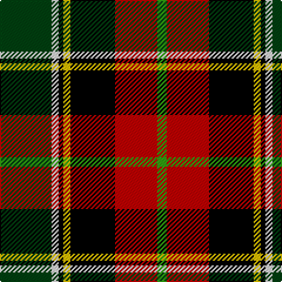

In pattern [GRKYKWG](/patterns/grkykwg/).

This was sourced from weddslist.  It is a [7 stripes tartan](/stripes/stripes7/).

Original link http://www.weddslist.com/cgi-bin/tartans/pg.pl?source=sts

## Thread count
DG/44 LN6 K4 Y6 K38 R36 G/8

## Palette
Each colour and its ΔE from the base-6 reference it is a variant of.

| Colour | Shade | Base | ΔE (OKLab) |
|---|---|---|---|
| DG | <code style="background-color:#004010;">#004010</code> `#004010` | G <code style="background-color:#006100;">#006100</code> | 0.11 |
| G | <code style="background-color:#30A010;">#30A010</code> `#30A010` | G <code style="background-color:#006100;">#006100</code> | 0.20 |
| K | <code style="background-color:#000000;">#000000</code> `#000000` | K <code style="background-color:#000000;">#000000</code> | 0.00 |
| LN | <code style="background-color:#E0E0E0;">#E0E0E0</code> `#E0E0E0` | W <code style="background-color:#F7F7F7;">#F7F7F7</code> | 0.07 |
| R | <code style="background-color:#C00000;">#C00000</code> `#C00000` | R <code style="background-color:#CC0000;">#CC0000</code> | 0.03 |
| Y | <code style="background-color:#F0C000;">#F0C000</code> `#F0C000` | Y <code style="background-color:#F2BF00;">#F2BF00</code> | 0.00 |

# Sample pattern

## Nearest tartans

The nearest existing variants by ΔTartan distance.

1. [Scotch House 2000 Dress](/setts/s7/g22w3k2y3k19r18b4~b1c0070-g006818-k101010-rc80000-we0e0e0-ye8c000~x2/) — ΔT 0.83
1. [Morris of Balgonie](/setts/s6/w3b22r3k22g22y2~b300030-g008000-k000000-rc00000-we0e0e0-yf0c000~x2/) — ΔT 0.94
1. [Craigmoor](/setts/s9/k2r8b2k2r2k6ra2g6y1~b304080-g008000-k000000-rc00000-ra806050-yf0c000~x2/) — ΔT 0.99
1. [Comyn, Cumming](/setts/s9/b4k2b4k10y1g10r4w1r4~b5480b0-g008000-k000000-rc00000-we0e0e0-yf0c000~x4/) — ΔT 1.01
1. [Barbour](/setts/s7/r4y2r21b11w2k20ra3~b401000-k000000-r806050-rac00000-we0e0e0-yf0c000~x2/) — ΔT 1.04
1. [McMuldroch (2014)](/setts/s10/g19k18r18w2y2b2y2w2r8b3~b780078-g006818-k000000-r960028-wf8f8f8-yfccc00~x2/) — ΔT 1.16
1. [MacLachlan W](/setts/s7/r24y2ya3g16k16y2ya3~g11450d-k000000-raa0000-yaaaaaa-yaaaaa00~x2/) — ΔT 1.16
1. [MacLachlan W](/setts/s7/r24y2ya3g16k16y2ya3~g11450d-k000000-raa0000-yaaaaaa-yaaaaa00/) — ΔT 1.16
1. [National](/setts/s9/w2b3r6k8g12y1b4k2w2~b304080-g008000-k000000-rc00000-we0e0e0-yf0c000~x2/) — ΔT 1.21
1. [Mellor, Phillip (Oldham)](/setts/s7/b8w8k16g32ba3y5w5~b351e14-ba433a5a-g23321b-k000000-wf9f5ef-ye0a126~x2/) — ΔT 1.21

## Neighbour map

Every grey dot is one of 15726 variants placed by the first two principal components of the ΔTartan feature space (44% of its variance). Red is this tartan; blue dots are its nearest — click one to open its page.

<svg viewBox="0 0 640 380" role="img" style="max-width:100%;height:auto;border:1px solid #e0e0e0;border-radius:4px;display:block" xmlns="http://www.w3.org/2000/svg"><image href="/nn/cloud.v1.png" width="640" height="380"/><a href="/setts/s7/g22w3k2y3k19r18b4~b1c0070-g006818-k101010-rc80000-we0e0e0-ye8c000~x2/"><circle cx="110.1" cy="157.3" r="4" fill="#3465a4"><title>Scotch House 2000 Dress</title></circle></a><a href="/setts/s6/w3b22r3k22g22y2~b300030-g008000-k000000-rc00000-we0e0e0-yf0c000~x2/"><circle cx="97.6" cy="171.7" r="4" fill="#3465a4"><title>Morris of Balgonie</title></circle></a><a href="/setts/s9/k2r8b2k2r2k6ra2g6y1~b304080-g008000-k000000-rc00000-ra806050-yf0c000~x2/"><circle cx="77.0" cy="166.1" r="4" fill="#3465a4"><title>Craigmoor</title></circle></a><a href="/setts/s9/b4k2b4k10y1g10r4w1r4~b5480b0-g008000-k000000-rc00000-we0e0e0-yf0c000~x4/"><circle cx="61.6" cy="154.3" r="4" fill="#3465a4"><title>Comyn, Cumming</title></circle></a><a href="/setts/s7/r4y2r21b11w2k20ra3~b401000-k000000-r806050-rac00000-we0e0e0-yf0c000~x2/"><circle cx="150.2" cy="156.7" r="4" fill="#3465a4"><title>Barbour</title></circle></a><a href="/setts/s10/g19k18r18w2y2b2y2w2r8b3~b780078-g006818-k000000-r960028-wf8f8f8-yfccc00~x2/"><circle cx="103.9" cy="130.2" r="4" fill="#3465a4"><title>McMuldroch (2014)</title></circle></a><a href="/setts/s7/r24y2ya3g16k16y2ya3~g11450d-k000000-raa0000-yaaaaaa-yaaaaa00~x2/"><circle cx="153.6" cy="162.3" r="4" fill="#3465a4"><title>MacLachlan W</title></circle></a><a href="/setts/s7/r24y2ya3g16k16y2ya3~g11450d-k000000-raa0000-yaaaaaa-yaaaaa00/"><circle cx="153.6" cy="162.3" r="4" fill="#3465a4"><title>MacLachlan W</title></circle></a><a href="/setts/s9/w2b3r6k8g12y1b4k2w2~b304080-g008000-k000000-rc00000-we0e0e0-yf0c000~x2/"><circle cx="62.0" cy="142.3" r="4" fill="#3465a4"><title>National</title></circle></a><a href="/setts/s7/b8w8k16g32ba3y5w5~b351e14-ba433a5a-g23321b-k000000-wf9f5ef-ye0a126~x2/"><circle cx="124.4" cy="153.0" r="4" fill="#3465a4"><title>Mellor, Phillip (Oldham)</title></circle></a><circle cx="98.1" cy="155.6" r="5" fill="#c00000"/></svg>

ID: /setts/s7/g22w3k2y3k19r18ga4~g004010-ga30a010-k000000-rc00000-we0e0e0-yf0c000~x2/
