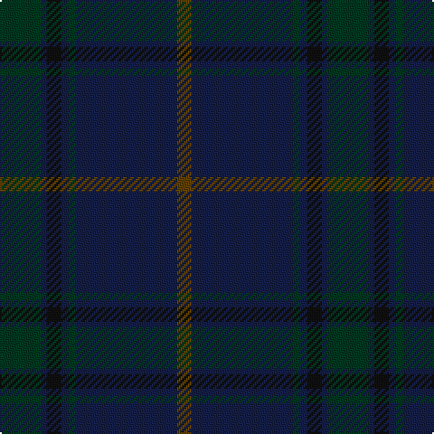

In pattern [GBGBKBG](/patterns/gbgbkbg/).

This was sourced from register-of-tartans.  It is a [7 stripes tartan](/stripes/stripes7/).

Original link https://www.tartanregister.gov.uk/tartanDetails.aspx?ref=11247

## Thread count
DG/23 DB3 K8 DB4 DG4 DB56 T/8

## Palette
Each colour and its ΔE from the base-6 reference it is a variant of.

| Colour | Shade | Base | ΔE (OKLab) |
|---|---|---|---|
| DB | <code style="background-color:#141E46;">#141E46</code> `#141E46` | B <code style="background-color:#2A418A;">#2A418A</code> | 0.16 |
| DG | <code style="background-color:#003820;">#003820</code> `#003820` | G <code style="background-color:#006100;">#006100</code> | 0.15 |
| K | <code style="background-color:#101010;">#101010</code> `#101010` | K <code style="background-color:#000000;">#000000</code> | 0.17 |
| T | <code style="background-color:#604000;">#604000</code> `#604000` | G <code style="background-color:#006100;">#006100</code> | 0.14 |

# Sample pattern

## Nearest tartans

The nearest existing variants by ΔTartan distance.

1. [Hector, James (Corporate)](/setts/s5/b2g11ba27g8r2~b441800-ba003c64-g003820-r880000~x2/) — ΔT 1.38
1. [St Andrews Old Course Hotel, Golf Course and Spa](/setts/s6/g45b14k3b2ga2b5~b000048-g002814-ga604000-k101010~x2/) — ΔT 1.39
1. [Land's End, Blue (Fashion)](/setts/s8/b2g9r2g9b2g2b26g2~b003054-g004c2c-r901c38~x2/) — ΔT 1.46
1. [Little Hunting](/setts/s8/b5ba3b4ba3b4k28b8r1~b1c1c50-ba2c2c80-k101010-rc80000~x2/) — ΔT 1.60
1. [Hughes Welsh Name Tartan Tartan Number: 5756. Earliest known date: 2002 The tartan for this Welsh surname and its variations, Hugh, Hullin, Hullyn, Huws, Pugh, Tugh, Hoell, is actually woven in Wales at the Cambrian Woollen Mill, weaving on the same site since 1830. This tartan differs from many traditional patterns in that the warp and weft differ, giving the finished worsted wool cloth more of a predominant stripe, vertically noticeable in the finished Kilt, or Cilt in Wales. See products available Copyright © Blair Urquhart, Comrie, 2015](/setts/s11/g4b34ba20b4ba8b6r2b5ba2b3g4~b202060-ba003c64-g006818-rc80000/) — ΔT 1.67
1. [Deighan (Edinburgh)](/setts/s5/b4k43ka20b7g2~b1b1b1b-g696969-k01002c-ka101010~x2/) — ΔT 1.82
1. [Hector, James](/setts/s8/g8b27g11ba2g11b27g8r2~b003c64-ba441800-g003820-r880000~x2/) — ΔT 1.85
1. [Dauphinee, Andrew Hunter (Personal)](/setts/s9/r3b32ba2b3ba4b2ba16w1ba1~b3c4359-ba172d60-ra00000-wf8f4d0~x2/) — ΔT 1.87
1. [Hueg (Bavaria) Hunting (Personal)](/setts/s10/b17g5b5g17b4g17k2ka2k2g5~b433a5a-g23321b-k1c1714-ka000000~x2/) — ΔT 1.92
1. [Conlon](/setts/s9/g4b2g17ga2r4ga2g3ga11g2~b2c2c80-g005448-ga003820-r880000~x2/) — ΔT 2.04

## Neighbour map

Every grey dot is one of 15726 variants placed by the first two principal components of the ΔTartan feature space (44% of its variance). Red is this tartan; blue dots are its nearest — click one to open its page.

<svg viewBox="0 0 640 380" role="img" style="max-width:100%;height:auto;border:1px solid #e0e0e0;border-radius:4px;display:block" xmlns="http://www.w3.org/2000/svg"><image href="/nn/cloud.v1.png" width="640" height="380"/><a href="/setts/s5/b2g11ba27g8r2~b441800-ba003c64-g003820-r880000~x2/"><circle cx="491.0" cy="289.4" r="4" fill="#3465a4"><title>Hector, James (Corporate)</title></circle></a><a href="/setts/s6/g45b14k3b2ga2b5~b000048-g002814-ga604000-k101010~x2/"><circle cx="560.5" cy="236.8" r="4" fill="#3465a4"><title>St Andrews Old Course Hotel, Golf Course and Spa</title></circle></a><a href="/setts/s8/b2g9r2g9b2g2b26g2~b003054-g004c2c-r901c38~x2/"><circle cx="521.8" cy="267.3" r="4" fill="#3465a4"><title>Land's End, Blue (Fashion)</title></circle></a><a href="/setts/s8/b5ba3b4ba3b4k28b8r1~b1c1c50-ba2c2c80-k101010-rc80000~x2/"><circle cx="473.1" cy="212.1" r="4" fill="#3465a4"><title>Little Hunting</title></circle></a><a href="/setts/s11/g4b34ba20b4ba8b6r2b5ba2b3g4~b202060-ba003c64-g006818-rc80000/"><circle cx="476.0" cy="220.4" r="4" fill="#3465a4"><title>Hughes Welsh Name Tartan Tartan Number: 5756. Earliest known date: 2002 The tartan for this Welsh surname and its variations, Hugh, Hullin, Hullyn, Huws, Pugh, Tugh, Hoell, is actually woven in Wales at the Cambrian Woollen Mill, weaving on the same site since 1830. This tartan differs from many traditional patterns in that the warp and weft differ, giving the finished worsted wool cloth more of a predominant stripe, vertically noticeable in the finished Kilt, or Cilt in Wales. See products available Copyright © Blair Urquhart, Comrie, 2015</title></circle></a><a href="/setts/s5/b4k43ka20b7g2~b1b1b1b-g696969-k01002c-ka101010~x2/"><circle cx="532.2" cy="278.9" r="4" fill="#3465a4"><title>Deighan (Edinburgh)</title></circle></a><a href="/setts/s8/g8b27g11ba2g11b27g8r2~b003c64-ba441800-g003820-r880000~x2/"><circle cx="508.2" cy="292.0" r="4" fill="#3465a4"><title>Hector, James</title></circle></a><a href="/setts/s9/r3b32ba2b3ba4b2ba16w1ba1~b3c4359-ba172d60-ra00000-wf8f4d0~x2/"><circle cx="528.6" cy="187.6" r="4" fill="#3465a4"><title>Dauphinee, Andrew Hunter (Personal)</title></circle></a><a href="/setts/s10/b17g5b5g17b4g17k2ka2k2g5~b433a5a-g23321b-k1c1714-ka000000~x2/"><circle cx="469.7" cy="279.0" r="4" fill="#3465a4"><title>Hueg (Bavaria) Hunting (Personal)</title></circle></a><a href="/setts/s9/g4b2g17ga2r4ga2g3ga11g2~b2c2c80-g005448-ga003820-r880000~x2/"><circle cx="443.1" cy="268.8" r="4" fill="#3465a4"><title>Conlon</title></circle></a><circle cx="526.2" cy="244.6" r="5" fill="#c00000"/></svg>

ID: /setts/s7/g23b3k8b4g4b56ga8~b141e46-g003820-ga604000-k101010/
