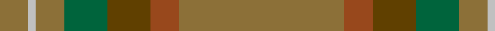

In pattern [GRGGGWG](/patterns/grgggwg/).

This was sourced from tartans-authority.  It is a [7 stripes tartan](/stripes/stripes7/).

Original link http://www.tartansauthority.com/tartan-ferret/display/5823/

## Thread count
LT/16 N4 LT16 G24 T24 Ta16 LT/92

## Palette
Each colour and its ΔE from the base-6 reference it is a variant of.

| Colour | Shade | Base | ΔE (OKLab) |
|---|---|---|---|
| G | <code style="background-color:#00643C;">#00643C</code> `#00643C` | G <code style="background-color:#006100;">#006100</code> | 0.05 |
| LT | <code style="background-color:#8C7038;">#8C7038</code> `#8C7038` | G <code style="background-color:#006100;">#006100</code> | 0.18 |
| N | <code style="background-color:#C0C0C0;">#C0C0C0</code> `#C0C0C0` | W <code style="background-color:#F7F7F7;">#F7F7F7</code> | 0.17 |
| T | <code style="background-color:#604000;">#604000</code> `#604000` | G <code style="background-color:#006100;">#006100</code> | 0.14 |
| Ta | <code style="background-color:#98481C;">#98481C</code> `#98481C` | R <code style="background-color:#CC0000;">#CC0000</code> | 0.11 |

# Sample pattern

## Nearest tartans

The nearest existing variants by ΔTartan distance.

1. [Huntsman](/setts/s8/g3ga3g4k4gb14k3g41gc2~g5c6428-ga604000-gb603800-gc408060-k101010~x2/) — ΔT 1.67
1. [Weathered Cyclist](/setts/s7/g32w2g9y2g12r21ra1~g777b57-r9f8757-raa40000-wffffff-ye7bf00~x2/) — ΔT 1.69
1. [Highland Greenford (Personal)](/setts/s4/g50ga25y2b6~b440044-g5c6428-ga604000-yc4bc68~x2/) — ΔT 1.73
1. [Historic Scotland Corporate Tartan Tartan Number: 2122. Earliest known date: 1988 Custodians at Historic Scotland properties throughout Scotland, including Edinburgh Castle, wear this distinctive tartan. See products available Copyright © Blair Urquhart, Comrie, 2015](/setts/s9/g2r1g1r2g21ga9k1ga7k2~g604000-ga5c6428-k101010-r888888~x2/) — ΔT 1.89
1. [Ulster (Peat) (District](/setts/s10/g28k2g28k2g2k2ga29k2r2k2~g7c5428-ga604000-k101010-rc80000~x2/) — ΔT 1.91
1. [Tricor](/setts/s12/g4w1g4ga6gb6r4g23r4gb6ga6g4w1~g8c7038-ga00643c-gb604000-r98481c-wc0c0c0~x4/) — ΔT 2.03
1. [Williams (Fashion)](/setts/s11/g50b6r3b3ga3b3ba10g8b3g6ga3~b441800-ba14283c-g604000-ga8c7038-r98481c~x2/) — ΔT 2.03
1. [Isaia (Fashion)](/setts/s7/r80ra8r4g4y4g45b8~b5c5c5c-g604000-rac6c64-ra904c40-ya0a0a0/) — ΔT 2.05
1. [McGuigan, Julia (St Monans, Fife) (Personal)](/setts/s4/g9ga52gb15y4~g70714d-ga5a601e-gb4e3d20-ybfab40~x2/) — ΔT 2.11
1. [Orkney Slate (Corporate)](/setts/s8/b8r74w8b42r11ba2r16b4~b5c5c5c-ba780078-r888888-wc0c0c0/) — ΔT 2.17

## Neighbour map

Every grey dot is one of 15726 variants placed by the first two principal components of the ΔTartan feature space (44% of its variance). Red is this tartan; blue dots are its nearest — click one to open its page.

<svg viewBox="0 0 640 380" role="img" style="max-width:100%;height:auto;border:1px solid #e0e0e0;border-radius:4px;display:block" xmlns="http://www.w3.org/2000/svg"><image href="/nn/cloud.v1.png" width="640" height="380"/><a href="/setts/s8/g3ga3g4k4gb14k3g41gc2~g5c6428-ga604000-gb603800-gc408060-k101010~x2/"><circle cx="499.8" cy="179.7" r="4" fill="#3465a4"><title>Huntsman</title></circle></a><a href="/setts/s7/g32w2g9y2g12r21ra1~g777b57-r9f8757-raa40000-wffffff-ye7bf00~x2/"><circle cx="562.4" cy="208.0" r="4" fill="#3465a4"><title>Weathered Cyclist</title></circle></a><a href="/setts/s4/g50ga25y2b6~b440044-g5c6428-ga604000-yc4bc68~x2/"><circle cx="506.1" cy="248.8" r="4" fill="#3465a4"><title>Highland Greenford (Personal)</title></circle></a><a href="/setts/s9/g2r1g1r2g21ga9k1ga7k2~g604000-ga5c6428-k101010-r888888~x2/"><circle cx="457.3" cy="197.6" r="4" fill="#3465a4"><title>Historic Scotland Corporate Tartan Tartan Number: 2122. Earliest known date: 1988 Custodians at Historic Scotland properties throughout Scotland, including Edinburgh Castle, wear this distinctive tartan. See products available Copyright © Blair Urquhart, Comrie, 2015</title></circle></a><a href="/setts/s10/g28k2g28k2g2k2ga29k2r2k2~g7c5428-ga604000-k101010-rc80000~x2/"><circle cx="481.6" cy="205.8" r="4" fill="#3465a4"><title>Ulster (Peat) (District</title></circle></a><a href="/setts/s12/g4w1g4ga6gb6r4g23r4gb6ga6g4w1~g8c7038-ga00643c-gb604000-r98481c-wc0c0c0~x4/"><circle cx="385.2" cy="174.2" r="4" fill="#3465a4"><title>Tricor</title></circle></a><a href="/setts/s11/g50b6r3b3ga3b3ba10g8b3g6ga3~b441800-ba14283c-g604000-ga8c7038-r98481c~x2/"><circle cx="528.4" cy="177.5" r="4" fill="#3465a4"><title>Williams (Fashion)</title></circle></a><a href="/setts/s7/r80ra8r4g4y4g45b8~b5c5c5c-g604000-rac6c64-ra904c40-ya0a0a0/"><circle cx="443.0" cy="173.4" r="4" fill="#3465a4"><title>Isaia (Fashion)</title></circle></a><a href="/setts/s4/g9ga52gb15y4~g70714d-ga5a601e-gb4e3d20-ybfab40~x2/"><circle cx="538.8" cy="286.7" r="4" fill="#3465a4"><title>McGuigan, Julia (St Monans, Fife) (Personal)</title></circle></a><a href="/setts/s8/b8r74w8b42r11ba2r16b4~b5c5c5c-ba780078-r888888-wc0c0c0/"><circle cx="530.4" cy="184.1" r="4" fill="#3465a4"><title>Orkney Slate (Corporate)</title></circle></a><circle cx="507.6" cy="206.5" r="5" fill="#c00000"/></svg>

ID: /setts/s7/g23r4ga6gb6g4w1g4~g8c7038-ga604000-gb00643c-r98481c-wc0c0c0~x4/
