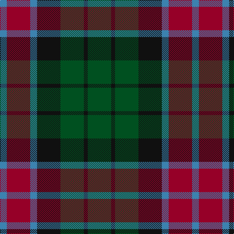

In pattern [BRBKGKG](/patterns/brbkgkg/).

This was sourced from register-of-tartans.  It is a [7 stripes tartan](/stripes/stripes7/).

Original link https://www.tartanregister.gov.uk/tartanDetails.aspx?ref=4341

## Register references

External register numbers recorded for this tartan.

- Scottish Register of Tartans: [4341](https://www.tartanregister.gov.uk/tartanDetails.aspx?ref=4341)
- Scottish Tartans World Register: 413

## Thread count
B/14 DR48 B14 K48 G48 K8 G/48

## Palette
Each colour and its ΔE from the base-6 reference it is a variant of.

| Colour | Shade | Base | ΔE (OKLab) |
|---|---|---|---|
| B | <code style="background-color:#3C82AF;">#3C82AF</code> `#3C82AF` | B <code style="background-color:#2A418A;">#2A418A</code> | 0.19 |
| DR | <code style="background-color:#960028;">#960028</code> `#960028` | R <code style="background-color:#CC0000;">#CC0000</code> | 0.12 |
| G | <code style="background-color:#005020;">#005020</code> `#005020` | G <code style="background-color:#006100;">#006100</code> | 0.07 |
| K | <code style="background-color:#101010;">#101010</code> `#101010` | K <code style="background-color:#000000;">#000000</code> | 0.17 |

# Sample pattern

## Nearest tartans

The nearest existing variants by ΔTartan distance.

1. [Gleneagles Group Corporate Tartan Tartan Number: 2107. Earliest known date: 1989 Designed for a range of tartan goods called the Gleneagles Collection. See products available Copyright © Blair Urquhart, Comrie, 2015](/setts/s7/b5g6ga1g6b5ba6b1~b680028-ba2c2c80-g006818-ga604000~x2/) — ΔT 0.90
1. [Tennant](/setts/s7/r1b7g7b7g7ba7r1~b304080-ba401000-g008000-rc00000~x4/) — ΔT 0.90
1. [Abercrombie (Wilsons No 2/64)](/setts/s7/k6g6y1g6k6b6k1~b5a008c-g005020-k101010-ye8c000~x4/) — ΔT 0.93
1. [MacCallum](/setts/s7/g21k6b3g11k17ba17k3~b5c8ca8-ba2c2c80-g006818-k101010~x2/) — ΔT 1.03
1. [Gunn - 1810 (Clan)](/setts/s6/r4g12k12g2b12g3~b1c0070-g006818-k101010-rc80000~x2/) — ΔT 1.05
1. [Daks (Navy)](/setts/s8/r3g6b2ba2b11g9b2r3~b202060-ba2c2c80-g006818-rc80000~x2/) — ΔT 1.05
1. [MacIntyre Hunting Clan Tartan Tartan Number: 56. Earliest known date: 1930-50 This sample comes from the MacGregor-Hastie collection which forms the basis of the cloth archive of the Scottish Tartans Society. Some of the samples, including this one, were unmarked. One can assume that the sample dates between 1930 and 1950. See products available Copyright © Blair Urquhart, Comrie, 2015](/setts/s7/k12g12k2g12k12b12ba3~b2c2c80-ba5c8ca8-g006818-k101010~x2/) — ΔT 1.06
1. [Scottish Parliament (unofficial)](/setts/s7/b14g18k3g18r20k14y3~b1c0070-g006818-k101010-r880000-yd09800~x2/) — ΔT 1.07
1. [Hebrides #8](/setts/s8/b7r3g7r1g7r3b7ba1~b2c2c80-ba5c8ca8-g006818-rc80000~x2/) — ΔT 1.07
1. [Scottish Airports](/setts/s6/b4g18b3k17b18ba4~b3c505c-ba9058d8-g006818-k101010~x2/) — ΔT 1.08

## Neighbour map

Every grey dot is one of 15726 variants placed by the first two principal components of the ΔTartan feature space (44% of its variance). Red is this tartan; blue dots are its nearest — click one to open its page.

<svg viewBox="0 0 640 380" role="img" style="max-width:100%;height:auto;border:1px solid #e0e0e0;border-radius:4px;display:block" xmlns="http://www.w3.org/2000/svg"><image href="/nn/cloud.v1.png" width="640" height="380"/><a href="/setts/s7/b5g6ga1g6b5ba6b1~b680028-ba2c2c80-g006818-ga604000~x2/"><circle cx="211.0" cy="277.3" r="4" fill="#3465a4"><title>Gleneagles Group Corporate Tartan Tartan Number: 2107. Earliest known date: 1989 Designed for a range of tartan goods called the Gleneagles Collection. See products available Copyright © Blair Urquhart, Comrie, 2015</title></circle></a><a href="/setts/s7/r1b7g7b7g7ba7r1~b304080-ba401000-g008000-rc00000~x4/"><circle cx="177.3" cy="260.8" r="4" fill="#3465a4"><title>Tennant</title></circle></a><a href="/setts/s7/k6g6y1g6k6b6k1~b5a008c-g005020-k101010-ye8c000~x4/"><circle cx="189.9" cy="274.5" r="4" fill="#3465a4"><title>Abercrombie (Wilsons No 2/64)</title></circle></a><a href="/setts/s7/g21k6b3g11k17ba17k3~b5c8ca8-ba2c2c80-g006818-k101010~x2/"><circle cx="202.6" cy="257.0" r="4" fill="#3465a4"><title>MacCallum</title></circle></a><a href="/setts/s6/r4g12k12g2b12g3~b1c0070-g006818-k101010-rc80000~x2/"><circle cx="164.3" cy="260.3" r="4" fill="#3465a4"><title>Gunn - 1810 (Clan)</title></circle></a><a href="/setts/s8/r3g6b2ba2b11g9b2r3~b202060-ba2c2c80-g006818-rc80000~x2/"><circle cx="197.9" cy="243.3" r="4" fill="#3465a4"><title>Daks (Navy)</title></circle></a><a href="/setts/s7/k12g12k2g12k12b12ba3~b2c2c80-ba5c8ca8-g006818-k101010~x2/"><circle cx="177.2" cy="279.9" r="4" fill="#3465a4"><title>MacIntyre Hunting Clan Tartan Tartan Number: 56. Earliest known date: 1930-50 This sample comes from the MacGregor-Hastie collection which forms the basis of the cloth archive of the Scottish Tartans Society. Some of the samples, including this one, were unmarked. One can assume that the sample dates between 1930 and 1950. See products available Copyright © Blair Urquhart, Comrie, 2015</title></circle></a><a href="/setts/s7/b14g18k3g18r20k14y3~b1c0070-g006818-k101010-r880000-yd09800~x2/"><circle cx="140.7" cy="241.8" r="4" fill="#3465a4"><title>Scottish Parliament (unofficial)</title></circle></a><a href="/setts/s8/b7r3g7r1g7r3b7ba1~b2c2c80-ba5c8ca8-g006818-rc80000~x2/"><circle cx="191.2" cy="243.8" r="4" fill="#3465a4"><title>Hebrides #8</title></circle></a><a href="/setts/s6/b4g18b3k17b18ba4~b3c505c-ba9058d8-g006818-k101010~x2/"><circle cx="208.6" cy="267.9" r="4" fill="#3465a4"><title>Scottish Airports</title></circle></a><circle cx="190.1" cy="264.1" r="5" fill="#c00000"/></svg>

ID: /setts/s7/g24k4g24k24b7r24b7~b3c82af-g005020-k101010-r960028~x2/
