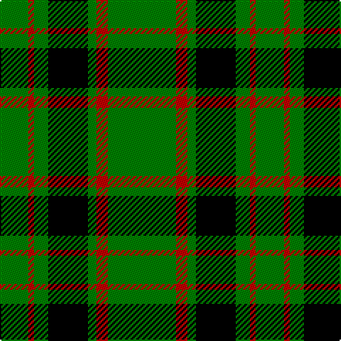

In pattern [GRGKGRG](/patterns/grgkgrg/).

This was sourced from weddslist.  It is a [7 stripes tartan](/stripes/stripes7/).

Original link http://www.weddslist.com/cgi-bin/tartans/pg.pl?source=sts

## Thread count
G/20 R4 G10 K28 G6 R8 G/48

## Palette
Each colour and its ΔE from the base-6 reference it is a variant of.

| Colour | Shade | Base | ΔE (OKLab) |
|---|---|---|---|
| G | <code style="background-color:#008000;">#008000</code> `#008000` | G <code style="background-color:#006100;">#006100</code> | 0.10 |
| K | <code style="background-color:#000000;">#000000</code> `#000000` | K <code style="background-color:#000000;">#000000</code> | 0.00 |
| R | <code style="background-color:#C00000;">#C00000</code> `#C00000` | R <code style="background-color:#CC0000;">#CC0000</code> | 0.03 |

# Sample pattern

## Nearest tartans

The nearest existing variants by ΔTartan distance.

1. [MacArthur](/setts/s6/g18y2g18k4g2k15x2~g008000-k000000-yf0c000/) — ΔT 0.85
1. [Fife, Duchess of..](/setts/s6/g30k12g6k6b2k5x2~b304080-g008000-k000000/) — ΔT 1.26
1. [Innes](/setts/s6/g7k1g7b1k6b1x2~b5480b0-g008000-k000000/) — ΔT 1.32
1. [Granger](/setts/s6/g40k4g12k21g17w4x2~g006030-k000000-we0e0e0/) — ΔT 1.33
1. [Heritage #2](/setts/s7/g20w2g9w2y5w7g10x2~g005020-we0e0e0-ye8c000/) — ΔT 1.36
1. [Loch Rannoch Fancy Tartan Tartan Number: 943. Earliest known date: 1975 Nothing See products available Copyright © Blair Urquhart, Comrie, 2015](/setts/s5/g37w9g3k9w3~g006818-k101010-we0e0e0/) — ΔT 1.43
1. [Moncrieffe Athol](/setts/s13/g20k3g3k3g3k18g21r4g21k18g19k2r4x2~g008000-k000000-rc00000/) — ΔT 1.45
1. [Forbes](/setts/s6/r1g16k8g4k4y1x2~g008000-k000000-rc00000-yf0c000/) — ΔT 1.46
1. [Sir Billi (Corporate)](/setts/s6/r8g12w5k11g42k3x2~g347400-k101010-rc80000-wf4f8c8/) — ΔT 1.47
1. [Loch Rannoch](/setts/s5/g37w9g3k9w3~g008000-k000000-we0e0e0/) — ΔT 1.49

## Neighbour map

Every grey dot is one of 15726 variants placed by the first two principal components of the ΔTartan feature space (44% of its variance). Red is this tartan; blue dots are its nearest — click one to open its page.

<svg viewBox="0 0 640 380" role="img" style="max-width:100%;height:auto;border:1px solid #e0e0e0;border-radius:4px;display:block" xmlns="http://www.w3.org/2000/svg"><image href="/nn/cloud.v1.png" width="640" height="380"/><a href="/setts/s6/g18y2g18k4g2k15x2~g008000-k000000-yf0c000/"><circle cx="331.6" cy="247.2" r="4" fill="#3465a4"><title>MacArthur</title></circle></a><a href="/setts/s6/g30k12g6k6b2k5x2~b304080-g008000-k000000/"><circle cx="340.8" cy="215.1" r="4" fill="#3465a4"><title>Fife, Duchess of..</title></circle></a><a href="/setts/s6/g7k1g7b1k6b1x2~b5480b0-g008000-k000000/"><circle cx="295.1" cy="254.0" r="4" fill="#3465a4"><title>Innes</title></circle></a><a href="/setts/s6/g40k4g12k21g17w4x2~g006030-k000000-we0e0e0/"><circle cx="388.6" cy="250.0" r="4" fill="#3465a4"><title>Granger</title></circle></a><a href="/setts/s7/g20w2g9w2y5w7g10x2~g005020-we0e0e0-ye8c000/"><circle cx="370.5" cy="231.4" r="4" fill="#3465a4"><title>Heritage #2</title></circle></a><a href="/setts/s5/g37w9g3k9w3~g006818-k101010-we0e0e0/"><circle cx="370.3" cy="214.2" r="4" fill="#3465a4"><title>Loch Rannoch Fancy Tartan Tartan Number: 943. Earliest known date: 1975 Nothing See products available Copyright © Blair Urquhart, Comrie, 2015</title></circle></a><a href="/setts/s13/g20k3g3k3g3k18g21r4g21k18g19k2r4x2~g008000-k000000-rc00000/"><circle cx="313.2" cy="204.6" r="4" fill="#3465a4"><title>Moncrieffe Athol</title></circle></a><a href="/setts/s6/r1g16k8g4k4y1x2~g008000-k000000-rc00000-yf0c000/"><circle cx="315.5" cy="193.1" r="4" fill="#3465a4"><title>Forbes</title></circle></a><a href="/setts/s6/r8g12w5k11g42k3x2~g347400-k101010-rc80000-wf4f8c8/"><circle cx="371.9" cy="194.9" r="4" fill="#3465a4"><title>Sir Billi (Corporate)</title></circle></a><a href="/setts/s5/g37w9g3k9w3~g008000-k000000-we0e0e0/"><circle cx="354.7" cy="209.3" r="4" fill="#3465a4"><title>Loch Rannoch</title></circle></a><circle cx="365.3" cy="221.6" r="5" fill="#c00000"/></svg>

ID: /setts/s7/g24r4g3k14g5r2g10x2~g008000-k000000-rc00000/
