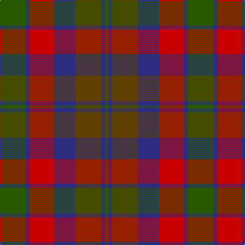

In pattern [GBGBRBG](/patterns/gbgbrbg/).

This was sourced from tartans-authority.  It is a [7 stripes tartan](/stripes/stripes7/).

Original link http://www.tartansauthority.com/tartan-ferret/display/5769/

## Thread count
G/50 DB8 R48 DB42 T50 DB8 G/6

## Palette
Each colour and its ΔE from the base-6 reference it is a variant of.

| Colour | Shade | Base | ΔE (OKLab) |
|---|---|---|---|
| DB | <code style="background-color:#2C2C80;">#2C2C80</code> `#2C2C80` | B <code style="background-color:#2A418A;">#2A418A</code> | 0.06 |
| G | <code style="background-color:#285800;">#285800</code> `#285800` | G <code style="background-color:#006100;">#006100</code> | 0.03 |
| R | <code style="background-color:#C80000;">#C80000</code> `#C80000` | R <code style="background-color:#CC0000;">#CC0000</code> | 0.01 |
| T | <code style="background-color:#604000;">#604000</code> `#604000` | G <code style="background-color:#006100;">#006100</code> | 0.14 |

# Sample pattern

## Nearest tartans

The nearest existing variants by ΔTartan distance.

1. [Edinburgh International Conference Centre, The](/setts/s6/g4b20g3k20r24b3~b14283c-g603800-k101010-r98481c~x2/) — ΔT 1.04
1. [Monaghan Irish County Tartan Tartan Number: 2267. Earliest known date: 1996 One of a series of Irish District tartans designed by Polly Wittering of the House of Edgar, with colours reminiscent of the Country with soft warm colours dominating. See products available Copyright © Blair Urquhart, Comrie, 2015](/setts/s9/y3g2r14ga17g14y8r14g2y3~g28200c-ga004830-r782030-ycc9410~x2/) — ΔT 1.19
1. [Bristol Gramar School Check (School)](/setts/s6/r4b3ba12bb8b2r4~b447084-ba5c5c5c-bb1c1c50-rc80000/) — ΔT 1.21
1. [Crook](/setts/s9/g4b12r3k3r3g16b2r14k4~b1870a4-g406054-k101010-ra00048~x2/) — ΔT 1.23
1. [Orban-Prentice (Personal)](/setts/s12/g25b4r24b21ga25b4g3b4ga25b21r24b4~b2c2c80-g285800-ga604000-rc80000~x2/) — ΔT 1.24
1. [Hueg (Munich) Hunting (Personal)](/setts/s11/r10b10r4g2r2b2r4g12ba12g3ba4~b311f11-ba433a5a-g23321b-rca2625~x2/) — ΔT 1.31
1. [Monaghan, County (District)](/setts/s9/y3b2r14y8b14g16r13b2y3~b4c3428-g003820-ra03400-ybc8c00~x2/) — ΔT 1.31
1. [Glenmorangie #2](/setts/s11/g6r2g2r4g13ga12ra13r4ra2r2ra6~g503c14-ga2a2303-r781c38-rabe7832~x2/) — ΔT 1.39
1. [Orkney (District?)](/setts/s8/r9g3b19k3g19r13k3y3~b1870a4-g408060-k101010-r901c38-ybc8c00~x2/) — ΔT 1.43
1. [Carnegie #3](/setts/s8/r33g17b50g17r11g17r9k7~b2c4084-g005020-k101010-rdc0000/) — ΔT 1.44

## Neighbour map

Every grey dot is one of 15726 variants placed by the first two principal components of the ΔTartan feature space (44% of its variance). Red is this tartan; blue dots are its nearest — click one to open its page.

<svg viewBox="0 0 640 380" role="img" style="max-width:100%;height:auto;border:1px solid #e0e0e0;border-radius:4px;display:block" xmlns="http://www.w3.org/2000/svg"><image href="/nn/cloud.v1.png" width="640" height="380"/><a href="/setts/s6/g4b20g3k20r24b3~b14283c-g603800-k101010-r98481c~x2/"><circle cx="215.8" cy="248.2" r="4" fill="#3465a4"><title>Edinburgh International Conference Centre, The</title></circle></a><a href="/setts/s9/y3g2r14ga17g14y8r14g2y3~g28200c-ga004830-r782030-ycc9410~x2/"><circle cx="185.4" cy="217.1" r="4" fill="#3465a4"><title>Monaghan Irish County Tartan Tartan Number: 2267. Earliest known date: 1996 One of a series of Irish District tartans designed by Polly Wittering of the House of Edgar, with colours reminiscent of the Country with soft warm colours dominating. See products available Copyright © Blair Urquhart, Comrie, 2015</title></circle></a><a href="/setts/s6/r4b3ba12bb8b2r4~b447084-ba5c5c5c-bb1c1c50-rc80000/"><circle cx="196.0" cy="259.4" r="4" fill="#3465a4"><title>Bristol Gramar School Check (School)</title></circle></a><a href="/setts/s9/g4b12r3k3r3g16b2r14k4~b1870a4-g406054-k101010-ra00048~x2/"><circle cx="199.4" cy="218.2" r="4" fill="#3465a4"><title>Crook</title></circle></a><a href="/setts/s12/g25b4r24b21ga25b4g3b4ga25b21r24b4~b2c2c80-g285800-ga604000-rc80000~x2/"><circle cx="172.7" cy="213.7" r="4" fill="#3465a4"><title>Orban-Prentice (Personal)</title></circle></a><a href="/setts/s11/r10b10r4g2r2b2r4g12ba12g3ba4~b311f11-ba433a5a-g23321b-rca2625~x2/"><circle cx="173.8" cy="231.1" r="4" fill="#3465a4"><title>Hueg (Munich) Hunting (Personal)</title></circle></a><a href="/setts/s9/y3b2r14y8b14g16r13b2y3~b4c3428-g003820-ra03400-ybc8c00~x2/"><circle cx="201.0" cy="225.3" r="4" fill="#3465a4"><title>Monaghan, County (District)</title></circle></a><a href="/setts/s11/g6r2g2r4g13ga12ra13r4ra2r2ra6~g503c14-ga2a2303-r781c38-rabe7832~x2/"><circle cx="180.8" cy="218.7" r="4" fill="#3465a4"><title>Glenmorangie #2</title></circle></a><a href="/setts/s8/r9g3b19k3g19r13k3y3~b1870a4-g408060-k101010-r901c38-ybc8c00~x2/"><circle cx="149.3" cy="214.4" r="4" fill="#3465a4"><title>Orkney (District?)</title></circle></a><a href="/setts/s8/r33g17b50g17r11g17r9k7~b2c4084-g005020-k101010-rdc0000/"><circle cx="169.9" cy="223.8" r="4" fill="#3465a4"><title>Carnegie #3</title></circle></a><circle cx="168.6" cy="237.1" r="5" fill="#c00000"/></svg>

ID: /setts/s7/g25b4r24b21ga25b4g3~b2c2c80-g285800-ga604000-rc80000~x2/
