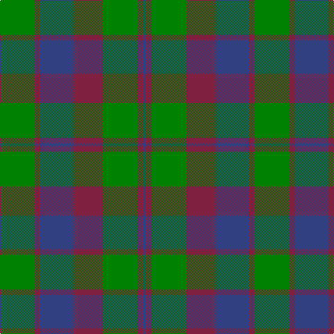

This page is one **sett** — a single exact thread-count. It belongs to the [tartan](/tartans/g25m4db24m21g25m4db2/)
(the same proportion at any scale), whose colour order is pattern [BRGRBRG](/stripes/brgrbrg/).

Sourced from weddslist.  It is a [7 stripe tartan](/stripes/stripes7/).

Original link http://www.weddslist.com/cgi-bin/tartans/pg.pl?source=sts

## Thread count
G/50 DR8 B48 DR42 G50 DR8 B/4

## Palette

Palette: <strong>custom</strong>
<table><thead><tr><th>Colour</th><th>Threads</th><th>Shade</th><th>Base</th><th>OKLCh</th></tr></thead><tbody><tr><td>G/</td><td style="text-align:right;font-variant-numeric:tabular-nums">50</td><td><code style="background-color:#008000;">#008000</code> <small style="color:#888">#008000</small></td><td>G <code style="background-color:#006100;">#006100</code></td><td><small style="color:#888">oklch(52.0% 0.177 142.5)</small></td></tr><tr><td>DR</td><td style="text-align:right;font-variant-numeric:tabular-nums">8</td><td><code style="background-color:#802040;">#802040</code> <small style="color:#888">#802040</small></td><td>R <code style="background-color:#CC0000;">#CC0000</code></td><td><small style="color:#888">oklch(40.8% 0.132 5.2)</small></td></tr><tr><td>B</td><td style="text-align:right;font-variant-numeric:tabular-nums">48</td><td><code style="background-color:#304080;">#304080</code> <small style="color:#888">#304080</small></td><td>B <code style="background-color:#2A418A;">#2A418A</code></td><td><small style="color:#888">oklch(39.4% 0.109 270.2)</small></td></tr><tr><td>DR</td><td style="text-align:right;font-variant-numeric:tabular-nums">42</td><td><code style="background-color:#802040;">#802040</code> <small style="color:#888">#802040</small></td><td>R <code style="background-color:#CC0000;">#CC0000</code></td><td><small style="color:#888">oklch(40.8% 0.132 5.2)</small></td></tr><tr><td>G</td><td style="text-align:right;font-variant-numeric:tabular-nums">50</td><td><code style="background-color:#008000;">#008000</code> <small style="color:#888">#008000</small></td><td>G <code style="background-color:#006100;">#006100</code></td><td><small style="color:#888">oklch(52.0% 0.177 142.5)</small></td></tr><tr><td>DR</td><td style="text-align:right;font-variant-numeric:tabular-nums">8</td><td><code style="background-color:#802040;">#802040</code> <small style="color:#888">#802040</small></td><td>R <code style="background-color:#CC0000;">#CC0000</code></td><td><small style="color:#888">oklch(40.8% 0.132 5.2)</small></td></tr><tr><td>B/</td><td style="text-align:right;font-variant-numeric:tabular-nums">4</td><td><code style="background-color:#304080;">#304080</code> <small style="color:#888">#304080</small></td><td>B <code style="background-color:#2A418A;">#2A418A</code></td><td><small style="color:#888">oklch(39.4% 0.109 270.2)</small></td></tr></tbody></table>

# Sample pattern

## Nearest tartans

The nearest existing variants by ΔTartan distance, with this tartan at the top so the swatches line up against it.

ΔTartan

Tartan

Sett

—

<a href="/ttd/edit/#slug=g25m4db24m21g25m4db2~x2">Glasgow, Rock and Wheel</a> <a class="nn-out" href="/setts/s7/g25m4db24m21g25m4db2~x2/" title="open its dictionary page">↗</a>

1.00

<a href="/ttd/edit/#slug=g25r4db24r21g25r3db4~x2">Glasgow</a> <a class="nn-out" href="/setts/s7/g25r4db24r21g25r3db4~x2/" title="open its dictionary page">↗</a>

1.02

<a href="/ttd/edit/#slug=dg25r4db24r21dg25r3db4~x2">Glasgow #2</a> <a class="nn-out" href="/setts/s7/dg25r4db24r21dg25r3db4~x2/" title="open its dictionary page">↗</a>

1.13

<a href="/ttd/edit/#slug=dt30r5g30r22dt30r5g4">GS Gaelic School (School)</a> <a class="nn-out" href="/setts/s7/dt30r5g30r22dt30r5g4/" title="open its dictionary page">↗</a>

1.17

<a href="/ttd/edit/#slug=r6db2r2db21g20r4g4~x2">Robertson of Struan</a> <a class="nn-out" href="/setts/s7/r6db2r2db21g20r4g4~x2/" title="open its dictionary page">↗</a>

1.18

<a href="/ttd/edit/#slug=t3dg1t10dg4dy10t2~x4">Rob Roy (Film) (Corporate)</a> <a class="nn-out" href="/setts/s6/t3dg1t10dg4dy10t2~x4/" title="open its dictionary page">↗</a>

1.22

<a href="/ttd/edit/#slug=db6r3g1r3g12r3g1~x2">Skene</a> <a class="nn-out" href="/setts/s7/db6r3g1r3g12r3g1~x2/" title="open its dictionary page">↗</a>

1.26

<a href="/ttd/edit/#slug=db8r3db1r3g14r3db1~x4">Logan</a> <a class="nn-out" href="/setts/s7/db8r3db1r3g14r3db1~x4/" title="open its dictionary page">↗</a>

1.26

<a href="/ttd/edit/#slug=lo6n2lo2n2lo18n13dt13n2~x2">Heil, Rudiger (Personal)</a> <a class="nn-out" href="/setts/s8/lo6n2lo2n2lo18n13dt13n2~x2/" title="open its dictionary page">↗</a>

1.29

<a href="/ttd/edit/#slug=b5k1g3k1b3k1g10r3~x2">Ayrton 1979 No. 2 (Personal)</a> <a class="nn-out" href="/setts/s8/b5k1g3k1b3k1g10r3~x2/" title="open its dictionary page">↗</a>

1.30

<a href="/ttd/edit/#slug=db6r3g1r3g12r3g1~x4">Skene - 1831 (Clan)</a> <a class="nn-out" href="/setts/s7/db6r3g1r3g12r3g1~x4/" title="open its dictionary page">↗</a>

## Neighbour map

Every grey dot is one of 14359 variants placed by the first two principal components of the ΔTartan feature space (44% of its variance). Red is this tartan; blue dots are its nearest — click one to open its page.

<svg viewBox="0 0 640 380" role="img" style="max-width:100%;height:auto;border:1px solid #e0e0e0;border-radius:4px;display:block" xmlns="http://www.w3.org/2000/svg"><image href="/nn/cloud.v1.png" width="640" height="380"/><a href="/setts/s7/g25r4db24r21g25r3db4~x2/"><circle cx="256.5" cy="248.9" r="4" fill="#3465a4"><title>Glasgow</title></circle></a><a href="/setts/s7/dg25r4db24r21dg25r3db4~x2/"><circle cx="281.5" cy="262.6" r="4" fill="#3465a4"><title>Glasgow #2</title></circle></a><a href="/setts/s7/dt30r5g30r22dt30r5g4/"><circle cx="270.0" cy="263.0" r="4" fill="#3465a4"><title>GS Gaelic School (School)</title></circle></a><a href="/setts/s7/r6db2r2db21g20r4g4~x2/"><circle cx="269.0" cy="222.3" r="4" fill="#3465a4"><title>Robertson of Struan</title></circle></a><a href="/setts/s6/t3dg1t10dg4dy10t2~x4/"><circle cx="334.1" cy="266.4" r="4" fill="#3465a4"><title>Rob Roy (Film) (Corporate)</title></circle></a><a href="/setts/s7/db6r3g1r3g12r3g1~x2/"><circle cx="297.2" cy="217.3" r="4" fill="#3465a4"><title>Skene</title></circle></a><a href="/setts/s7/db8r3db1r3g14r3db1~x4/"><circle cx="279.5" cy="207.2" r="4" fill="#3465a4"><title>Logan</title></circle></a><a href="/setts/s8/lo6n2lo2n2lo18n13dt13n2~x2/"><circle cx="279.0" cy="228.4" r="4" fill="#3465a4"><title>Heil, Rudiger (Personal)</title></circle></a><a href="/setts/s8/b5k1g3k1b3k1g10r3~x2/"><circle cx="258.4" cy="215.7" r="4" fill="#3465a4"><title>Ayrton 1979 No. 2 (Personal)</title></circle></a><a href="/setts/s7/db6r3g1r3g12r3g1~x4/"><circle cx="298.3" cy="217.6" r="4" fill="#3465a4"><title>Skene - 1831 (Clan)</title></circle></a><circle cx="291.1" cy="246.0" r="5" fill="#c00000"/></svg>

ID: /setts/s7/g25m4db24m21g25m4db2~x2/
