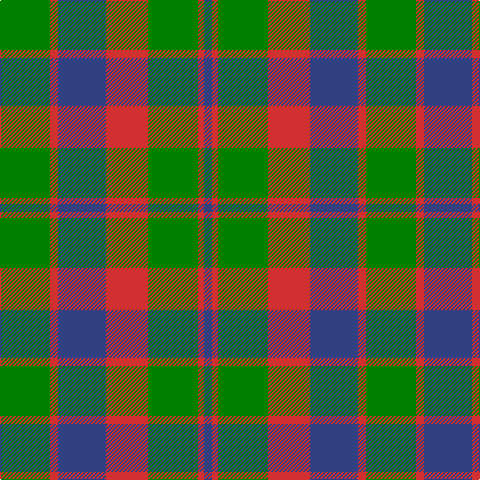

This page is one **sett** — a single exact thread-count. It belongs to the [tartan](/tartans/g25r4b24r21g25r3b4/)
(the same proportion at any scale), whose colour order is pattern [BRGRBRG](/stripes/brgrbrg/).

Sourced from weddslist.  It is a [7 stripe tartan](/stripes/stripes7/).

Original link http://www.weddslist.com/cgi-bin/tartans/pg.pl?source=sts

## Also known as

This cloth is also recorded under:

- Glasgow #2

## Thread count
G/50 R8 B48 R42 G50 R6 B/8

## Palette
Each colour and the base-6 reference it is a variant of.

| Colour | Shade | Base |
|---|---|---|
| B | <code style="background-color:#304080;">#304080</code> `oklch(39.4% 0.109 270.2)` <small>#304080</small> | B <code style="background-color:#2A418A;">#2A418A</code> |
| G | <code style="background-color:#008000;">#008000</code> `oklch(52.0% 0.177 142.5)` <small>#008000</small> | G <code style="background-color:#006100;">#006100</code> |
| R | <code style="background-color:#D03030;">#D03030</code> `oklch(56.4% 0.196 26.2)` <small>#D03030</small> | R <code style="background-color:#CC0000;">#CC0000</code> |

# Sample pattern

## Nearest tartans

The nearest existing variants by ΔTartan distance, with this tartan at the top so the swatches line up against it.

ΔTartan

Tartan

Sett

—

<a href="/ttd/edit/#slug=g25r4db24r21g25r3db4~x2">Glasgow</a> <a class="nn-out" href="/setts/s7/g25r4db24r21g25r3db4~x2/" title="open its dictionary page">↗</a>

0.92

<a href="/ttd/edit/#slug=db6r3g2r3g12r3g2~x2">Skene Clan Tartan Tartan Number: 516. Earliest known date: 1886 Smith No 53 has ROSE in place of RED. Grant's version is similar to the sample named Skene in the 1830 pattern book of Wilson's of Bannockburn. See products available Copyright © Blair Urquhart, Comrie, 2015</a> <a class="nn-out" href="/setts/s7/db6r3g2r3g12r3g2~x2/" title="open its dictionary page">↗</a>

1.00

<a href="/ttd/edit/#slug=db6r3g1r3g12r3g1~x2">Skene</a> <a class="nn-out" href="/setts/s7/db6r3g1r3g12r3g1~x2/" title="open its dictionary page">↗</a>

1.00

<a href="/ttd/edit/#slug=g25m4db24m21g25m4db2~x2">Glasgow, Rock and Wheel</a> <a class="nn-out" href="/setts/s7/g25m4db24m21g25m4db2~x2/" title="open its dictionary page">↗</a>

1.06

<a href="/ttd/edit/#slug=lo6n2lo2n2lo18n13dt13n2~x2">Heil, Rudiger (Personal)</a> <a class="nn-out" href="/setts/s8/lo6n2lo2n2lo18n13dt13n2~x2/" title="open its dictionary page">↗</a>

1.14

<a href="/ttd/edit/#slug=dt30r5g30r22dt30r5g4">GS Gaelic School (School)</a> <a class="nn-out" href="/setts/s7/dt30r5g30r22dt30r5g4/" title="open its dictionary page">↗</a>

1.18

<a href="/ttd/edit/#slug=db6r3g1r3g12r3g1~x4">Skene - 1831 (Clan)</a> <a class="nn-out" href="/setts/s7/db6r3g1r3g12r3g1~x4/" title="open its dictionary page">↗</a>

1.20

<a href="/ttd/edit/#slug=dg25r4db24r21dg25r3db4~x2">Glasgow #2</a> <a class="nn-out" href="/setts/s7/dg25r4db24r21dg25r3db4~x2/" title="open its dictionary page">↗</a>

1.23

<a href="/ttd/edit/#slug=db9r3db1r3g9r3db1~x2">Logan, or Skene</a> <a class="nn-out" href="/setts/s7/db9r3db1r3g9r3db1~x2/" title="open its dictionary page">↗</a>

1.24

<a href="/ttd/edit/#slug=r6db2r2db21g20r4g4~x2">Robertson of Struan</a> <a class="nn-out" href="/setts/s7/r6db2r2db21g20r4g4~x2/" title="open its dictionary page">↗</a>

1.32

<a href="/ttd/edit/#slug=db8r3db1r3g14r3db1~x4">Logan</a> <a class="nn-out" href="/setts/s7/db8r3db1r3g14r3db1~x4/" title="open its dictionary page">↗</a>

## Neighbour map

Every grey dot is one of 14299 variants placed by the first two principal components of the ΔTartan feature space (44% of its variance). Red is this tartan; blue dots are its nearest — click one to open its page.

<svg viewBox="0 0 640 380" role="img" style="max-width:100%;height:auto;border:1px solid #e0e0e0;border-radius:4px;display:block" xmlns="http://www.w3.org/2000/svg"><image href="/nn/cloud.v1.png" width="640" height="380"/><a href="/setts/s7/db6r3g2r3g12r3g2~x2/"><circle cx="284.0" cy="253.3" r="4" fill="#3465a4"><title>Skene Clan Tartan Tartan Number: 516. Earliest known date: 1886 Smith No 53 has ROSE in place of RED. Grant's version is similar to the sample named Skene in the 1830 pattern book of Wilson's of Bannockburn. See products available Copyright © Blair Urquhart, Comrie, 2015</title></circle></a><a href="/setts/s7/db6r3g1r3g12r3g1~x2/"><circle cx="297.8" cy="216.5" r="4" fill="#3465a4"><title>Skene</title></circle></a><a href="/setts/s7/g25m4db24m21g25m4db2~x2/"><circle cx="291.4" cy="245.1" r="4" fill="#3465a4"><title>Glasgow, Rock and Wheel</title></circle></a><a href="/setts/s8/lo6n2lo2n2lo18n13dt13n2~x2/"><circle cx="279.5" cy="227.5" r="4" fill="#3465a4"><title>Heil, Rudiger (Personal)</title></circle></a><a href="/setts/s7/dt30r5g30r22dt30r5g4/"><circle cx="270.3" cy="261.8" r="4" fill="#3465a4"><title>GS Gaelic School (School)</title></circle></a><a href="/setts/s7/db6r3g1r3g12r3g1~x4/"><circle cx="298.8" cy="216.7" r="4" fill="#3465a4"><title>Skene - 1831 (Clan)</title></circle></a><a href="/setts/s7/dg25r4db24r21dg25r3db4~x2/"><circle cx="281.8" cy="261.5" r="4" fill="#3465a4"><title>Glasgow #2</title></circle></a><a href="/setts/s7/db9r3db1r3g9r3db1~x2/"><circle cx="235.8" cy="232.9" r="4" fill="#3465a4"><title>Logan, or Skene</title></circle></a><a href="/setts/s7/r6db2r2db21g20r4g4~x2/"><circle cx="269.3" cy="221.4" r="4" fill="#3465a4"><title>Robertson of Struan</title></circle></a><a href="/setts/s7/db8r3db1r3g14r3db1~x4/"><circle cx="280.0" cy="206.4" r="4" fill="#3465a4"><title>Logan</title></circle></a><circle cx="257.0" cy="247.8" r="5" fill="#c00000"/></svg>

ID: /setts/s7/g25r4db24r21g25r3db4~x2/
