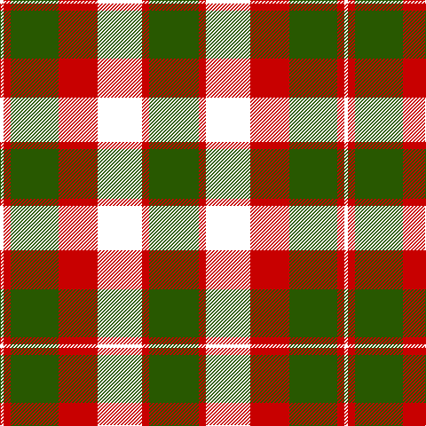

In pattern [GRKRGRK](/patterns/grkrgrk/).

This was sourced from house-of-tartan.  It is a [7 stripes tartan](/stripes/stripes7/).

Original link http://www.house-of-tartan.scotland.net/house/TartanViewjs.asp?colr=Def&tnam=515

## Thread count
DP/4 R8 Ga54 R44 DP50 R8 Ga/56

## Palette
Each colour and its ΔE from the base-6 reference it is a variant of.

| Colour | Shade | Base | ΔE (OKLab) |
|---|---|---|---|
| G | <code style="background-color:#006818;">#006818</code> `#006818` | G <code style="background-color:#006100;">#006100</code> | 0.02 |
| Ga | <code style="background-color:#285800;">#285800</code> `#285800` | G <code style="background-color:#006100;">#006100</code> | 0.03 |
| P | <code style="background-color:#780078;">#780078</code> `#780078` | B <code style="background-color:#2A418A;">#2A418A</code> | 0.17 |
| R | <code style="background-color:#C80000;">#C80000</code> `#C80000` | R <code style="background-color:#CC0000;">#CC0000</code> | 0.01 |

# Sample pattern

## Nearest tartans

The nearest existing variants by ΔTartan distance.

1. [Skene D](/setts/s7/b9r6g2r6g18r6g2~b00004c-g004c00-rc80000/) — ΔT 1.19
1. [Strummer, Joe (Commemorative)](/setts/s7/k3g3y6k12y1r2g2x4~g604000-k101010-r888888-ybc8c00/) — ΔT 1.19
1. [Logan - 1810 (Cockburn Collection)](/setts/s7/k14r6k2r6g25r6k2x2~g285800-k00002c-rc80000/) — ΔT 1.23
1. [New Glasgow (Canada)](/setts/s8/g28r4b25w5r22g27r4b2x2~b000048-g004c00-rdc0000-wffffff/) — ΔT 1.30
1. [Blackstock Hunting](/setts/s7/k2r7k6g12y1g1k2x4~g006818-k101010-rc80000-ye8c000/) — ΔT 1.43
1. [MacMillan - 2002 (Black - Unofficial](/setts/s6/g3k31r17g6y18k3x2~g004810-k101010-r880000-ybc8c00/) — ΔT 1.45
1. [Blackstock, hunting](/setts/s7/k2r7k6g12y1g1k2x4~g008000-k000000-rc00000-yf0c000/) — ΔT 1.48
1. [Dickie](/setts/s8/g8r2g12k6g3b6r24k4x2~b00008c-g146400-k000000-rc82800/) — ΔT 1.50
1. [Finnlaggan](/setts/s6/g7w1g18b6r18g2x2~b304080-g003000-rc00000-we0e0e0/) — ΔT 1.51
1. [New Glasgow (Canada)](/setts/s8/g28r4b25w5r22g27r4b2x2~b440044-g285800-rc80000-wfcfcfc/) — ΔT 1.51

## Neighbour map

Every grey dot is one of 15726 variants placed by the first two principal components of the ΔTartan feature space (44% of its variance). Red is this tartan; blue dots are its nearest — click one to open its page.

<svg viewBox="0 0 640 380" role="img" style="max-width:100%;height:auto;border:1px solid #e0e0e0;border-radius:4px;display:block" xmlns="http://www.w3.org/2000/svg"><image href="/nn/cloud.v1.png" width="640" height="380"/><a href="/setts/s7/b9r6g2r6g18r6g2~b00004c-g004c00-rc80000/"><circle cx="254.3" cy="234.5" r="4" fill="#3465a4"><title>Skene D</title></circle></a><a href="/setts/s7/k3g3y6k12y1r2g2x4~g604000-k101010-r888888-ybc8c00/"><circle cx="262.6" cy="195.2" r="4" fill="#3465a4"><title>Strummer, Joe (Commemorative)</title></circle></a><a href="/setts/s7/k14r6k2r6g25r6k2x2~g285800-k00002c-rc80000/"><circle cx="248.1" cy="207.5" r="4" fill="#3465a4"><title>Logan - 1810 (Cockburn Collection)</title></circle></a><a href="/setts/s8/g28r4b25w5r22g27r4b2x2~b000048-g004c00-rdc0000-wffffff/"><circle cx="226.0" cy="187.3" r="4" fill="#3465a4"><title>New Glasgow (Canada)</title></circle></a><a href="/setts/s7/k2r7k6g12y1g1k2x4~g006818-k101010-rc80000-ye8c000/"><circle cx="227.2" cy="195.1" r="4" fill="#3465a4"><title>Blackstock Hunting</title></circle></a><a href="/setts/s6/g3k31r17g6y18k3x2~g004810-k101010-r880000-ybc8c00/"><circle cx="216.2" cy="211.2" r="4" fill="#3465a4"><title>MacMillan - 2002 (Black - Unofficial</title></circle></a><a href="/setts/s7/k2r7k6g12y1g1k2x4~g008000-k000000-rc00000-yf0c000/"><circle cx="197.2" cy="186.1" r="4" fill="#3465a4"><title>Blackstock, hunting</title></circle></a><a href="/setts/s8/g8r2g12k6g3b6r24k4x2~b00008c-g146400-k000000-rc82800/"><circle cx="198.6" cy="182.2" r="4" fill="#3465a4"><title>Dickie</title></circle></a><a href="/setts/s6/g7w1g18b6r18g2x2~b304080-g003000-rc00000-we0e0e0/"><circle cx="314.6" cy="198.4" r="4" fill="#3465a4"><title>Finnlaggan</title></circle></a><a href="/setts/s8/g28r4b25w5r22g27r4b2x2~b440044-g285800-rc80000-wfcfcfc/"><circle cx="248.3" cy="189.4" r="4" fill="#3465a4"><title>New Glasgow (Canada)</title></circle></a><circle cx="264.1" cy="218.4" r="5" fill="#c00000"/></svg>

ID: /setts/s7/g28r4k25r22g27r4k2x2~g285800-k000000-rc80000/
