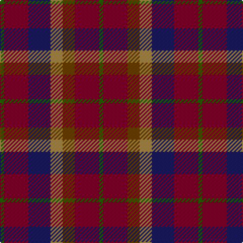

In pattern [GBBYGBG](/patterns/gbbygbg/).

This was sourced from register-of-tartans.  It is a [7 stripes tartan](/stripes/stripes7/).

Original link https://www.tartanregister.gov.uk/tartanDetails.aspx?ref=1648

## Attestations

This cloth appears in 2 source records; the oldest owns this page.

- 01/01/1988 — Heather MacRae (register-of-tartans, [record](https://www.tartanregister.gov.uk/tartanDetails.aspx?ref=1648))
- 1988 — Heather MacRae (Fashion) (tartans-authority, [record](http://www.tartansauthority.com/tartan-ferret/display/7044/))

## Thread count
G/4 DR24 DB22 LT12 T12 DR24 G/4

## Palette
Each colour and its ΔE from the base-6 reference it is a variant of.

| Colour | Shade | Base | ΔE (OKLab) |
|---|---|---|---|
| DB | <code style="background-color:#1C1C50;">#1C1C50</code> `#1C1C50` | B <code style="background-color:#2A418A;">#2A418A</code> | 0.14 |
| DR | <code style="background-color:#680028;">#680028</code> `#680028` | B <code style="background-color:#2A418A;">#2A418A</code> | 0.21 |
| G | <code style="background-color:#285800;">#285800</code> `#285800` | G <code style="background-color:#006100;">#006100</code> | 0.03 |
| LT | <code style="background-color:#A08858;">#A08858</code> `#A08858` | Y <code style="background-color:#F2BF00;">#F2BF00</code> | 0.21 |
| T | <code style="background-color:#604000;">#604000</code> `#604000` | G <code style="background-color:#006100;">#006100</code> | 0.14 |

# Sample pattern

## Nearest tartans

The nearest existing variants by ΔTartan distance.

1. [Lanark (Fashion #1)](/setts/s6/r1b3ba1g3ba5w1x4~b202060-ba680028-g006818-ra00000-wa8ace8/) — ΔT 1.33
1. [MacDuff Hunting Clan Tartan Tartan Number: 1654. Earliest known date: 1906 STS records (sic) 'Sett may be quite wrong. (S.S. May 86)' See products available Copyright © Blair Urquhart, Comrie, 2015](/setts/s8/g8r1g8ga8k8b8g8r2x2~b2c2c80-g604000-ga006818-k101010-rc80000/) — ΔT 1.52
1. [MacDuff Hunting](/setts/s8/b10r2b10g17k12ba9b9r2x2~b441800-ba2c2c80-g006818-k101010-rc80000/) — ΔT 1.54
1. [Wcwm 1310](/setts/s8/b10r3b10g14k12ba12b14r4x2~b441800-ba1c0070-g006818-k101010-r880000/) — ΔT 1.54
1. [McCurdy-Stribbling (Personal)](/setts/s5/b15ba20k12r34g3x2~b262753-ba236b8e-g7d776b-k111214-r80252e/) — ΔT 1.55
1. [Bristol Gramar School Check (School)](/setts/s6/r4b3ba12bb8b2r4~b447084-ba5c5c5c-bb1c1c50-rc80000/) — ΔT 1.55
1. [Clare, County](/setts/s10/r3b14g14b2r14b2r14g14b2y3x2~b440044-g003820-r880000-yd8b000/) — ΔT 1.55
1. [Akins Clan Tartan Tartan Number: 2426. Earliest known date: 1822 This is the `Approved` tartan for the Akins Clan See products available Copyright © Blair Urquhart, Comrie, 2015](/setts/s8/r12ra4r4ra4r4b11g12ba4x2~b003c64-ba5c8ca8-g003820-r880000-rac80000/) — ΔT 1.57
1. [Dorward/Dogwood](/setts/s7/g7r3g9ga15b19g14r4x2~b2c2c80-g604000-ga006818-rc80000/) — ΔT 1.57
1. [Ruben Delanghe (Personal)](/setts/s10/g14k5b2r21g18k4b18r9k2r12~b38388c-g0c442c-k101010-r940c0c/) — ΔT 1.60

## Neighbour map

Every grey dot is one of 15726 variants placed by the first two principal components of the ΔTartan feature space (44% of its variance). Red is this tartan; blue dots are its nearest — click one to open its page.

<svg viewBox="0 0 640 380" role="img" style="max-width:100%;height:auto;border:1px solid #e0e0e0;border-radius:4px;display:block" xmlns="http://www.w3.org/2000/svg"><image href="/nn/cloud.v1.png" width="640" height="380"/><a href="/setts/s6/r1b3ba1g3ba5w1x4~b202060-ba680028-g006818-ra00000-wa8ace8/"><circle cx="179.3" cy="242.6" r="4" fill="#3465a4"><title>Lanark (Fashion #1)</title></circle></a><a href="/setts/s8/g8r1g8ga8k8b8g8r2x2~b2c2c80-g604000-ga006818-k101010-rc80000/"><circle cx="214.3" cy="255.7" r="4" fill="#3465a4"><title>MacDuff Hunting Clan Tartan Tartan Number: 1654. Earliest known date: 1906 STS records (sic) 'Sett may be quite wrong. (S.S. May 86)' See products available Copyright © Blair Urquhart, Comrie, 2015</title></circle></a><a href="/setts/s8/b10r2b10g17k12ba9b9r2x2~b441800-ba2c2c80-g006818-k101010-rc80000/"><circle cx="189.6" cy="240.8" r="4" fill="#3465a4"><title>MacDuff Hunting</title></circle></a><a href="/setts/s8/b10r3b10g14k12ba12b14r4x2~b441800-ba1c0070-g006818-k101010-r880000/"><circle cx="173.1" cy="284.2" r="4" fill="#3465a4"><title>Wcwm 1310</title></circle></a><a href="/setts/s5/b15ba20k12r34g3x2~b262753-ba236b8e-g7d776b-k111214-r80252e/"><circle cx="230.0" cy="240.0" r="4" fill="#3465a4"><title>McCurdy-Stribbling (Personal)</title></circle></a><a href="/setts/s6/r4b3ba12bb8b2r4~b447084-ba5c5c5c-bb1c1c50-rc80000/"><circle cx="196.0" cy="259.4" r="4" fill="#3465a4"><title>Bristol Gramar School Check (School)</title></circle></a><a href="/setts/s10/r3b14g14b2r14b2r14g14b2y3x2~b440044-g003820-r880000-yd8b000/"><circle cx="231.0" cy="230.1" r="4" fill="#3465a4"><title>Clare, County</title></circle></a><a href="/setts/s8/r12ra4r4ra4r4b11g12ba4x2~b003c64-ba5c8ca8-g003820-r880000-rac80000/"><circle cx="129.0" cy="262.8" r="4" fill="#3465a4"><title>Akins Clan Tartan Tartan Number: 2426. Earliest known date: 1822 This is the `Approved` tartan for the Akins Clan See products available Copyright © Blair Urquhart, Comrie, 2015</title></circle></a><a href="/setts/s7/g7r3g9ga15b19g14r4x2~b2c2c80-g604000-ga006818-rc80000/"><circle cx="228.1" cy="271.9" r="4" fill="#3465a4"><title>Dorward/Dogwood</title></circle></a><a href="/setts/s10/g14k5b2r21g18k4b18r9k2r12~b38388c-g0c442c-k101010-r940c0c/"><circle cx="241.5" cy="224.5" r="4" fill="#3465a4"><title>Ruben Delanghe (Personal)</title></circle></a><circle cx="227.3" cy="251.0" r="5" fill="#c00000"/></svg>

ID: /setts/s7/g2b12ba11y6ga6b12g2x2~b680028-ba1c1c50-g285800-ga604000-ya08858/
