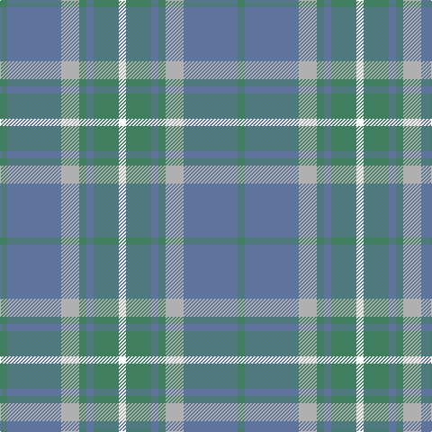

In pattern [GBYGBGW](/patterns/gbygbgw/).

This was sourced from register-of-tartans.  It is a [7 stripes tartan](/stripes/stripes7/).

Original link https://www.tartanregister.gov.uk/tartanDetails.aspx?ref=11350

## Register references

External register numbers recorded for this tartan.

- Scottish Register of Tartans: [11350](https://www.tartanregister.gov.uk/tartanDetails.aspx?ref=11350)

## Thread count
G/8 B60 N20 G8 B8 G28 W/8

## Palette
Each colour and its ΔE from the base-6 reference it is a variant of.

| Colour | Shade | Base | ΔE (OKLab) |
|---|---|---|---|
| B | <code style="background-color:#5F749C;">#5F749C</code> `#5F749C` | B <code style="background-color:#2A418A;">#2A418A</code> | 0.17 |
| G | <code style="background-color:#408060;">#408060</code> `#408060` | G <code style="background-color:#006100;">#006100</code> | 0.14 |
| N | <code style="background-color:#B0B0B0;">#B0B0B0</code> `#B0B0B0` | Y <code style="background-color:#F2BF00;">#F2BF00</code> | 0.18 |
| W | <code style="background-color:#FFFFFF;">#FFFFFF</code> `#FFFFFF` | W <code style="background-color:#F7F7F7;">#F7F7F7</code> | 0.02 |

# Sample pattern

## Nearest tartans

The nearest existing variants by ΔTartan distance.

1. [Irving of Glentulchan (Personal)](/setts/s6/r1y9ya9k1ya1w1~k101010-rc80000-we0e0e0-y70a880-ya80a0b4~x6/) — ΔT 1.33
1. [Dama Classic (Fashion)](/setts/s8/y30w3y3w3y12b30r3b5~b5c5c5c-r888888-wf0dcbc-ya0a0a0~x2/) — ΔT 1.41
1. [Bermuda (1986)](/setts/s5/b4w2g17b17y2~b2888c4-g009468-wfcfcfc-yd87c00~x4/) — ΔT 1.43
1. [Auld Lang Syne (Fashion)](/setts/s8/w1b1w1b7g7w1g1w1~b5c8ca8-g8c7038-w98c8e8~x6/) — ΔT 1.43
1. [Universal, Ancient](/setts/s8/b12g2b2g2b2r8ga8r1~b5480b0-g008000-ga30a010-r806050~x2/) — ΔT 1.45
1. [Lochnagar Plaid (District)](/setts/s6/w1b1r7ba4r1w1~b780078-ba5c5c5c-r888888-we0e0e0~x4/) — ΔT 1.51
1. [Organic](/setts/s9/g25b3g8b13y8ya2yb11g2b3~b9058d8-g669999-yc89800-yaa0a0a0-ybc4bc68~x2/) — ΔT 1.56
1. [Irving of Glentulchan (Personal)](/setts/s10/y9ya9k1ya1w1ya1k1ya9y9r1~k101010-rc80000-we0e0e0-y70a880-ya80a0b4~x6/) — ΔT 1.60
1. [Highland Road (Fashion)](/setts/s9/k3y15b3y4b3y4b10g30w3~b5c8ca8-g587478-k101010-we0e0e0-ya0a0a0~x2/) — ΔT 1.60
1. [Lochnagar Trade Tartan Tartan Number: 1771. Earliest known date: pre 2003 Colours represents the Scottish hills, the water, and the heather. See products available Copyright © Blair Urquhart, Comrie, 2015](/setts/s6/w1b1wa7r4wa1w1~b780078-r888888-we0e0e0-wac0c0c0~x4/) — ΔT 1.64

## Neighbour map

Every grey dot is one of 15726 variants placed by the first two principal components of the ΔTartan feature space (44% of its variance). Red is this tartan; blue dots are its nearest — click one to open its page.

<svg viewBox="0 0 640 380" role="img" style="max-width:100%;height:auto;border:1px solid #e0e0e0;border-radius:4px;display:block" xmlns="http://www.w3.org/2000/svg"><image href="/nn/cloud.v1.png" width="640" height="380"/><a href="/setts/s6/r1y9ya9k1ya1w1~k101010-rc80000-we0e0e0-y70a880-ya80a0b4~x6/"><circle cx="298.1" cy="205.1" r="4" fill="#3465a4"><title>Irving of Glentulchan (Personal)</title></circle></a><a href="/setts/s8/y30w3y3w3y12b30r3b5~b5c5c5c-r888888-wf0dcbc-ya0a0a0~x2/"><circle cx="343.0" cy="202.1" r="4" fill="#3465a4"><title>Dama Classic (Fashion)</title></circle></a><a href="/setts/s5/b4w2g17b17y2~b2888c4-g009468-wfcfcfc-yd87c00~x4/"><circle cx="332.6" cy="255.8" r="4" fill="#3465a4"><title>Bermuda (1986)</title></circle></a><a href="/setts/s8/w1b1w1b7g7w1g1w1~b5c8ca8-g8c7038-w98c8e8~x6/"><circle cx="317.3" cy="238.9" r="4" fill="#3465a4"><title>Auld Lang Syne (Fashion)</title></circle></a><a href="/setts/s8/b12g2b2g2b2r8ga8r1~b5480b0-g008000-ga30a010-r806050~x2/"><circle cx="288.3" cy="223.0" r="4" fill="#3465a4"><title>Universal, Ancient</title></circle></a><a href="/setts/s6/w1b1r7ba4r1w1~b780078-ba5c5c5c-r888888-we0e0e0~x4/"><circle cx="310.0" cy="226.8" r="4" fill="#3465a4"><title>Lochnagar Plaid (District)</title></circle></a><a href="/setts/s9/g25b3g8b13y8ya2yb11g2b3~b9058d8-g669999-yc89800-yaa0a0a0-ybc4bc68~x2/"><circle cx="268.5" cy="182.0" r="4" fill="#3465a4"><title>Organic</title></circle></a><a href="/setts/s10/y9ya9k1ya1w1ya1k1ya9y9r1~k101010-rc80000-we0e0e0-y70a880-ya80a0b4~x6/"><circle cx="314.0" cy="198.9" r="4" fill="#3465a4"><title>Irving of Glentulchan (Personal)</title></circle></a><a href="/setts/s9/k3y15b3y4b3y4b10g30w3~b5c8ca8-g587478-k101010-we0e0e0-ya0a0a0~x2/"><circle cx="266.6" cy="189.1" r="4" fill="#3465a4"><title>Highland Road (Fashion)</title></circle></a><a href="/setts/s6/w1b1wa7r4wa1w1~b780078-r888888-we0e0e0-wac0c0c0~x4/"><circle cx="317.9" cy="224.8" r="4" fill="#3465a4"><title>Lochnagar Trade Tartan Tartan Number: 1771. Earliest known date: pre 2003 Colours represents the Scottish hills, the water, and the heather. See products available Copyright © Blair Urquhart, Comrie, 2015</title></circle></a><circle cx="304.0" cy="234.2" r="5" fill="#c00000"/></svg>

ID: /setts/s7/g2b15y5g2b2g7w2~b5f749c-g408060-wffffff-yb0b0b0~x4/
