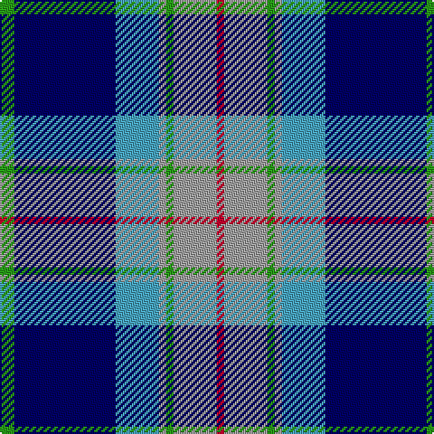

This page is one **sett** — a single exact thread-count. It belongs to the [tartan](/tartans/g2db14b6n1g1n6r1/)
(the same proportion at any scale), whose colour order is pattern [GBYYGYR](/stripes/gbyygyr/).

Sourced from register-of-tartans.  It is a [7 stripe tartan](/stripes/stripes7/).

Original link https://www.tartanregister.gov.uk/tartanDetails.aspx?ref=11569

## Register references

External register numbers recorded for this tartan.

- Scottish Register of Tartans: [11569](https://www.tartanregister.gov.uk/tartanDetails.aspx?ref=11569)

## Thread count
G/8 DB56 B24 N4 G4 N24 R/4

## Palette
Each colour and the base-6 reference it is a variant of.

| Colour | Shade | Base |
|---|---|---|
| B | <code style="background-color:#48A4C0;">#48A4C0</code> `oklch(67.5% 0.096 221.0)` <small>#48A4C0</small> | Y <code style="background-color:#F2BF00;">#F2BF00</code> |
| DB | <code style="background-color:#000064;">#000064</code> `oklch(22.7% 0.158 264.1)` <small>#000064</small> | B <code style="background-color:#2A418A;">#2A418A</code> |
| G | <code style="background-color:#289C18;">#289C18</code> `oklch(60.6% 0.191 141.6)` <small>#289C18</small> | G <code style="background-color:#006100;">#006100</code> |
| N | <code style="background-color:#A0A0A0;">#A0A0A0</code> `oklch(70.6% 0.000 89.9)` <small>#A0A0A0</small> | Y <code style="background-color:#F2BF00;">#F2BF00</code> |
| R | <code style="background-color:#C8002C;">#C8002C</code> `oklch(52.6% 0.212 22.0)` <small>#C8002C</small> | R <code style="background-color:#CC0000;">#CC0000</code> |

# Sample pattern

## Nearest tartans

The nearest existing variants by ΔTartan distance, with this tartan at the top so the swatches line up against it.

ΔTartan

Tartan

Sett

—

<a href="/ttd/edit/#slug=g2db14lg6lr1g1lr6r1~x4">Loch Ness in Scotland</a> <a class="nn-out" href="/setts/s7/g2db14lg6lr1g1lr6r1~x4/" title="open its dictionary page">↗</a>

0.70

<a href="/ttd/edit/#slug=w4k24ly2n24t5k4ly4~x2">Mina Perhonen</a> <a class="nn-out" href="/setts/s7/w4k24ly2n24t5k4ly4~x2/" title="open its dictionary page">↗</a>

0.72

<a href="/ttd/edit/#slug=r2t2r2t21lg11k17lb2~x2">Loch Ness (Fashion)</a> <a class="nn-out" href="/setts/s7/r2t2r2t21lg11k17lb2~x2/" title="open its dictionary page">↗</a>

0.97

<a href="/ttd/edit/#slug=db4r2db31k10g4w21g2~x2">Sinclair Dress (Dance)</a> <a class="nn-out" href="/setts/s7/db4r2db31k10g4w21g2~x2/" title="open its dictionary page">↗</a>

0.97

<a href="/ttd/edit/#slug=b30db3b3db3b3db10k10g20k2w4~x2">St Kentigern College</a> <a class="nn-out" href="/setts/s10/b30db3b3db3b3db10k10g20k2w4~x2/" title="open its dictionary page">↗</a>

1.00

<a href="/ttd/edit/#slug=t12k1t1k1t1db8w9y2~x4">Arran (Pendleton)</a> <a class="nn-out" href="/setts/s8/t12k1t1k1t1db8w9y2~x4/" title="open its dictionary page">↗</a>

1.02

<a href="/ttd/edit/#slug=w7b10k7b7t7b45k21g21t4k4w7~x2">Utah State University</a> <a class="nn-out" href="/setts/s11/w7b10k7b7t7b45k21g21t4k4w7~x2/" title="open its dictionary page">↗</a>

1.06

<a href="/ttd/edit/#slug=db2r1db16k5g2w11g1~x4">Sinclair dress</a> <a class="nn-out" href="/setts/s7/db2r1db16k5g2w11g1~x4/" title="open its dictionary page">↗</a>

1.11

<a href="/ttd/edit/#slug=t3k2g2k1db10w1~x8">Isle of Harris (District)</a> <a class="nn-out" href="/setts/s6/t3k2g2k1db10w1~x8/" title="open its dictionary page">↗</a>

1.11

<a href="/ttd/edit/#slug=r3dt25k6lb20ly2lb2w3~x2">Madras College (Corporate)</a> <a class="nn-out" href="/setts/s7/r3dt25k6lb20ly2lb2w3~x2/" title="open its dictionary page">↗</a>

1.15

<a href="/ttd/edit/#slug=w12db48k13o22k3ly6">Clunie (Personal)</a> <a class="nn-out" href="/setts/s6/w12db48k13o22k3ly6/" title="open its dictionary page">↗</a>

## Neighbour map

Every grey dot is one of 14299 variants placed by the first two principal components of the ΔTartan feature space (44% of its variance). Red is this tartan; blue dots are its nearest — click one to open its page.

<svg viewBox="0 0 640 380" role="img" style="max-width:100%;height:auto;border:1px solid #e0e0e0;border-radius:4px;display:block" xmlns="http://www.w3.org/2000/svg"><image href="/nn/cloud.v1.png" width="640" height="380"/><a href="/setts/s7/w4k24ly2n24t5k4ly4~x2/"><circle cx="187.5" cy="168.3" r="4" fill="#3465a4"><title>Mina Perhonen</title></circle></a><a href="/setts/s7/r2t2r2t21lg11k17lb2~x2/"><circle cx="169.5" cy="170.4" r="4" fill="#3465a4"><title>Loch Ness (Fashion)</title></circle></a><a href="/setts/s7/db4r2db31k10g4w21g2~x2/"><circle cx="213.9" cy="143.1" r="4" fill="#3465a4"><title>Sinclair Dress (Dance)</title></circle></a><a href="/setts/s10/b30db3b3db3b3db10k10g20k2w4~x2/"><circle cx="173.8" cy="142.1" r="4" fill="#3465a4"><title>St Kentigern College</title></circle></a><a href="/setts/s8/t12k1t1k1t1db8w9y2~x4/"><circle cx="158.3" cy="148.0" r="4" fill="#3465a4"><title>Arran (Pendleton)</title></circle></a><a href="/setts/s11/w7b10k7b7t7b45k21g21t4k4w7~x2/"><circle cx="169.1" cy="150.8" r="4" fill="#3465a4"><title>Utah State University</title></circle></a><a href="/setts/s7/db2r1db16k5g2w11g1~x4/"><circle cx="210.0" cy="139.2" r="4" fill="#3465a4"><title>Sinclair dress</title></circle></a><a href="/setts/s6/t3k2g2k1db10w1~x8/"><circle cx="243.4" cy="184.7" r="4" fill="#3465a4"><title>Isle of Harris (District)</title></circle></a><a href="/setts/s7/r3dt25k6lb20ly2lb2w3~x2/"><circle cx="172.0" cy="140.0" r="4" fill="#3465a4"><title>Madras College (Corporate)</title></circle></a><a href="/setts/s6/w12db48k13o22k3ly6/"><circle cx="197.6" cy="160.5" r="4" fill="#3465a4"><title>Clunie (Personal)</title></circle></a><circle cx="200.2" cy="156.6" r="5" fill="#c00000"/></svg>

ID: /setts/s7/g2db14lg6lr1g1lr6r1~x4/
