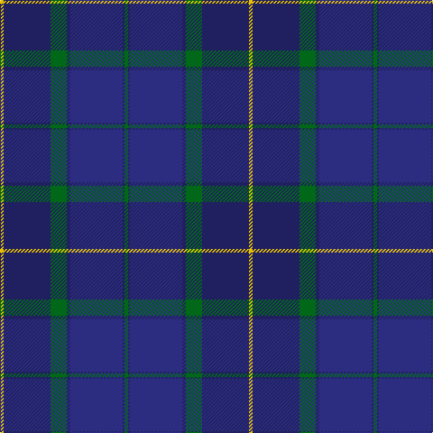

**Bands:** [YBGBBBG](/stripes/ybgbbbg/) · **Stripes:** [LY DB G DB DB DB G](/stripes/stripes7/) LY DB G DB DB DB G

This was sourced from tartans-authority.  It is a [7 band tartan](/bands/bands7/).

Original link http://www.tartansauthority.com/tartan-ferret/display/3916/

## Attestations

This cloth appears in 2 source records; the oldest owns this page.

- Dec. 2001 — Scottish Canals (Corporate) (tartans-authority, [record](http://www.tartansauthority.com/tartan-ferret/display/3916/))
- undated — Scottish Canals (register-of-tartans, [record](https://www.tartanregister.gov.uk/tartanDetails.aspx?ref=5424))

## Register references

External register numbers recorded for this tartan.

- Scottish Register of Tartans: [5424](https://www.tartanregister.gov.uk/tartanDetails.aspx?ref=5424)
- Scottish Tartans Authority (ITI): 3916

## Thread count
Y/4 DBa52 G18 DBa4 DB58 DBa2 G/4

## Palette
Each colour and its ΔE from the base-6 reference it is a variant of.

| Colour | Shade | Base | ΔE (OKLab) |
|---|---|---|---|
| DB | <code style="background-color:#2C2C80;">#2C2C80</code> `#2C2C80` | B <code style="background-color:#2A418A;">#2A418A</code> | 0.06 |
| DBa | <code style="background-color:#202060;">#202060</code> `#202060` | B <code style="background-color:#2A418A;">#2A418A</code> | 0.11 |
| G | <code style="background-color:#006818;">#006818</code> `#006818` | G <code style="background-color:#006100;">#006100</code> | 0.02 |
| Y | <code style="background-color:#E8C000;">#E8C000</code> `#E8C000` | Y <code style="background-color:#F2BF00;">#F2BF00</code> | 0.02 |

# Sample pattern

## Nearest tartans

The nearest existing variants by ΔTartan distance.

1. [Caledonian Canals (Corporate)](/setts/s7/dg2k1db29k2dg9k27lo2~x2/) — ΔT 1.34
1. [Monarchs](/setts/s6/db19k4dr1k4dg9dr1~x4/) — ΔT 1.40
1. [U.S. Navy/Edzell (Military)](/setts/s6/dt45db7w3db27r1db7~x2/) — ΔT 1.44
1. [Scottish Canals Corporate Tartan Tartan Number: 3916. Earliest known date: 2001 Designed by Claire Donaldson of House of Edgar for BWB. Initially called Highland Canals, later changed (April 2002) to Caledonian Canal and then in January 2003 to Scottish Canals. See products available Copyright © Blair Urquhart, Comrie, 2015](/setts/s12/g2db1db29db2g9db26ly2~x2/) — ΔT 1.48
1. [Pitceathly Chamberlain Tartan Tartan Number: 10190. Earliest known date: 2010 Designed for the 80th birthday of Sophia Joan Chamberlain nee Pitceathly for her own use and that of her immediate family. See products available Copyright © Blair Urquhart, Comrie, 2015](/setts/s10/db2k3dg5k7db20k2db5k2dg20lb1~x2/) — ΔT 1.50
1. [Doral](/setts/s7/db26dg6db2dg17dy4w1dy4~x4/) — ΔT 1.63
1. [Monarchs Corporate Sport Tartan Tartan Number: 2222. Earliest known date: 2002 Designed by Enid Brown of Lyle & Scott Ltd for Gleneagles Golf Developments. To be used for golf clothing and accessories. The Monarch's Course, created in the early 1990's by Jack Nicklaus, was renamed The PGA Centenary Course in February 2001 to celebrate the centenary year of The Professional Golfer's Association and is the selected venue for the 2014 Ryder Cup. See products available Copyright © Blair Urquhart, Comrie, 2015](/setts/s6/db19k4dr1k4dg9k1~x4/) — ΔT 1.64
1. [Raith Rovers Football Club](/setts/s8/dt3w2db2w3dt24r1db36r1~x2/) — ΔT 1.66
1. [Goldblatt, Joe, Jeff (Personal)](/setts/s9/dp6dt4k4dt26k12dp3db42ly4db4/) — ΔT 1.69
1. [Rangers Football Club #2](/setts/s11/r3db14k12db40k12db2k2db2k2db7r3~x2/) — ΔT 1.70

## Neighbour map

Every grey dot is one of 14299 variants placed by the first two principal components of the ΔTartan feature space (44% of its variance). Red is this tartan; blue dots are its nearest — click one to open its page.

<svg viewBox="0 0 640 380" role="img" style="max-width:100%;height:auto;border:1px solid #e0e0e0;border-radius:4px;display:block" xmlns="http://www.w3.org/2000/svg"><image href="/nn/cloud.v1.png" width="640" height="380"/><a href="/setts/s7/dg2k1db29k2dg9k27lo2~x2/"><circle cx="360.5" cy="201.6" r="4" fill="#3465a4"><title>Caledonian Canals (Corporate)</title></circle></a><a href="/setts/s6/db19k4dr1k4dg9dr1~x4/"><circle cx="380.9" cy="232.6" r="4" fill="#3465a4"><title>Monarchs</title></circle></a><a href="/setts/s6/dt45db7w3db27r1db7~x2/"><circle cx="450.4" cy="200.4" r="4" fill="#3465a4"><title>U.S. Navy/Edzell (Military)</title></circle></a><a href="/setts/s12/g2db1db29db2g9db26ly2~x2/"><circle cx="376.5" cy="198.2" r="4" fill="#3465a4"><title>Scottish Canals Corporate Tartan Tartan Number: 3916. Earliest known date: 2001 Designed by Claire Donaldson of House of Edgar for BWB. Initially called Highland Canals, later changed (April 2002) to Caledonian Canal and then in January 2003 to Scottish Canals. See products available Copyright © Blair Urquhart, Comrie, 2015</title></circle></a><a href="/setts/s10/db2k3dg5k7db20k2db5k2dg20lb1~x2/"><circle cx="330.9" cy="205.3" r="4" fill="#3465a4"><title>Pitceathly Chamberlain Tartan Tartan Number: 10190. Earliest known date: 2010 Designed for the 80th birthday of Sophia Joan Chamberlain nee Pitceathly for her own use and that of her immediate family. See products available Copyright © Blair Urquhart, Comrie, 2015</title></circle></a><a href="/setts/s7/db26dg6db2dg17dy4w1dy4~x4/"><circle cx="348.8" cy="199.2" r="4" fill="#3465a4"><title>Doral</title></circle></a><a href="/setts/s6/db19k4dr1k4dg9k1~x4/"><circle cx="351.1" cy="211.8" r="4" fill="#3465a4"><title>Monarchs Corporate Sport Tartan Tartan Number: 2222. Earliest known date: 2002 Designed by Enid Brown of Lyle &amp; Scott Ltd for Gleneagles Golf Developments. To be used for golf clothing and accessories. The Monarch's Course, created in the early 1990's by Jack Nicklaus, was renamed The PGA Centenary Course in February 2001 to celebrate the centenary year of The Professional Golfer's Association and is the selected venue for the 2014 Ryder Cup. See products available Copyright © Blair Urquhart, Comrie, 2015</title></circle></a><a href="/setts/s8/dt3w2db2w3dt24r1db36r1~x2/"><circle cx="383.0" cy="142.6" r="4" fill="#3465a4"><title>Raith Rovers Football Club</title></circle></a><a href="/setts/s9/dp6dt4k4dt26k12dp3db42ly4db4/"><circle cx="288.8" cy="191.0" r="4" fill="#3465a4"><title>Goldblatt, Joe, Jeff (Personal)</title></circle></a><a href="/setts/s11/r3db14k12db40k12db2k2db2k2db7r3~x2/"><circle cx="307.3" cy="175.3" r="4" fill="#3465a4"><title>Rangers Football Club #2</title></circle></a><circle cx="359.1" cy="199.0" r="5" fill="#c00000"/></svg>

ID: /setts/s7/g2db1db29db2g9db26ly2~x2/
