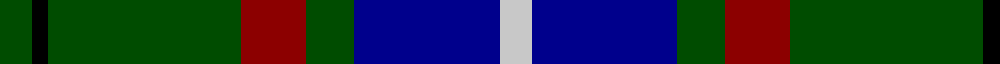
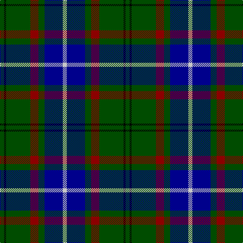

In pattern [GKGRGBW](/patterns/gkgrgbw/).

This was sourced from register-of-tartans.  It is a [7 stripes tartan](/stripes/stripes7/).

Original link https://www.tartanregister.gov.uk/tartanDetails.aspx?ref=2080

## Attestations

This cloth appears in 2 source records; the oldest owns this page.

- 01/01/1995 — Lee (Personal) (register-of-tartans, [record](https://www.tartanregister.gov.uk/tartanDetails.aspx?ref=2080))
- 1995 — Lee (Name) (tartans-authority, [record](http://www.tartansauthority.com/tartan-ferret/display/5407/))

## Register references

External register numbers recorded for this tartan.

- Scottish Register of Tartans: [2080](https://www.tartanregister.gov.uk/tartanDetails.aspx?ref=2080)
- Scottish Tartans Authority (ITI): 5407

## Thread count
G/8 K4 G48 DR16 G12 DB36 N/8

## Palette
Each colour and its ΔE from the base-6 reference it is a variant of.

| Colour | Shade | Base | ΔE (OKLab) |
|---|---|---|---|
| DB | <code style="background-color:#00008C;">#00008C</code> `#00008C` | B <code style="background-color:#2A418A;">#2A418A</code> | 0.13 |
| DR | <code style="background-color:#8C0000;">#8C0000</code> `#8C0000` | R <code style="background-color:#CC0000;">#CC0000</code> | 0.14 |
| G | <code style="background-color:#004C00;">#004C00</code> `#004C00` | G <code style="background-color:#006100;">#006100</code> | 0.07 |
| K | <code style="background-color:#000000;">#000000</code> `#000000` | K <code style="background-color:#000000;">#000000</code> | 0.00 |
| N | <code style="background-color:#C8C8C8;">#C8C8C8</code> `#C8C8C8` | W <code style="background-color:#F7F7F7;">#F7F7F7</code> | 0.14 |

# Sample pattern

## Nearest tartans

The nearest existing variants by ΔTartan distance.

1. [Gillies](/setts/s8/b32k12b12g6r6g18k2y3~b304080-g008000-k000000-rc00000-yf0c000~x2/) — ΔT 0.88
1. [Croy, Jake (Personal)](/setts/s8/b10k7w2wa2k27ba7w2ba7~b505050-ba1870a4-k1c1714-w82cffd-wae8ccb8~x2/) — ΔT 0.90
1. [City of Guelph](/setts/s8/g28k4g5b4g5k19ba19ga2~b600030-ba304080-g008000-ga908000-k000030~x2/) — ΔT 0.93
1. [Lossiemouth/Hersbruck](/setts/s6/g26b3g12k10ba15w2~b2c2c80-ba780078-g006818-k101010-we0e0e0~x2/) — ΔT 0.96
1. [Pride of Yorkland (Fashion)](/setts/s6/g35k3b26k4ba4w3~b2c2c80-ba1c0070-g006818-k101010-wfcfcfc~x2/) — ΔT 1.01
1. [Carmichael](/setts/s6/k5g32b32r3b3y3~b2c2c80-g006818-k000000-rc80000-ye8c000~x2/) — ΔT 1.01
1. [Maitland Chief](/setts/s9/g5b24g7k10g24y2b2y2r2~b2c2c80-g006818-k101010-rc80000-ye8c000~x2/) — ΔT 1.02
1. [Inglis Family Tartan Tartan Number: 1798. Earliest known date: 1930-50 Inglis, or Ingles, tartan is a variation of the MacIntyre tartan recognised by Lord Lyon. The green stripe of the MacIntyre is replaced by yellow in the Inglis tartan. The pattern comes from the collection of the late James MacKinlay which he called MacIntyre or Inglis. MacKinlay collected samples of tartan between 1930 and 1950 but did not provide details of the origins of the specimens. The original MacIntyre tartan can be seen on a doublet at the Kingussie museum dated 1800. It was registered in the Public Register of All Arms and Bearings in 1955. See products available Copyright © Blair Urquhart, Comrie, 2015](/setts/s6/w4g28b18r4b18y3~b2c2c80-g006818-rc80000-we0e0e0-ye8c000~x2/) — ΔT 1.03
1. [Fraser Gathering Hunting Trade Tartan Tartan Number: 2363. Earliest known date: 1997 Unknown until House of Edgar published their own Old and Rare. See products available Copyright © Blair Urquhart, Comrie, 2015](/setts/s9/r2b12g2ga11g4b5ga2g24w2~b202060-g003820-ga289c18-rc80000-we0e0e0~x2/) — ΔT 1.04
1. [Snodgrass Family Tartan Tartan Number: 1216. Earliest known date: 1978 Designed for the Snodgrass Clan Association. It is based on the Cunningham tartan, and the colours chosen were, Black, Green and Gold - of the Snodgrass Coat of Arms, Green - for the 'grasy place' (sic) alluded to in the name, and Blue - representing the traditional Highland 'Blue Bonnet'. See products available Copyright © Blair Urquhart, Comrie, 2015](/setts/s8/k3r1y1b11g13b5r1y1~b2c2c80-g006818-k101010-rc80000-ye8c000~x2/) — ΔT 1.06

## Neighbour map

Every grey dot is one of 15726 variants placed by the first two principal components of the ΔTartan feature space (44% of its variance). Red is this tartan; blue dots are its nearest — click one to open its page.

<svg viewBox="0 0 640 380" role="img" style="max-width:100%;height:auto;border:1px solid #e0e0e0;border-radius:4px;display:block" xmlns="http://www.w3.org/2000/svg"><image href="/nn/cloud.v1.png" width="640" height="380"/><a href="/setts/s8/b32k12b12g6r6g18k2y3~b304080-g008000-k000000-rc00000-yf0c000~x2/"><circle cx="218.8" cy="167.3" r="4" fill="#3465a4"><title>Gillies</title></circle></a><a href="/setts/s8/b10k7w2wa2k27ba7w2ba7~b505050-ba1870a4-k1c1714-w82cffd-wae8ccb8~x2/"><circle cx="264.0" cy="167.8" r="4" fill="#3465a4"><title>Croy, Jake (Personal)</title></circle></a><a href="/setts/s8/g28k4g5b4g5k19ba19ga2~b600030-ba304080-g008000-ga908000-k000030~x2/"><circle cx="205.8" cy="176.4" r="4" fill="#3465a4"><title>City of Guelph</title></circle></a><a href="/setts/s6/g26b3g12k10ba15w2~b2c2c80-ba780078-g006818-k101010-we0e0e0~x2/"><circle cx="273.2" cy="206.3" r="4" fill="#3465a4"><title>Lossiemouth/Hersbruck</title></circle></a><a href="/setts/s6/g35k3b26k4ba4w3~b2c2c80-ba1c0070-g006818-k101010-wfcfcfc~x2/"><circle cx="249.3" cy="185.0" r="4" fill="#3465a4"><title>Pride of Yorkland (Fashion)</title></circle></a><a href="/setts/s6/k5g32b32r3b3y3~b2c2c80-g006818-k000000-rc80000-ye8c000~x2/"><circle cx="247.5" cy="186.4" r="4" fill="#3465a4"><title>Carmichael</title></circle></a><a href="/setts/s9/g5b24g7k10g24y2b2y2r2~b2c2c80-g006818-k101010-rc80000-ye8c000~x2/"><circle cx="238.6" cy="169.4" r="4" fill="#3465a4"><title>Maitland Chief</title></circle></a><a href="/setts/s6/w4g28b18r4b18y3~b2c2c80-g006818-rc80000-we0e0e0-ye8c000~x2/"><circle cx="226.0" cy="208.0" r="4" fill="#3465a4"><title>Inglis Family Tartan Tartan Number: 1798. Earliest known date: 1930-50 Inglis, or Ingles, tartan is a variation of the MacIntyre tartan recognised by Lord Lyon. The green stripe of the MacIntyre is replaced by yellow in the Inglis tartan. The pattern comes from the collection of the late James MacKinlay which he called MacIntyre or Inglis. MacKinlay collected samples of tartan between 1930 and 1950 but did not provide details of the origins of the specimens. The original MacIntyre tartan can be seen on a doublet at the Kingussie museum dated 1800. It was registered in the Public Register of All Arms and Bearings in 1955. See products available Copyright © Blair Urquhart, Comrie, 2015</title></circle></a><a href="/setts/s9/r2b12g2ga11g4b5ga2g24w2~b202060-g003820-ga289c18-rc80000-we0e0e0~x2/"><circle cx="234.2" cy="170.5" r="4" fill="#3465a4"><title>Fraser Gathering Hunting Trade Tartan Tartan Number: 2363. Earliest known date: 1997 Unknown until House of Edgar published their own Old and Rare. See products available Copyright © Blair Urquhart, Comrie, 2015</title></circle></a><a href="/setts/s8/k3r1y1b11g13b5r1y1~b2c2c80-g006818-k101010-rc80000-ye8c000~x2/"><circle cx="237.9" cy="167.3" r="4" fill="#3465a4"><title>Snodgrass Family Tartan Tartan Number: 1216. Earliest known date: 1978 Designed for the Snodgrass Clan Association. It is based on the Cunningham tartan, and the colours chosen were, Black, Green and Gold - of the Snodgrass Coat of Arms, Green - for the 'grasy place' (sic) alluded to in the name, and Blue - representing the traditional Highland 'Blue Bonnet'. See products available Copyright © Blair Urquhart, Comrie, 2015</title></circle></a><circle cx="245.3" cy="192.9" r="5" fill="#c00000"/></svg>

ID: /setts/s7/g2k1g12r4g3b9w2~b00008c-g004c00-k000000-r8c0000-wc8c8c8~x4/
