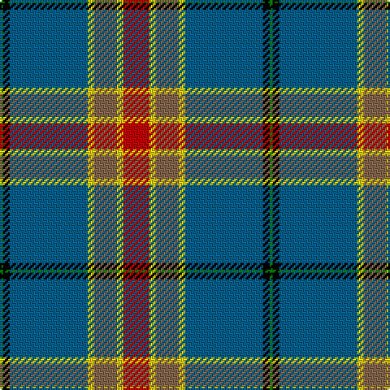

In pattern [GKBYRYR](/patterns/gkbyryr/).

This was sourced from weddslist.  It is a [7 stripes tartan](/stripes/stripes7/).

Original link http://www.weddslist.com/cgi-bin/tartans/pg.pl?source=misc

## Thread count
G/2 K4 B48 Y4 LT14 Y4 R/16

## Palette
Each colour and its ΔE from the base-6 reference it is a variant of.

| Colour | Shade | Base | ΔE (OKLab) |
|---|---|---|---|
| B | <code style="background-color:#005F8C;">#005F8C</code> `#005F8C` | B <code style="background-color:#2C4084;">#2C4084</code> | 0.09 |
| G | <code style="background-color:#008000;">#008000</code> `#008000` | G <code style="background-color:#006400;">#006400</code> | 0.09 |
| K | <code style="background-color:#000000;">#000000</code> `#000000` | K <code style="background-color:#000000;">#000000</code> | 0.00 |
| LT | <code style="background-color:#82644B;">#82644B</code> `#82644B` | R <code style="background-color:#C80000;">#C80000</code> | 0.17 |
| R | <code style="background-color:#C10000;">#C10000</code> `#C10000` | R <code style="background-color:#C80000;">#C80000</code> | 0.01 |
| Y | <code style="background-color:#EFCC09;">#EFCC09</code> `#EFCC09` | Y <code style="background-color:#E8C000;">#E8C000</code> | 0.03 |

# Sample pattern

ID: /setts/s7/g2k4b48y4r14y4ra16-b005f8c-g008000-k000000-r82644b-rac10000-yefcc09/
