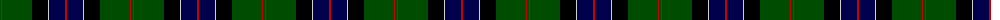
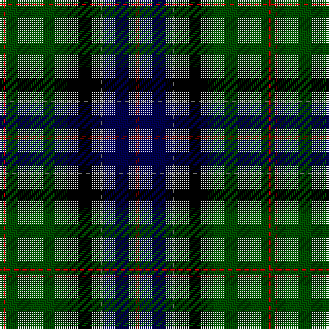

In pattern [GRGKWBR](/patterns/grgkwbr/).

This was sourced from weddslist.  It is a [7 stripes tartan](/stripes/stripes7/).

Original link http://www.weddslist.com/cgi-bin/tartans/pg.pl?source=rb

## Thread count
G/2 R1 G30 K16 N1 DB16 R/2

## Palette
Each colour and its ΔE from the base-6 reference it is a variant of.

| Colour | Shade | Base | ΔE (OKLab) |
|---|---|---|---|
| DB | <code style="background-color:#00004C;">#00004C</code> `#00004C` | B <code style="background-color:#2A418A;">#2A418A</code> | 0.21 |
| G | <code style="background-color:#004C00;">#004C00</code> `#004C00` | G <code style="background-color:#006100;">#006100</code> | 0.07 |
| K | <code style="background-color:#000000;">#000000</code> `#000000` | K <code style="background-color:#000000;">#000000</code> | 0.00 |
| N | <code style="background-color:#D0D0D0;">#D0D0D0</code> `#D0D0D0` | W <code style="background-color:#F7F7F7;">#F7F7F7</code> | 0.12 |
| R | <code style="background-color:#C80000;">#C80000</code> `#C80000` | R <code style="background-color:#CC0000;">#CC0000</code> | 0.01 |

# Sample pattern

## Nearest tartans

The nearest existing variants by ΔTartan distance.

1. [Sinclair Hunting](/setts/s7/g4r2g60k32y2b32r4-b000052-g11450d-k000000-raa0000-yaaaaaa/) — ΔT 0.45
1. [Sinclair Hunting](/setts/s7/g2r1g30k16y1b16r2-b000052-g11450d-k000000-raa0000-yaaaaaa/) — ΔT 0.45
1. [MacDonnald of ye Ylis](/setts/s9/y8g60k2g2k2g6k24b20r6-b000052-g11450d-k000000-raa0000-yaaaaaa/) — ΔT 0.83
1. [Colquhoun VS](/setts/s7/b4k2b16w1k8g24r4-b000064-g004c00-k000000-rc80000-wd0d0d0/) — ΔT 0.94
1. [Ogilvy VS](/setts/s8/b56y2b4k32g48k2g4r6-b00004c-g004c00-k000000-rc80000-yffc800/) — ΔT 0.98
1. [Fergusson](/setts/s7/b24k8g8r2g8k1w2-b00004c-g004c00-k000000-rc80000-wd0d0d0/) — ΔT 1.02
1. [Colqhoun VS](/setts/s7/b8k4b32y2k16g48r8-b000052-g11450d-k000000-raa0000-yaaaaaa/) — ΔT 1.04
1. [Colqhoun VS](/setts/s7/b4k2b16y1k8g24r4-b000052-g11450d-k000000-raa0000-yaaaaaa/) — ΔT 1.04
1. [MacDonnald of ye Ylis](/setts/s9/w4g30k1g1k1g3k12b10r3-b00004c-g004c00-k000000-rc80000-wd0d0d0/) — ΔT 1.05
1. [Ogilvy Hunting](/setts/s9/b48y4k16g32k2g6k2g6r8-b00004c-g004c00-k000000-rc80000-yffc800/) — ΔT 1.09

## Neighbour map

Every grey dot is one of 15726 variants placed by the first two principal components of the ΔTartan feature space (44% of its variance). Red is this tartan; blue dots are its nearest — click one to open its page.

<svg viewBox="0 0 640 380" role="img" style="max-width:100%;height:auto;border:1px solid #e0e0e0;border-radius:4px;display:block" xmlns="http://www.w3.org/2000/svg"><image href="/nn/cloud.v1.png" width="640" height="380"/><a href="/setts/s7/g4r2g60k32y2b32r4-b000052-g11450d-k000000-raa0000-yaaaaaa/"><circle cx="287.4" cy="149.7" r="4" fill="#3465a4"><title>Sinclair Hunting</title></circle></a><a href="/setts/s7/g2r1g30k16y1b16r2-b000052-g11450d-k000000-raa0000-yaaaaaa/"><circle cx="287.4" cy="149.7" r="4" fill="#3465a4"><title>Sinclair Hunting</title></circle></a><a href="/setts/s9/y8g60k2g2k2g6k24b20r6-b000052-g11450d-k000000-raa0000-yaaaaaa/"><circle cx="299.3" cy="122.0" r="4" fill="#3465a4"><title>MacDonnald of ye Ylis</title></circle></a><a href="/setts/s7/b4k2b16w1k8g24r4-b000064-g004c00-k000000-rc80000-wd0d0d0/"><circle cx="227.2" cy="159.2" r="4" fill="#3465a4"><title>Colquhoun VS</title></circle></a><a href="/setts/s8/b56y2b4k32g48k2g4r6-b00004c-g004c00-k000000-rc80000-yffc800/"><circle cx="243.9" cy="142.4" r="4" fill="#3465a4"><title>Ogilvy VS</title></circle></a><a href="/setts/s7/b24k8g8r2g8k1w2-b00004c-g004c00-k000000-rc80000-wd0d0d0/"><circle cx="248.7" cy="158.4" r="4" fill="#3465a4"><title>Fergusson</title></circle></a><a href="/setts/s7/b8k4b32y2k16g48r8-b000052-g11450d-k000000-raa0000-yaaaaaa/"><circle cx="243.2" cy="166.2" r="4" fill="#3465a4"><title>Colqhoun VS</title></circle></a><a href="/setts/s7/b4k2b16y1k8g24r4-b000052-g11450d-k000000-raa0000-yaaaaaa/"><circle cx="243.2" cy="166.2" r="4" fill="#3465a4"><title>Colqhoun VS</title></circle></a><a href="/setts/s9/w4g30k1g1k1g3k12b10r3-b00004c-g004c00-k000000-rc80000-wd0d0d0/"><circle cx="285.1" cy="116.1" r="4" fill="#3465a4"><title>MacDonnald of ye Ylis</title></circle></a><a href="/setts/s9/b48y4k16g32k2g6k2g6r8-b00004c-g004c00-k000000-rc80000-yffc800/"><circle cx="219.7" cy="135.6" r="4" fill="#3465a4"><title>Ogilvy Hunting</title></circle></a><circle cx="275.0" cy="144.8" r="5" fill="#c00000"/></svg>

ID: /setts/s7/g2r1g30k16w1b16r2-b00004c-g004c00-k000000-rc80000-wd0d0d0/
