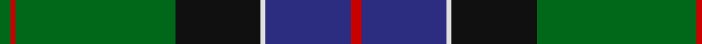
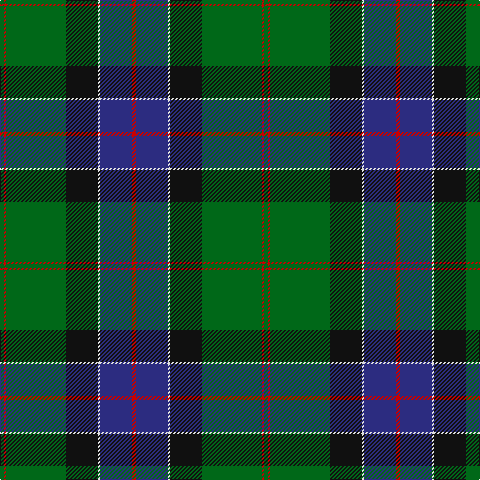

In pattern [GRGKWBR](/patterns/grgkwbr/).

This was sourced from register-of-tartans.  It is a [7 stripes tartan](/stripes/stripes7/).

Original link https://www.tartanregister.gov.uk/tartanDetails.aspx?ref=3797

## Attestations

This cloth appears in 3 source records; the oldest owns this page.

- undated — Sinclair Hunting (VS) (register-of-tartans, [record](https://www.tartanregister.gov.uk/tartanDetails.aspx?ref=3797))
- Unknown — Sinclair Htg (VS) (Clan) (tartans-authority, [record](http://www.tartansauthority.com/tartan-ferret/display/889/))
- undated — Sinclair Hunting Clan Tartan Tartan Number: 889. Earliest known date: 1842 Sinclairs wore a green tartan at the Battle of Flodden where the entire contingent were killed save the drummer. See products available Copyright © Blair Urquhart, Comrie, 2015 (house-of-tartan, [record](http://www.house-of-tartan.scotland.net/house/TartanViewjs.asp?colr=Def&tnam=889))

## Thread count
G/4 R2 G60 K32 LN2 DB32 R/4

## Palette
Each colour and its ΔE from the base-6 reference it is a variant of.

| Colour | Shade | Base | ΔE (OKLab) |
|---|---|---|---|
| DB | <code style="background-color:#2C2C80;">#2C2C80</code> `#2C2C80` | B <code style="background-color:#2A418A;">#2A418A</code> | 0.06 |
| G | <code style="background-color:#006818;">#006818</code> `#006818` | G <code style="background-color:#006100;">#006100</code> | 0.02 |
| K | <code style="background-color:#101010;">#101010</code> `#101010` | K <code style="background-color:#000000;">#000000</code> | 0.17 |
| LN | <code style="background-color:#E0E0E0;">#E0E0E0</code> `#E0E0E0` | W <code style="background-color:#F7F7F7;">#F7F7F7</code> | 0.07 |
| R | <code style="background-color:#C80000;">#C80000</code> `#C80000` | R <code style="background-color:#CC0000;">#CC0000</code> | 0.01 |

# Sample pattern

## Nearest tartans

The nearest existing variants by ΔTartan distance.

1. [Mackay, John W. (Personal)](/setts/s9/k4g35y1k18g3b18r3g3r3x2~b1c0070-g006818-k101010-r880000-yd09800/) — ΔT 0.63
1. [Lowry Clan Tartan Tartan Number: 3203. Earliest known date: 2000 One of a set of three similar designs for Laurie, Lawrie and Lowry, designed by Peter MacDonald for Iain Laurie. See products available Copyright © Blair Urquhart, Comrie, 2015](/setts/s7/b6y2b1g25ba16k2ba4x2~b440044-ba2c2c80-g006818-k101010-ye8c000/) — ΔT 0.73
1. [McFadden (Personal)](/setts/s8/b18ba2b16k13g3k2g42y3x2~b1c0070-ba6c0070-g006818-k101010-yd09800/) — ΔT 0.87
1. [Hutchens (Personal)](/setts/s9/b10k12g3k1g1k1g30w4y4x2~b1c1c50-g003820-k101010-we0e0e0-ybc8c00/) — ΔT 0.96
1. [Laurie Clan Tartan Tartan Number: 3201. Earliest known date: 2000 One of a set of three similar designs for Laurie, Lawrie and Lowry, designed by Peter MacDonald for Iain Laurie. See products available Copyright © Blair Urquhart, Comrie, 2015](/setts/s7/b6r2b1g25ba16k2ba4x2~b440044-ba2c2c80-g006818-k101010-rc80000/) — ΔT 1.00
1. [MacLaren Clan Tartan Tartan Number: 342. Earliest known date: pre 1820 The MacLaren differs from The Ferguson only in having a yellow line where the latter has a white. They share the unusual feature of an unbroken band of blue. The present tartan appears under this name in Mclan's plate for Clan MacLaren. The Wilsons of Bannockburn were producing it before 1820 - but only under the name of 'Regent'. The Regency ended when George IV succeeded the throne in that year, the name of the tartan then becoming outdated; but production of the sett continued, as we know from specimens attached to customers' orders for more. Writers of the period tell us that the demand around 1822 for Clan tartans exceeded the authentic supply, and that not only were new setts invented but pre-existing ones acquired new names. Our present tartan may have been one of the latter; no older MacLaren has come to light. (MacLaren Society) See products available Copyright © Blair Urquhart, Comrie, 2015](/setts/s7/b24k8g8r2g8k1y2x2~b2c2c80-g006818-k101010-rc80000-ye8c000/) — ΔT 1.03
1. [Sarafilovic (Corporate)](/setts/s9/r4b15k18g3k2g2k2g44y4x2~b2c2c80-g006818-k101010-rc80000-ye8c000/) — ΔT 1.09
1. [MacDonald of the Isles VS Clan Tartan Tartan Number: 1366. Earliest known date: 1842 The design first appeared in the Vestiarium Scoticum and is different from earlier setts attributed to the Lord of the Isles or to any of the Clan Donald branches. It is not generally regarded as a clan tartan. The Sobieski Stuart brothers who published the Vestiarium claimed to be the heirs to a manuscript once in the hands of Prince Charles Edward himself but the original was never produced for public examination. The book appears to be a curious mixture of fact and fiction in keeping with the romantic ideals of the Victorian era. See products available Copyright © Blair Urquhart, Comrie, 2015](/setts/s9/w4g30k1g1k1g3k12b10r3x2~b2c2c80-g006818-k101010-rc80000-we0e0e0/) — ΔT 1.09
1. [Lawrie Clan Tartan Tartan Number: 3202. Earliest known date: 2000 One of a set of three similar designs for Laurie, Lawrie and Lowry, designed by Peter MacDonald for Iain Laurie. See products available Copyright © Blair Urquhart, Comrie, 2015](/setts/s7/b6r2b1g25ba16k2ba4x2~b440044-ba2c2c80-g006818-k101010-r945008/) — ΔT 1.12
1. [Young](/setts/s8/b3ba3g30b25bb4r3y2bb1x2~b1c1c50-ba2888c4-bb6c0070-g006818-rc8002c-ye8c000/) — ΔT 1.14

## Neighbour map

Every grey dot is one of 15726 variants placed by the first two principal components of the ΔTartan feature space (44% of its variance). Red is this tartan; blue dots are its nearest — click one to open its page.

<svg viewBox="0 0 640 380" role="img" style="max-width:100%;height:auto;border:1px solid #e0e0e0;border-radius:4px;display:block" xmlns="http://www.w3.org/2000/svg"><image href="/nn/cloud.v1.png" width="640" height="380"/><a href="/setts/s9/k4g35y1k18g3b18r3g3r3x2~b1c0070-g006818-k101010-r880000-yd09800/"><circle cx="291.4" cy="129.1" r="4" fill="#3465a4"><title>Mackay, John W. (Personal)</title></circle></a><a href="/setts/s7/b6y2b1g25ba16k2ba4x2~b440044-ba2c2c80-g006818-k101010-ye8c000/"><circle cx="282.7" cy="155.1" r="4" fill="#3465a4"><title>Lowry Clan Tartan Tartan Number: 3203. Earliest known date: 2000 One of a set of three similar designs for Laurie, Lawrie and Lowry, designed by Peter MacDonald for Iain Laurie. See products available Copyright © Blair Urquhart, Comrie, 2015</title></circle></a><a href="/setts/s8/b18ba2b16k13g3k2g42y3x2~b1c0070-ba6c0070-g006818-k101010-yd09800/"><circle cx="267.1" cy="156.0" r="4" fill="#3465a4"><title>McFadden (Personal)</title></circle></a><a href="/setts/s9/b10k12g3k1g1k1g30w4y4x2~b1c1c50-g003820-k101010-we0e0e0-ybc8c00/"><circle cx="308.8" cy="128.9" r="4" fill="#3465a4"><title>Hutchens (Personal)</title></circle></a><a href="/setts/s7/b6r2b1g25ba16k2ba4x2~b440044-ba2c2c80-g006818-k101010-rc80000/"><circle cx="296.9" cy="160.1" r="4" fill="#3465a4"><title>Laurie Clan Tartan Tartan Number: 3201. Earliest known date: 2000 One of a set of three similar designs for Laurie, Lawrie and Lowry, designed by Peter MacDonald for Iain Laurie. See products available Copyright © Blair Urquhart, Comrie, 2015</title></circle></a><a href="/setts/s7/b24k8g8r2g8k1y2x2~b2c2c80-g006818-k101010-rc80000-ye8c000/"><circle cx="264.3" cy="158.1" r="4" fill="#3465a4"><title>MacLaren Clan Tartan Tartan Number: 342. Earliest known date: pre 1820 The MacLaren differs from The Ferguson only in having a yellow line where the latter has a white. They share the unusual feature of an unbroken band of blue. The present tartan appears under this name in Mclan's plate for Clan MacLaren. The Wilsons of Bannockburn were producing it before 1820 - but only under the name of 'Regent'. The Regency ended when George IV succeeded the throne in that year, the name of the tartan then becoming outdated; but production of the sett continued, as we know from specimens attached to customers' orders for more. Writers of the period tell us that the demand around 1822 for Clan tartans exceeded the authentic supply, and that not only were new setts invented but pre-existing ones acquired new names. Our present tartan may have been one of the latter; no older MacLaren has come to light. (MacLaren Society) See products available Copyright © Blair Urquhart, Comrie, 2015</title></circle></a><a href="/setts/s9/r4b15k18g3k2g2k2g44y4x2~b2c2c80-g006818-k101010-rc80000-ye8c000/"><circle cx="299.7" cy="132.3" r="4" fill="#3465a4"><title>Sarafilovic (Corporate)</title></circle></a><a href="/setts/s9/w4g30k1g1k1g3k12b10r3x2~b2c2c80-g006818-k101010-rc80000-we0e0e0/"><circle cx="296.4" cy="117.6" r="4" fill="#3465a4"><title>MacDonald of the Isles VS Clan Tartan Tartan Number: 1366. Earliest known date: 1842 The design first appeared in the Vestiarium Scoticum and is different from earlier setts attributed to the Lord of the Isles or to any of the Clan Donald branches. It is not generally regarded as a clan tartan. The Sobieski Stuart brothers who published the Vestiarium claimed to be the heirs to a manuscript once in the hands of Prince Charles Edward himself but the original was never produced for public examination. The book appears to be a curious mixture of fact and fiction in keeping with the romantic ideals of the Victorian era. See products available Copyright © Blair Urquhart, Comrie, 2015</title></circle></a><a href="/setts/s7/b6r2b1g25ba16k2ba4x2~b440044-ba2c2c80-g006818-k101010-r945008/"><circle cx="301.9" cy="162.9" r="4" fill="#3465a4"><title>Lawrie Clan Tartan Tartan Number: 3202. Earliest known date: 2000 One of a set of three similar designs for Laurie, Lawrie and Lowry, designed by Peter MacDonald for Iain Laurie. See products available Copyright © Blair Urquhart, Comrie, 2015</title></circle></a><a href="/setts/s8/b3ba3g30b25bb4r3y2bb1x2~b1c1c50-ba2888c4-bb6c0070-g006818-rc8002c-ye8c000/"><circle cx="265.7" cy="112.5" r="4" fill="#3465a4"><title>Young</title></circle></a><circle cx="289.4" cy="146.0" r="5" fill="#c00000"/></svg>

ID: /setts/s7/g2r1g30k16w1b16r2x2~b2c2c80-g006818-k101010-rc80000-we0e0e0/
