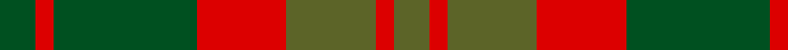

In pattern [GRGRGRG](/patterns/grgrgrg/).

This was sourced from register-of-tartans.  It is a [7 stripes tartan](/stripes/stripes7/).

Original link https://www.tartanregister.gov.uk/tartanDetails.aspx?ref=1377

## Thread count
G/8 R4 G32 R20 Ga20 R4 Ga/8

## Palette
Each colour and its ΔE from the base-6 reference it is a variant of.

| Colour | Shade | Base | ΔE (OKLab) |
|---|---|---|---|
| G | <code style="background-color:#005020;">#005020</code> `#005020` | G <code style="background-color:#006100;">#006100</code> | 0.07 |
| Ga | <code style="background-color:#5C6428;">#5C6428</code> `#5C6428` | G <code style="background-color:#006100;">#006100</code> | 0.10 |
| R | <code style="background-color:#DC0000;">#DC0000</code> `#DC0000` | R <code style="background-color:#CC0000;">#CC0000</code> | 0.03 |

# Sample pattern

## Nearest tartans

The nearest existing variants by ΔTartan distance.

1. [Glen Esk (Fashion)](/setts/s7/g2r1g8r5ga5r1ga2~g004c00-ga6c6c00-rc80000~x4/) — ΔT 0.39
1. [Dewar](/setts/s10/g1ga1g7ga4r7ga1r7ga4g7ga1~g006818-ga604000-rc80000~x4/) — ΔT 1.02
1. [Chindecella Gorse (Kemete Heil)](/setts/s8/r9b4r4b4r24g19b19g4~b241b1e-g4f4232-r8c6627~x2/) — ΔT 1.12
1. [Harmony 8](/setts/s5/b2g10r15b10g2~b401000-g808080-r906030~x4/) — ΔT 1.12
1. [Scott Htg (Clan)](/setts/s8/r3g16ga10r3ga3w2ga3r3~g604000-ga006818-rc80000-wc0c0c0~x2/) — ΔT 1.16
1. [MacNab, Variant](/setts/s6/g1r1g7r4ra7r1~g008000-r900030-rac00000~x4/) — ΔT 1.22
1. [Heil, Rudiger (Personal)](/setts/s8/y6b2y2b2y18b13ba13b2~b5c5c5c-ba003c64-ybc8c00~x2/) — ΔT 1.28
1. [Ballantrae (Dalgety)](/setts/s7/g5r3g31ga20g3gb22r5~g604000-ga003820-gb289c18-rc80000~x2/) — ΔT 1.36
1. [Loch Rannoch Trade Tartan Tartan Number: 1735. Earliest known date: 1975 Nothing See products available Copyright © Blair Urquhart, Comrie, 2015](/setts/s8/b24g2b5y14g2y5ga17b2~b441800-g006818-ga604000-ya08858~x2/) — ΔT 1.39
1. [Harmony, 6](/setts/s5/b2g10r15b10g2~b800070-g008000-r806050~x4/) — ΔT 1.39

## Neighbour map

Every grey dot is one of 15726 variants placed by the first two principal components of the ΔTartan feature space (44% of its variance). Red is this tartan; blue dots are its nearest — click one to open its page.

<svg viewBox="0 0 640 380" role="img" style="max-width:100%;height:auto;border:1px solid #e0e0e0;border-radius:4px;display:block" xmlns="http://www.w3.org/2000/svg"><image href="/nn/cloud.v1.png" width="640" height="380"/><a href="/setts/s7/g2r1g8r5ga5r1ga2~g004c00-ga6c6c00-rc80000~x4/"><circle cx="272.5" cy="255.0" r="4" fill="#3465a4"><title>Glen Esk (Fashion)</title></circle></a><a href="/setts/s10/g1ga1g7ga4r7ga1r7ga4g7ga1~g006818-ga604000-rc80000~x4/"><circle cx="252.2" cy="248.5" r="4" fill="#3465a4"><title>Dewar</title></circle></a><a href="/setts/s8/r9b4r4b4r24g19b19g4~b241b1e-g4f4232-r8c6627~x2/"><circle cx="280.2" cy="267.0" r="4" fill="#3465a4"><title>Chindecella Gorse (Kemete Heil)</title></circle></a><a href="/setts/s5/b2g10r15b10g2~b401000-g808080-r906030~x4/"><circle cx="256.1" cy="273.1" r="4" fill="#3465a4"><title>Harmony 8</title></circle></a><a href="/setts/s8/r3g16ga10r3ga3w2ga3r3~g604000-ga006818-rc80000-wc0c0c0~x2/"><circle cx="246.8" cy="220.1" r="4" fill="#3465a4"><title>Scott Htg (Clan)</title></circle></a><a href="/setts/s6/g1r1g7r4ra7r1~g008000-r900030-rac00000~x4/"><circle cx="251.4" cy="246.8" r="4" fill="#3465a4"><title>MacNab, Variant</title></circle></a><a href="/setts/s8/y6b2y2b2y18b13ba13b2~b5c5c5c-ba003c64-ybc8c00~x2/"><circle cx="278.0" cy="224.9" r="4" fill="#3465a4"><title>Heil, Rudiger (Personal)</title></circle></a><a href="/setts/s7/g5r3g31ga20g3gb22r5~g604000-ga003820-gb289c18-rc80000~x2/"><circle cx="260.0" cy="220.0" r="4" fill="#3465a4"><title>Ballantrae (Dalgety)</title></circle></a><a href="/setts/s8/b24g2b5y14g2y5ga17b2~b441800-g006818-ga604000-ya08858~x2/"><circle cx="276.5" cy="201.4" r="4" fill="#3465a4"><title>Loch Rannoch Trade Tartan Tartan Number: 1735. Earliest known date: 1975 Nothing See products available Copyright © Blair Urquhart, Comrie, 2015</title></circle></a><a href="/setts/s5/b2g10r15b10g2~b800070-g008000-r806050~x4/"><circle cx="252.5" cy="273.6" r="4" fill="#3465a4"><title>Harmony, 6</title></circle></a><circle cx="270.1" cy="253.4" r="5" fill="#c00000"/></svg>

ID: /setts/s7/g2r1g8r5ga5r1ga2~g005020-ga5c6428-rdc0000~x4/
