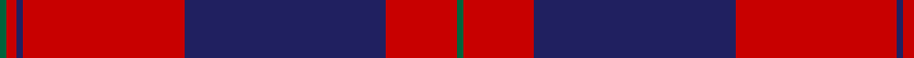

In pattern [GRBRBRG](/patterns/grbrbrg/).

This was sourced from register-of-tartans.  It is a [7 stripes tartan](/stripes/stripes7/).

Original link https://www.tartanregister.gov.uk/tartanDetails.aspx?ref=1270

## Register references

External register numbers recorded for this tartan.

- Scottish Register of Tartans: [1270](https://www.tartanregister.gov.uk/tartanDetails.aspx?ref=1270)
- Scottish Tartans Authority (ITI): 837
- Scottish Tartans World Register: 837

## Thread count
G/4 R6 DB4 R96 DB120 R42 G/4

## Palette
Each colour and its ΔE from the base-6 reference it is a variant of.

| Colour | Shade | Base | ΔE (OKLab) |
|---|---|---|---|
| DB | <code style="background-color:#202060;">#202060</code> `#202060` | B <code style="background-color:#2A418A;">#2A418A</code> | 0.11 |
| G | <code style="background-color:#00643C;">#00643C</code> `#00643C` | G <code style="background-color:#006100;">#006100</code> | 0.05 |
| R | <code style="background-color:#C80000;">#C80000</code> `#C80000` | R <code style="background-color:#CC0000;">#CC0000</code> | 0.01 |

# Sample pattern

## Nearest tartans

The nearest existing variants by ΔTartan distance.

1. [Double Elvis Gallery (Corporate)](/setts/s6/r40b15k2ba1b15k6~b2c2c80-ba440044-k101010-rc80000~x2/) — ΔT 1.25
1. [Leslie Clan Tartan Tartan Number: 1142. Earliest known date: 1842 The Vestarium Scoticum See products available Copyright © Blair Urquhart, Comrie, 2015](/setts/s8/r4k6y1k6r4b16r32k1~b2c2c80-k101010-rc80000-ye8c000~x2/) — ΔT 1.29
1. [Greater Victoria Police PB (Corp)](/setts/s7/r7b1r26b31w1b1w2~b14283c-r880000-we0e0e0~x2/) — ΔT 1.32
1. [Mens Bigi](/setts/s8/y4k17r1k4r2k4r33w3~k101010-r901c38-wfcfcfc-yd87c00~x2/) — ΔT 1.34
1. [Unidentified Plaid #12](/setts/s8/b3r64b3r3b62r3b3r3~b2c4084-rdc0000/) — ΔT 1.35
1. [Robberstad](/setts/s9/r60b15r4ba10w2ba10w2ba10r4~b3850c8-ba003c64-rc80000-wf8f8f8~x2/) — ΔT 1.43
1. [Las Vegas Fire Fighters](/setts/s8/r1k3w2k28r30k1r2w1~k101010-rc80000-wc0c0c0~x2/) — ΔT 1.43
1. [Knights Templar - Grand Priory (Corp](/setts/s8/b1r2w1b30r30k1r2w1~b1c0070-k101010-ra00000-wfcfcfc~x2/) — ΔT 1.45
1. [Rosser (Welsh Name)](/setts/s6/r16k57r36k2r4r2~k101010-rc80000/) — ΔT 1.48
1. [Caledonian](/setts/s6/r60b20r8g45r8b2~b5a008c-g005020-rdc0000~x2/) — ΔT 1.50

## Neighbour map

Every grey dot is one of 15726 variants placed by the first two principal components of the ΔTartan feature space (44% of its variance). Red is this tartan; blue dots are its nearest — click one to open its page.

<svg viewBox="0 0 640 380" role="img" style="max-width:100%;height:auto;border:1px solid #e0e0e0;border-radius:4px;display:block" xmlns="http://www.w3.org/2000/svg"><image href="/nn/cloud.v1.png" width="640" height="380"/><a href="/setts/s6/r40b15k2ba1b15k6~b2c2c80-ba440044-k101010-rc80000~x2/"><circle cx="367.8" cy="146.1" r="4" fill="#3465a4"><title>Double Elvis Gallery (Corporate)</title></circle></a><a href="/setts/s8/r4k6y1k6r4b16r32k1~b2c2c80-k101010-rc80000-ye8c000~x2/"><circle cx="377.2" cy="129.1" r="4" fill="#3465a4"><title>Leslie Clan Tartan Tartan Number: 1142. Earliest known date: 1842 The Vestarium Scoticum See products available Copyright © Blair Urquhart, Comrie, 2015</title></circle></a><a href="/setts/s7/r7b1r26b31w1b1w2~b14283c-r880000-we0e0e0~x2/"><circle cx="409.7" cy="167.9" r="4" fill="#3465a4"><title>Greater Victoria Police PB (Corp)</title></circle></a><a href="/setts/s8/y4k17r1k4r2k4r33w3~k101010-r901c38-wfcfcfc-yd87c00~x2/"><circle cx="363.9" cy="125.6" r="4" fill="#3465a4"><title>Mens Bigi</title></circle></a><a href="/setts/s8/b3r64b3r3b62r3b3r3~b2c4084-rdc0000/"><circle cx="432.5" cy="164.1" r="4" fill="#3465a4"><title>Unidentified Plaid #12</title></circle></a><a href="/setts/s9/r60b15r4ba10w2ba10w2ba10r4~b3850c8-ba003c64-rc80000-wf8f8f8~x2/"><circle cx="386.7" cy="114.1" r="4" fill="#3465a4"><title>Robberstad</title></circle></a><a href="/setts/s8/r1k3w2k28r30k1r2w1~k101010-rc80000-wc0c0c0~x2/"><circle cx="381.8" cy="132.7" r="4" fill="#3465a4"><title>Las Vegas Fire Fighters</title></circle></a><a href="/setts/s8/b1r2w1b30r30k1r2w1~b1c0070-k101010-ra00000-wfcfcfc~x2/"><circle cx="381.8" cy="120.9" r="4" fill="#3465a4"><title>Knights Templar - Grand Priory (Corp</title></circle></a><a href="/setts/s6/r16k57r36k2r4r2~k101010-rc80000/"><circle cx="361.9" cy="169.9" r="4" fill="#3465a4"><title>Rosser (Welsh Name)</title></circle></a><a href="/setts/s6/r60b20r8g45r8b2~b5a008c-g005020-rdc0000~x2/"><circle cx="370.4" cy="175.5" r="4" fill="#3465a4"><title>Caledonian</title></circle></a><circle cx="410.1" cy="158.4" r="5" fill="#c00000"/></svg>

ID: /setts/s7/g2r21b60r48b2r3g2~b202060-g00643c-rc80000~x2/
