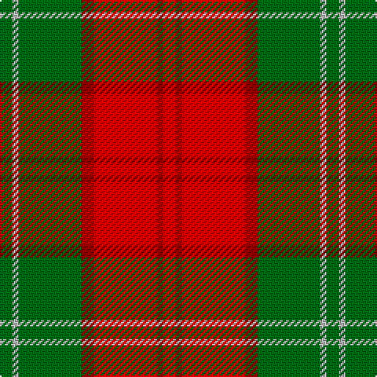

In pattern [GYGRRRR](/patterns/gygrrrr/).

This was sourced from register-of-tartans.  It is a [7 stripes tartan](/stripes/stripes7/).

Original link https://www.tartanregister.gov.uk/tartanDetails.aspx?ref=2096

## Attestations

This cloth appears in 2 source records; the oldest owns this page.

- 01/01/1893 — Lennox (register-of-tartans, [record](https://www.tartanregister.gov.uk/tartanDetails.aspx?ref=2096))
- 1893 — Lennox (District & Clan) (tartans-authority, [record](http://www.tartansauthority.com/tartan-ferret/display/935/))

## Thread count
G/8 N4 G40 DR8 R40 DR4 R/8

## Palette
Each colour and its ΔE from the base-6 reference it is a variant of.

| Colour | Shade | Base | ΔE (OKLab) |
|---|---|---|---|
| DR | <code style="background-color:#880000;">#880000</code> `#880000` | R <code style="background-color:#CC0000;">#CC0000</code> | 0.15 |
| G | <code style="background-color:#006818;">#006818</code> `#006818` | G <code style="background-color:#006100;">#006100</code> | 0.02 |
| N | <code style="background-color:#B8B8B8;">#B8B8B8</code> `#B8B8B8` | Y <code style="background-color:#F2BF00;">#F2BF00</code> | 0.17 |
| R | <code style="background-color:#C80000;">#C80000</code> `#C80000` | R <code style="background-color:#CC0000;">#CC0000</code> | 0.01 |

# Sample pattern

## Nearest tartans

The nearest existing variants by ΔTartan distance.

1. [Lennox District Tartan Tartan Number: 935. Earliest known date: pre 1600 Families with the surname 'Lennox' are usually considered related to Clans Stewart or MacFarlane. Some of this surname also choose to wear the distinctive and ancient 'Lennox' tartan. D W Stewart reproduced the sett from a 'lost' portrait of the Countess of Lennox dating from the 16th century. See products available Copyright © Blair Urquhart, Comrie, 2015](/setts/s7/g2w1g10r2ra10r1ra2~g006818-r880000-rac80000-we0e0e0~x2/) — ΔT 0.27
1. [Lennox](/setts/s7/g2w1g10r2ra10r1ra2~g008000-r800000-rac00000-we0e0e0~x2/) — ΔT 0.60
1. [MacNab 6](/setts/s7/g28r7ra7g14ra7r48k4~g008000-k000000-rc00000-ra802040~x2/) — ΔT 0.73
1. [Burnett](/setts/s8/g4r29ga3r4ga14y3ga14r4~g789484-ga006818-rc80000-yd8b000~x2/) — ΔT 0.76
1. [Cetoloni (Personal)](/setts/s6/b1r12g6y1g6b1~b2c2c80-g006818-rc80000-ye8c000~x4/) — ΔT 0.80
1. [MacNab 5](/setts/s7/g6r2ra2g4ra2r12k1~g008000-k000000-rc00000-ra900030~x2/) — ΔT 0.82
1. [Moray of Abercairney](/setts/s6/r8ra1g4ra1g1b2~b5480b0-g008000-rc00000-rad03030~x2/) — ΔT 0.95
1. [Scrymgeour](/setts/s7/g15k1r2b3g2k1r15~b304080-g908000-k000000-rc00000~x6/) — ΔT 0.96
1. [MacNab (Crimson)](/setts/s7/g28r7ra7g14ra7r48k4~g005020-k101010-rdc0000-ra781c38~x2/) — ΔT 1.00
1. [Loch Rannoch #2](/setts/s8/g24ga2g5r14ga2r5y17g2~g604000-ga289c18-re86000-ydc943c~x2/) — ΔT 1.05

## Neighbour map

Every grey dot is one of 15726 variants placed by the first two principal components of the ΔTartan feature space (44% of its variance). Red is this tartan; blue dots are its nearest — click one to open its page.

<svg viewBox="0 0 640 380" role="img" style="max-width:100%;height:auto;border:1px solid #e0e0e0;border-radius:4px;display:block" xmlns="http://www.w3.org/2000/svg"><image href="/nn/cloud.v1.png" width="640" height="380"/><a href="/setts/s7/g2w1g10r2ra10r1ra2~g006818-r880000-rac80000-we0e0e0~x2/"><circle cx="276.5" cy="193.8" r="4" fill="#3465a4"><title>Lennox District Tartan Tartan Number: 935. Earliest known date: pre 1600 Families with the surname 'Lennox' are usually considered related to Clans Stewart or MacFarlane. Some of this surname also choose to wear the distinctive and ancient 'Lennox' tartan. D W Stewart reproduced the sett from a 'lost' portrait of the Countess of Lennox dating from the 16th century. See products available Copyright © Blair Urquhart, Comrie, 2015</title></circle></a><a href="/setts/s7/g2w1g10r2ra10r1ra2~g008000-r800000-rac00000-we0e0e0~x2/"><circle cx="269.3" cy="191.6" r="4" fill="#3465a4"><title>Lennox</title></circle></a><a href="/setts/s7/g28r7ra7g14ra7r48k4~g008000-k000000-rc00000-ra802040~x2/"><circle cx="288.8" cy="188.0" r="4" fill="#3465a4"><title>MacNab 6</title></circle></a><a href="/setts/s8/g4r29ga3r4ga14y3ga14r4~g789484-ga006818-rc80000-yd8b000~x2/"><circle cx="308.3" cy="194.2" r="4" fill="#3465a4"><title>Burnett</title></circle></a><a href="/setts/s6/b1r12g6y1g6b1~b2c2c80-g006818-rc80000-ye8c000~x4/"><circle cx="287.4" cy="198.6" r="4" fill="#3465a4"><title>Cetoloni (Personal)</title></circle></a><a href="/setts/s7/g6r2ra2g4ra2r12k1~g008000-k000000-rc00000-ra900030~x2/"><circle cx="287.7" cy="191.4" r="4" fill="#3465a4"><title>MacNab 5</title></circle></a><a href="/setts/s6/r8ra1g4ra1g1b2~b5480b0-g008000-rc00000-rad03030~x2/"><circle cx="278.1" cy="213.1" r="4" fill="#3465a4"><title>Moray of Abercairney</title></circle></a><a href="/setts/s7/g15k1r2b3g2k1r15~b304080-g908000-k000000-rc00000~x6/"><circle cx="305.5" cy="167.2" r="4" fill="#3465a4"><title>Scrymgeour</title></circle></a><a href="/setts/s7/g28r7ra7g14ra7r48k4~g005020-k101010-rdc0000-ra781c38~x2/"><circle cx="298.0" cy="188.7" r="4" fill="#3465a4"><title>MacNab (Crimson)</title></circle></a><a href="/setts/s8/g24ga2g5r14ga2r5y17g2~g604000-ga289c18-re86000-ydc943c~x2/"><circle cx="268.8" cy="186.1" r="4" fill="#3465a4"><title>Loch Rannoch #2</title></circle></a><circle cx="284.5" cy="197.1" r="5" fill="#c00000"/></svg>

ID: /setts/s7/g2y1g10r2ra10r1ra2~g006818-r880000-rac80000-yb8b8b8~x4/
