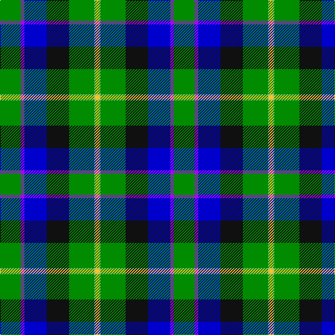

In pattern [GBBKGYY](/patterns/gbbkgyy/).

This was sourced from register-of-tartans.  It is a [7 stripes tartan](/stripes/stripes7/).

Original link https://www.tartanregister.gov.uk/tartanDetails.aspx?ref=487

## Register references

External register numbers recorded for this tartan.

- Scottish Register of Tartans: [487](https://www.tartanregister.gov.uk/tartanDetails.aspx?ref=487)
- Scottish Tartans Authority (ITI): 5978

## Thread count
G/30 P5 B32 K32 G36 LG2 Y/5

## Palette
Each colour and its ΔE from the base-6 reference it is a variant of.

| Colour | Shade | Base | ΔE (OKLab) |
|---|---|---|---|
| B | <code style="background-color:#0000CD;">#0000CD</code> `#0000CD` | B <code style="background-color:#2A418A;">#2A418A</code> | 0.14 |
| G | <code style="background-color:#008B00;">#008B00</code> `#008B00` | G <code style="background-color:#006100;">#006100</code> | 0.13 |
| K | <code style="background-color:#101010;">#101010</code> `#101010` | K <code style="background-color:#000000;">#000000</code> | 0.17 |
| LG | <code style="background-color:#86C67C;">#86C67C</code> `#86C67C` | Y <code style="background-color:#F2BF00;">#F2BF00</code> | 0.15 |
| P | <code style="background-color:#AA00FF;">#AA00FF</code> `#AA00FF` | B <code style="background-color:#2A418A;">#2A418A</code> | 0.28 |
| Y | <code style="background-color:#FFC125;">#FFC125</code> `#FFC125` | Y <code style="background-color:#F2BF00;">#F2BF00</code> | 0.02 |

# Sample pattern

## Nearest tartans

The nearest existing variants by ΔTartan distance.

1. [East Lothian](/setts/s7/b6ba17bb4ba2k11g33y4~b5480b0-ba304080-bb800080-g008000-k000000-yf0c000~x2/) — ΔT 1.14
1. [Hogg Dress](/setts/s9/b34r3b8ba4b8k24g34k2w6~b2888c4-ba003c64-g006818-k101010-rc80000-wffffff/) — ΔT 1.27
1. [Tooth](/setts/s8/g5y1r2g25k14b19w4g2~b304080-g008000-k000000-rc00000-we0e0e0-yf0c000~x2/) — ΔT 1.30
1. [Wishart, hunting](/setts/s7/k2b2g16ba2y1ba13w2~b304080-ba000050-g008000-k000000-we0e0e0-yf0c000~x2/) — ΔT 1.36
1. [Gillies (House of Edgar)](/setts/s8/b32k12b12g6r6g18k2y3~b1474b4-g289c18-k101010-rc80000-ye8c000~x2/) — ΔT 1.39
1. [Official Glasgow 2014, The](/setts/s6/k3g44b27y6r10w3~b0000cd-g2a8a0f-k101010-rff0000-wffffff-yffe600~x2/) — ΔT 1.41
1. [Sirens & Swords](/setts/s6/b36g20ga6w12k6r3~b0c4252-g789484-ga003c14-k1c1714-r960028-wffffff~x2/) — ΔT 1.43
1. [MacMillan, hunting](/setts/s9/b10y3b30y5k8g16r4g16r2~b304080-g008000-k000000-rd03030-yf0c000~x2/) — ΔT 1.44
1. [City of Guelph](/setts/s8/g28k4g5b4g5k19ba19ga2~b600030-ba304080-g008000-ga908000-k000030~x2/) — ΔT 1.45
1. [Ayrshire (District)](/setts/s8/b2r1b10w1g4ga8y1ga2~b1c0070-g785000-ga30ac38-r880000-we0e0e0-ybc8c00~x4/) — ΔT 1.45

## Neighbour map

Every grey dot is one of 15726 variants placed by the first two principal components of the ΔTartan feature space (44% of its variance). Red is this tartan; blue dots are its nearest — click one to open its page.

<svg viewBox="0 0 640 380" role="img" style="max-width:100%;height:auto;border:1px solid #e0e0e0;border-radius:4px;display:block" xmlns="http://www.w3.org/2000/svg"><image href="/nn/cloud.v1.png" width="640" height="380"/><a href="/setts/s7/b6ba17bb4ba2k11g33y4~b5480b0-ba304080-bb800080-g008000-k000000-yf0c000~x2/"><circle cx="167.0" cy="142.8" r="4" fill="#3465a4"><title>East Lothian</title></circle></a><a href="/setts/s9/b34r3b8ba4b8k24g34k2w6~b2888c4-ba003c64-g006818-k101010-rc80000-wffffff/"><circle cx="164.3" cy="133.3" r="4" fill="#3465a4"><title>Hogg Dress</title></circle></a><a href="/setts/s8/g5y1r2g25k14b19w4g2~b304080-g008000-k000000-rc00000-we0e0e0-yf0c000~x2/"><circle cx="190.7" cy="120.0" r="4" fill="#3465a4"><title>Tooth</title></circle></a><a href="/setts/s7/k2b2g16ba2y1ba13w2~b304080-ba000050-g008000-k000000-we0e0e0-yf0c000~x2/"><circle cx="190.1" cy="138.0" r="4" fill="#3465a4"><title>Wishart, hunting</title></circle></a><a href="/setts/s8/b32k12b12g6r6g18k2y3~b1474b4-g289c18-k101010-rc80000-ye8c000~x2/"><circle cx="220.9" cy="167.5" r="4" fill="#3465a4"><title>Gillies (House of Edgar)</title></circle></a><a href="/setts/s6/k3g44b27y6r10w3~b0000cd-g2a8a0f-k101010-rff0000-wffffff-yffe600~x2/"><circle cx="188.4" cy="141.5" r="4" fill="#3465a4"><title>Official Glasgow 2014, The</title></circle></a><a href="/setts/s6/b36g20ga6w12k6r3~b0c4252-g789484-ga003c14-k1c1714-r960028-wffffff~x2/"><circle cx="151.0" cy="162.1" r="4" fill="#3465a4"><title>Sirens &amp; Swords</title></circle></a><a href="/setts/s9/b10y3b30y5k8g16r4g16r2~b304080-g008000-k000000-rd03030-yf0c000~x2/"><circle cx="185.7" cy="160.6" r="4" fill="#3465a4"><title>MacMillan, hunting</title></circle></a><a href="/setts/s8/g28k4g5b4g5k19ba19ga2~b600030-ba304080-g008000-ga908000-k000030~x2/"><circle cx="205.8" cy="176.4" r="4" fill="#3465a4"><title>City of Guelph</title></circle></a><a href="/setts/s8/b2r1b10w1g4ga8y1ga2~b1c0070-g785000-ga30ac38-r880000-we0e0e0-ybc8c00~x4/"><circle cx="149.3" cy="152.6" r="4" fill="#3465a4"><title>Ayrshire (District)</title></circle></a><circle cx="170.8" cy="160.4" r="5" fill="#c00000"/></svg>

ID: /setts/s7/g30b5ba32k32g36y2ya5~baa00ff-ba0000cd-g008b00-k101010-y86c67c-yaffc125/
