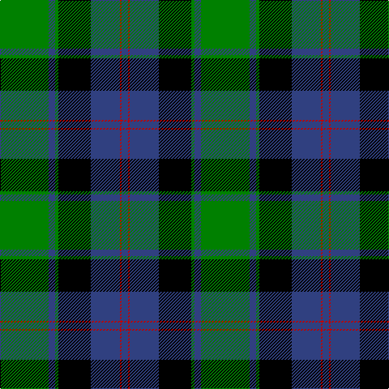

In pattern [BRBKGBG](/stripes/brbkgbg/).

This was sourced from weddslist.  It is a [7 stripe tartan](/stripes/stripes7/).

Original link http://www.weddslist.com/cgi-bin/tartans/pg.pl?source=sts

## Thread count
G/60 B8 G4 K40 B36 R2 B/8

## Palette
Each colour and the base-6 reference it is a variant of.

| Colour | Shade | Base |
|---|---|---|
| B | <code style="background-color:#304080;">#304080</code> `oklch(39.4% 0.109 270.2)` <small>#304080</small> | B <code style="background-color:#2A418A;">#2A418A</code> |
| G | <code style="background-color:#008000;">#008000</code> `oklch(52.0% 0.177 142.5)` <small>#008000</small> | G <code style="background-color:#006100;">#006100</code> |
| K | <code style="background-color:#000000;">#000000</code> `oklch(0.0% 0.000 0.0)` <small>#000000</small> | K <code style="background-color:#000000;">#000000</code> |
| R | <code style="background-color:#C00000;">#C00000</code> `oklch(50.7% 0.208 29.2)` <small>#C00000</small> | R <code style="background-color:#CC0000;">#CC0000</code> |

# Sample pattern

## Nearest tartans

The nearest existing variants by ΔTartan distance.

1. [Common Kilt](/setts/s8/r3k2db25k28g25k2r1db2~x2/) — ΔT 0.95
1. [Johnstone / Johnston](/setts/s8/k3db3k3db22g26k2db1ly3~x2/) — ΔT 1.04
1. [Colquhoun](/setts/s7/db4k2db16w1k8g24r4~x2/) — ΔT 1.05
1. [MacLaren](/setts/s7/db24k8g8r2g8k1ly2~x2/) — ΔT 1.17
1. [Hebridean Old](/setts/s9/k2db3g16b1k13b1db18k2db2~x2/) — ΔT 1.20
1. [Lochaber District](/setts/s8/g2r1g16k12r1t16g1t2~x2/) — ΔT 1.21
1. [Ferguson of Athol](/setts/s7/db24k8g8r2g8k1w2~x2/) — ΔT 1.22
1. [Lochaber](/setts/s8/g3r1g18k20r1db18t1g2~x4/) — ΔT 1.25
1. [Ogilvie 1](/setts/s9/db24ly2k8g16k1g3k1g3r4~x2/) — ΔT 1.31
1. [Blair](/setts/s7/db4r1db18k20g18r1g4~x2/) — ΔT 1.31

## Neighbour map

Every grey dot is one of 14299 variants placed by the first two principal components of the ΔTartan feature space (44% of its variance). Red is this tartan; blue dots are its nearest — click one to open its page.

<svg viewBox="0 0 640 380" role="img" style="max-width:100%;height:auto;border:1px solid #e0e0e0;border-radius:4px;display:block" xmlns="http://www.w3.org/2000/svg"><image href="/nn/cloud.v1.png" width="640" height="380"/><a href="/setts/s8/r3k2db25k28g25k2r1db2~x2/"><circle cx="224.9" cy="145.9" r="4" fill="#3465a4"><title>Common Kilt</title></circle></a><a href="/setts/s8/k3db3k3db22g26k2db1ly3~x2/"><circle cx="267.0" cy="142.7" r="4" fill="#3465a4"><title>Johnstone / Johnston</title></circle></a><a href="/setts/s7/db4k2db16w1k8g24r4~x2/"><circle cx="212.9" cy="148.6" r="4" fill="#3465a4"><title>Colquhoun</title></circle></a><a href="/setts/s7/db24k8g8r2g8k1ly2~x2/"><circle cx="236.5" cy="147.1" r="4" fill="#3465a4"><title>MacLaren</title></circle></a><a href="/setts/s9/k2db3g16b1k13b1db18k2db2~x2/"><circle cx="220.6" cy="160.3" r="4" fill="#3465a4"><title>Hebridean Old</title></circle></a><a href="/setts/s8/g2r1g16k12r1t16g1t2~x2/"><circle cx="209.1" cy="166.5" r="4" fill="#3465a4"><title>Lochaber District</title></circle></a><a href="/setts/s7/db24k8g8r2g8k1w2~x2/"><circle cx="234.9" cy="146.5" r="4" fill="#3465a4"><title>Ferguson of Athol</title></circle></a><a href="/setts/s8/g3r1g18k20r1db18t1g2~x4/"><circle cx="189.6" cy="143.5" r="4" fill="#3465a4"><title>Lochaber</title></circle></a><a href="/setts/s9/db24ly2k8g16k1g3k1g3r4~x2/"><circle cx="210.4" cy="126.6" r="4" fill="#3465a4"><title>Ogilvie 1</title></circle></a><a href="/setts/s7/db4r1db18k20g18r1g4~x2/"><circle cx="205.4" cy="184.8" r="4" fill="#3465a4"><title>Blair</title></circle></a><circle cx="244.0" cy="160.7" r="5" fill="#c00000"/></svg>

ID: /setts/s7/g30db4g2k20db18r1db4~x2/
