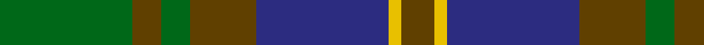
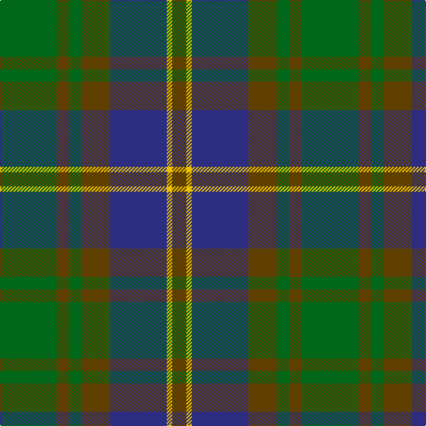

In pattern [GGGGBYG](/patterns/ggggbyg/).

This was sourced from tartans-authority.  It is a [7 stripes tartan](/stripes/stripes7/).

Original link http://www.tartansauthority.com/tartan-ferret/display/2259/

## Attestations

This cloth appears in 2 source records; the oldest owns this page.

- Sep. 1995 — Strange of Balcaskie (Clan) (tartans-authority, [record](http://www.tartansauthority.com/tartan-ferret/display/2259/))
- undated — Strange of Balcaskie Family Tartan Tartan Number: 2259. Earliest known date: 1996 Designed by Kenny Dalgliesh of D C Dalgliesh of Selkirk and recorded in Lyon Court Book. LCB101 on 11th June 1996. Lyon count: G64 Brown14 G14 Brown32 B64 Y6 Brown16. Full counts at pivots. Green and blue lightened to show sett. See products available Copyright © Blair Urquhart, Comrie, 2015 (house-of-tartan, [record](http://www.house-of-tartan.scotland.net/house/TartanViewjs.asp?colr=Def&tnam=2259))

## Thread count
G/64 T14 G14 T32 DB64 Y6 T/16

## Palette
Each colour and its ΔE from the base-6 reference it is a variant of.

| Colour | Shade | Base | ΔE (OKLab) |
|---|---|---|---|
| DB | <code style="background-color:#2C2C80;">#2C2C80</code> `#2C2C80` | B <code style="background-color:#2A418A;">#2A418A</code> | 0.06 |
| G | <code style="background-color:#006818;">#006818</code> `#006818` | G <code style="background-color:#006100;">#006100</code> | 0.02 |
| T | <code style="background-color:#604000;">#604000</code> `#604000` | G <code style="background-color:#006100;">#006100</code> | 0.14 |
| Y | <code style="background-color:#E8C000;">#E8C000</code> `#E8C000` | Y <code style="background-color:#F2BF00;">#F2BF00</code> | 0.02 |

# Sample pattern

## Nearest tartans

The nearest existing variants by ΔTartan distance.

1. [Strange Of Balcaskie](/setts/s7/g32r7g7r16b32y3r8x2~b304080-g008000-r806050-yf0c000/) — ΔT 0.68
1. [Tupper. Sir Charles.. Family Tartan Tartan Number: 614. Earliest known date: 1983 From Canada. See products available Copyright © Blair Urquhart, Comrie, 2015](/setts/s10/b4g7y3g12ga15g5b20g5ga4g2x2~b2c2c80-g604000-ga006818-ye8c000/) — ΔT 0.86
1. [Thompson/Thomson/MacTavish Hunting](/setts/s6/b4g28ga6b12k12b3x2~b3c82af-g503c14-ga005020-k101010/) — ΔT 0.89
1. [Montrose (1983)](/setts/s6/g6y3g26k10b30w3x2~b5c5c5c-g004c2c-k101010-wc0c0c0-ybca010/) — ΔT 1.02
1. [Tupper., Sir Charles..](/setts/s10/b4r7y3r12g15r5b20r5g4r2x2~b304080-g008000-r806050-yf0c000/) — ΔT 1.04
1. [Scottish Airports (Corporate)](/setts/s6/b4g18b3k17b18ba4x2~b3c505c-ba780078-g006818-k101010/) — ΔT 1.14
1. [Ferguson of Balquhidder](/setts/s6/g2b12r1k12g12k2x2~b2c4084-g005020-k101010-rdc0000/) — ΔT 1.14
1. [Eastern Western Motor Group, Dalbraith](/setts/s8/g28ga2g4b18ga23b2ga3y4x2~b202060-g604000-ga006818-ya08858/) — ΔT 1.15
1. [Scottish Airports](/setts/s6/b4g18b3k17b18ba4x2~b3c505c-ba9058d8-g006818-k101010/) — ΔT 1.15
1. [Reidy Wedding](/setts/s7/g31ga7y3ga14g8b18ba5x2~b2c4084-ba780078-g146000-ga002814-yd87c00/) — ΔT 1.17

## Neighbour map

Every grey dot is one of 15726 variants placed by the first two principal components of the ΔTartan feature space (44% of its variance). Red is this tartan; blue dots are its nearest — click one to open its page.

<svg viewBox="0 0 640 380" role="img" style="max-width:100%;height:auto;border:1px solid #e0e0e0;border-radius:4px;display:block" xmlns="http://www.w3.org/2000/svg"><image href="/nn/cloud.v1.png" width="640" height="380"/><a href="/setts/s7/g32r7g7r16b32y3r8x2~b304080-g008000-r806050-yf0c000/"><circle cx="235.6" cy="228.0" r="4" fill="#3465a4"><title>Strange Of Balcaskie</title></circle></a><a href="/setts/s10/b4g7y3g12ga15g5b20g5ga4g2x2~b2c2c80-g604000-ga006818-ye8c000/"><circle cx="239.3" cy="218.6" r="4" fill="#3465a4"><title>Tupper. Sir Charles.. Family Tartan Tartan Number: 614. Earliest known date: 1983 From Canada. See products available Copyright © Blair Urquhart, Comrie, 2015</title></circle></a><a href="/setts/s6/b4g28ga6b12k12b3x2~b3c82af-g503c14-ga005020-k101010/"><circle cx="247.5" cy="235.8" r="4" fill="#3465a4"><title>Thompson/Thomson/MacTavish Hunting</title></circle></a><a href="/setts/s6/g6y3g26k10b30w3x2~b5c5c5c-g004c2c-k101010-wc0c0c0-ybca010/"><circle cx="252.0" cy="219.9" r="4" fill="#3465a4"><title>Montrose (1983)</title></circle></a><a href="/setts/s10/b4r7y3r12g15r5b20r5g4r2x2~b304080-g008000-r806050-yf0c000/"><circle cx="240.0" cy="216.2" r="4" fill="#3465a4"><title>Tupper., Sir Charles..</title></circle></a><a href="/setts/s6/b4g18b3k17b18ba4x2~b3c505c-ba780078-g006818-k101010/"><circle cx="220.3" cy="272.4" r="4" fill="#3465a4"><title>Scottish Airports (Corporate)</title></circle></a><a href="/setts/s6/g2b12r1k12g12k2x2~b2c4084-g005020-k101010-rdc0000/"><circle cx="247.2" cy="242.0" r="4" fill="#3465a4"><title>Ferguson of Balquhidder</title></circle></a><a href="/setts/s8/g28ga2g4b18ga23b2ga3y4x2~b202060-g604000-ga006818-ya08858/"><circle cx="287.4" cy="208.7" r="4" fill="#3465a4"><title>Eastern Western Motor Group, Dalbraith</title></circle></a><a href="/setts/s6/b4g18b3k17b18ba4x2~b3c505c-ba9058d8-g006818-k101010/"><circle cx="208.6" cy="267.9" r="4" fill="#3465a4"><title>Scottish Airports</title></circle></a><a href="/setts/s7/g31ga7y3ga14g8b18ba5x2~b2c4084-ba780078-g146000-ga002814-yd87c00/"><circle cx="243.1" cy="222.7" r="4" fill="#3465a4"><title>Reidy Wedding</title></circle></a><circle cx="241.4" cy="232.5" r="5" fill="#c00000"/></svg>

ID: /setts/s7/g32ga7g7ga16b32y3ga8x2~b2c2c80-g006818-ga604000-ye8c000/
