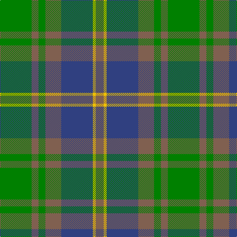

In pattern [GRGRBYR](/stripes/grgrbyr/).

This was sourced from weddslist.  It is a [7 stripe tartan](/stripes/stripes7/).

Original link http://www.weddslist.com/cgi-bin/tartans/pg.pl?source=sts

## Thread count
G/64 LT14 G14 LT32 B64 Y6 LT/16

## Palette
Each colour and the base-6 reference it is a variant of.

| Colour | Shade | Base |
|---|---|---|
| B | <code style="background-color:#304080;">#304080</code> `oklch(39.4% 0.109 270.2)` <small>#304080</small> | B <code style="background-color:#2A418A;">#2A418A</code> |
| G | <code style="background-color:#008000;">#008000</code> `oklch(52.0% 0.177 142.5)` <small>#008000</small> | G <code style="background-color:#006100;">#006100</code> |
| LT | <code style="background-color:#806050;">#806050</code> `oklch(51.7% 0.049 47.8)` <small>#806050</small> | R <code style="background-color:#CC0000;">#CC0000</code> |
| Y | <code style="background-color:#F0C000;">#F0C000</code> `oklch(82.7% 0.169 90.5)` <small>#F0C000</small> | Y <code style="background-color:#F2BF00;">#F2BF00</code> |

# Sample pattern

## Nearest tartans

The nearest existing variants by ΔTartan distance.

1. [Strange of Balcaskie (Clan)](/setts/s7/g32dy7g7dy16db32ly3dy8~x2/) — ΔT 0.68
1. [Universal Ancient](/setts/s8/t12dg2t2dg2t2dy8g8dy1~x2/) — ΔT 0.83
1. [Tupper., Sir Charles..](/setts/s10/db4o7ly3o12g15o5db20o5g4o2~x2/) — ΔT 0.92
1. [Universal Ancient International Tartan Tartan Number: 136. Earliest known date: Canada This design is different in warp and weft. The display gives the general appearance only. Produced to celebrate American tourism is Scotland. The colours are taken from the flags of the two nations and the Atlantic Ocean that separates them. See products available Copyright © Blair Urquhart, Comrie, 2015](/setts/s8/t12g2t2g2t2dy8g8dy1~x2/) — ΔT 0.93
1. [Balfour Hunting](/setts/s6/b30ly3dy11ly3g33r6~x2/) — ΔT 1.10
1. [Tupper. Sir Charles.. Family Tartan Tartan Number: 614. Earliest known date: 1983 From Canada. See products available Copyright © Blair Urquhart, Comrie, 2015](/setts/s10/db4dy7ly3dy12g15dy5db20dy5g4dy2~x2/) — ΔT 1.17
1. [Thompson/Thomson/MacTavish Hunting](/setts/s6/t4dy28dg6t12k12t3~x2/) — ΔT 1.24
1. [Bethlehem, City of (District)](/setts/s5/db3o10g9r1g3~x4/) — ΔT 1.24
1. [Montrose (1983)](/setts/s6/dg6ly3dg26k10n30lb3~x2/) — ΔT 1.24
1. [Ancient Universal (Fashion?)](/setts/s8/y12dg2y2dg2y2dy8y8dy1~x2/) — ΔT 1.25

## Neighbour map

Every grey dot is one of 14299 variants placed by the first two principal components of the ΔTartan feature space (44% of its variance). Red is this tartan; blue dots are its nearest — click one to open its page.

<svg viewBox="0 0 640 380" role="img" style="max-width:100%;height:auto;border:1px solid #e0e0e0;border-radius:4px;display:block" xmlns="http://www.w3.org/2000/svg"><image href="/nn/cloud.v1.png" width="640" height="380"/><a href="/setts/s7/g32dy7g7dy16db32ly3dy8~x2/"><circle cx="243.8" cy="240.5" r="4" fill="#3465a4"><title>Strange of Balcaskie (Clan)</title></circle></a><a href="/setts/s8/t12dg2t2dg2t2dy8g8dy1~x2/"><circle cx="254.6" cy="218.9" r="4" fill="#3465a4"><title>Universal Ancient</title></circle></a><a href="/setts/s10/db4o7ly3o12g15o5db20o5g4o2~x2/"><circle cx="242.1" cy="223.8" r="4" fill="#3465a4"><title>Tupper., Sir Charles..</title></circle></a><a href="/setts/s8/t12g2t2g2t2dy8g8dy1~x2/"><circle cx="265.0" cy="221.6" r="4" fill="#3465a4"><title>Universal Ancient International Tartan Tartan Number: 136. Earliest known date: Canada This design is different in warp and weft. The display gives the general appearance only. Produced to celebrate American tourism is Scotland. The colours are taken from the flags of the two nations and the Atlantic Ocean that separates them. See products available Copyright © Blair Urquhart, Comrie, 2015</title></circle></a><a href="/setts/s6/b30ly3dy11ly3g33r6~x2/"><circle cx="216.9" cy="209.0" r="4" fill="#3465a4"><title>Balfour Hunting</title></circle></a><a href="/setts/s10/db4dy7ly3dy12g15dy5db20dy5g4dy2~x2/"><circle cx="241.5" cy="226.0" r="4" fill="#3465a4"><title>Tupper. Sir Charles.. Family Tartan Tartan Number: 614. Earliest known date: 1983 From Canada. See products available Copyright © Blair Urquhart, Comrie, 2015</title></circle></a><a href="/setts/s6/t4dy28dg6t12k12t3~x2/"><circle cx="249.9" cy="241.5" r="4" fill="#3465a4"><title>Thompson/Thomson/MacTavish Hunting</title></circle></a><a href="/setts/s5/db3o10g9r1g3~x4/"><circle cx="279.6" cy="255.3" r="4" fill="#3465a4"><title>Bethlehem, City of (District)</title></circle></a><a href="/setts/s6/dg6ly3dg26k10n30lb3~x2/"><circle cx="254.3" cy="228.2" r="4" fill="#3465a4"><title>Montrose (1983)</title></circle></a><a href="/setts/s8/y12dg2y2dg2y2dy8y8dy1~x2/"><circle cx="283.5" cy="227.2" r="4" fill="#3465a4"><title>Ancient Universal (Fashion?)</title></circle></a><circle cx="238.0" cy="235.5" r="5" fill="#c00000"/></svg>

ID: /setts/s7/g32o7g7o16db32ly3o8~x2/
