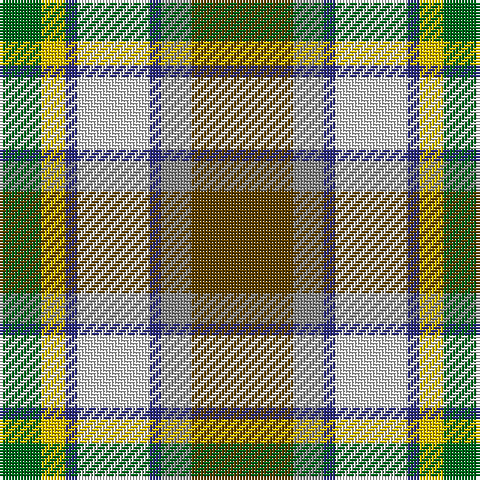

In pattern [GRBWBYG](/patterns/grbwbyg/).

This was sourced from house-of-tartan.  It is a [7 stripes tartan](/stripes/stripes7/).

Original link http://www.house-of-tartan.scotland.net/house/TartanViewjs.asp?colr=Def&tnam=956

## Thread count
G/14 Y8 DB4 LN24 DB4 N10 T/34

## Palette
Each colour and its ΔE from the base-6 reference it is a variant of.

| Colour | Shade | Base | ΔE (OKLab) |
|---|---|---|---|
| DB | <code style="background-color:#2C2C80;">#2C2C80</code> `#2C2C80` | B <code style="background-color:#2A418A;">#2A418A</code> | 0.06 |
| G | <code style="background-color:#006818;">#006818</code> `#006818` | G <code style="background-color:#006100;">#006100</code> | 0.02 |
| LN | <code style="background-color:#E0E0E0;">#E0E0E0</code> `#E0E0E0` | W <code style="background-color:#F7F7F7;">#F7F7F7</code> | 0.07 |
| N | <code style="background-color:#888888;">#888888</code> `#888888` | R <code style="background-color:#CC0000;">#CC0000</code> | 0.24 |
| T | <code style="background-color:#604000;">#604000</code> `#604000` | G <code style="background-color:#006100;">#006100</code> | 0.14 |
| Y | <code style="background-color:#E8C000;">#E8C000</code> `#E8C000` | Y <code style="background-color:#F2BF00;">#F2BF00</code> | 0.02 |

# Sample pattern

## Nearest tartans

The nearest existing variants by ΔTartan distance.

1. [Ontario, Northern](/setts/s7/r34g10b4w24b4y8ga14-b304080-g808080-ga008000-r806050-we0e0e0-yf0c000/) — ΔT 0.85
1. [Hackett William (Coatbridge) Hunting (Personal)](/setts/s8/k40y8r8y40g40w10g4ya4-g346428-k101010-rff0000-wffffff-ycfb47f-ya86ac5f/) — ΔT 0.92
1. [Carmen Lau (Hong Kong) (Personal)](/setts/s7/y16r6b4ba2w12g24ba4-b1474b4-ba2c2c80-g006818-r901c38-wfcfcfc-yfccc00/) — ΔT 0.97
1. [Coulter Dress (Personal)](/setts/s8/r12w40g24ra6g16b40k4b6-b788cb4-g007800-k000000-r8c0000-raa0783c-wf0f0f0/) — ΔT 0.98
1. [Northern Ontario](/setts/s7/g68ga20b8w48b8y16ga28-b1c0070-g603800-ga408060-wf8f8f8-ye8c000/) — ΔT 1.00
1. [Nicolson of Taransay (Personal)](/setts/s7/w12g20r44b32ga4ga8ga10-b2c2c80-g006818-ga289c18-rc80000-we0e0e0/) — ΔT 1.02
1. [Unnamed No 14](/setts/s9/r22b6ba10y4r4w4g22ba8y3-b5480b0-ba304080-g008000-rc00000-we0e0e0-yf0c000/) — ΔT 1.03
1. [Ball Hunting](/setts/s6/y52g32k20w12wa8r4-g009468-k101010-rc80000-w98c8e8-waf8f8f8-ydc943c/) — ΔT 1.04
1. [Porcupine City of](/setts/s7/r40b12ba4w32ba4y8g20-b5c5c5c-ba1c0070-g006818-rb03000-wc0c0c0-yd09800/) — ΔT 1.07
1. [Brittany Hunting French Fancy Tartan Tartan Number: 5977. Earliest known date: 2003 For Richard and Anne-Marie Duclos of Le Coudray-Montceaux, France. Based on the Breton National at 3902. The term Randonnée (Walking) is used in the sense of the Scottish category, Hunting. See products available Copyright © Blair Urquhart, Comrie, 2015](/setts/s9/b8g54y16k8y16k8y16r22ya6-b4898c4-g60441c-k101010-rb03000-yc8b898-yae8c000/) — ΔT 1.10

## Neighbour map

Every grey dot is one of 15726 variants placed by the first two principal components of the ΔTartan feature space (44% of its variance). Red is this tartan; blue dots are its nearest — click one to open its page.

<svg viewBox="0 0 640 380" role="img" style="max-width:100%;height:auto;border:1px solid #e0e0e0;border-radius:4px;display:block" xmlns="http://www.w3.org/2000/svg"><image href="/nn/cloud.v1.png" width="640" height="380"/><a href="/setts/s7/r34g10b4w24b4y8ga14-b304080-g808080-ga008000-r806050-we0e0e0-yf0c000/"><circle cx="101.8" cy="172.6" r="4" fill="#3465a4"><title>Ontario, Northern</title></circle></a><a href="/setts/s8/k40y8r8y40g40w10g4ya4-g346428-k101010-rff0000-wffffff-ycfb47f-ya86ac5f/"><circle cx="84.7" cy="144.2" r="4" fill="#3465a4"><title>Hackett William (Coatbridge) Hunting (Personal)</title></circle></a><a href="/setts/s7/y16r6b4ba2w12g24ba4-b1474b4-ba2c2c80-g006818-r901c38-wfcfcfc-yfccc00/"><circle cx="86.2" cy="145.5" r="4" fill="#3465a4"><title>Carmen Lau (Hong Kong) (Personal)</title></circle></a><a href="/setts/s8/r12w40g24ra6g16b40k4b6-b788cb4-g007800-k000000-r8c0000-raa0783c-wf0f0f0/"><circle cx="78.5" cy="153.1" r="4" fill="#3465a4"><title>Coulter Dress (Personal)</title></circle></a><a href="/setts/s7/g68ga20b8w48b8y16ga28-b1c0070-g603800-ga408060-wf8f8f8-ye8c000/"><circle cx="100.8" cy="177.0" r="4" fill="#3465a4"><title>Northern Ontario</title></circle></a><a href="/setts/s7/w12g20r44b32ga4ga8ga10-b2c2c80-g006818-ga289c18-rc80000-we0e0e0/"><circle cx="102.5" cy="161.1" r="4" fill="#3465a4"><title>Nicolson of Taransay (Personal)</title></circle></a><a href="/setts/s9/r22b6ba10y4r4w4g22ba8y3-b5480b0-ba304080-g008000-rc00000-we0e0e0-yf0c000/"><circle cx="86.3" cy="163.0" r="4" fill="#3465a4"><title>Unnamed No 14</title></circle></a><a href="/setts/s6/y52g32k20w12wa8r4-g009468-k101010-rc80000-w98c8e8-waf8f8f8-ydc943c/"><circle cx="138.9" cy="153.6" r="4" fill="#3465a4"><title>Ball Hunting</title></circle></a><a href="/setts/s7/r40b12ba4w32ba4y8g20-b5c5c5c-ba1c0070-g006818-rb03000-wc0c0c0-yd09800/"><circle cx="113.6" cy="162.7" r="4" fill="#3465a4"><title>Porcupine City of</title></circle></a><a href="/setts/s9/b8g54y16k8y16k8y16r22ya6-b4898c4-g60441c-k101010-rb03000-yc8b898-yae8c000/"><circle cx="116.4" cy="150.4" r="4" fill="#3465a4"><title>Brittany Hunting French Fancy Tartan Tartan Number: 5977. Earliest known date: 2003 For Richard and Anne-Marie Duclos of Le Coudray-Montceaux, France. Based on the Breton National at 3902. The term Randonnée (Walking) is used in the sense of the Scottish category, Hunting. See products available Copyright © Blair Urquhart, Comrie, 2015</title></circle></a><circle cx="84.5" cy="166.5" r="5" fill="#c00000"/></svg>

ID: /setts/s7/g34r10b4w24b4y8ga14-b2c2c80-g604000-ga006818-r888888-we0e0e0-ye8c000/
