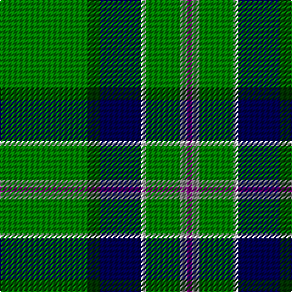

In pattern [BGGWBGG](/stripes/bggwbgg/).

This was sourced from weddslist.  It is a [7 stripe tartan](/stripes/stripes7/).

Original link http://www.weddslist.com/cgi-bin/tartans/pg.pl?source=sts

## Also known as

This cloth is also recorded under:

- Mounth, The,

## Thread count
G/72 DG10 DB34 LN4 G28 N6 P/4

## Palette
Each colour and the base-6 reference it is a variant of.

| Colour | Shade | Base |
|---|---|---|
| DB | <code style="background-color:#000050;">#000050</code> `oklch(19.5% 0.135 264.1)` <small>#000050</small> | B <code style="background-color:#2A418A;">#2A418A</code> |
| DG | <code style="background-color:#003000;">#003000</code> `oklch(26.8% 0.091 142.5)` <small>#003000</small> | G <code style="background-color:#006100;">#006100</code> |
| G | <code style="background-color:#008000;">#008000</code> `oklch(52.0% 0.177 142.5)` <small>#008000</small> | G <code style="background-color:#006100;">#006100</code> |
| LN | <code style="background-color:#E0E0E0;">#E0E0E0</code> `oklch(90.7% 0.000 89.9)` <small>#E0E0E0</small> | W <code style="background-color:#F7F7F7;">#F7F7F7</code> |
| N | <code style="background-color:#808080;">#808080</code> `oklch(60.0% 0.000 89.9)` <small>#808080</small> | G <code style="background-color:#006100;">#006100</code> |
| P | <code style="background-color:#800080;">#800080</code> `oklch(42.1% 0.193 328.4)` <small>#800080</small> | B <code style="background-color:#2A418A;">#2A418A</code> |

# Sample pattern

## Nearest tartans

The nearest existing variants by ΔTartan distance.

1. [Lambert Kai (Personal)](/setts/s8/k3g34b10g5r2k8dy2w3~x2/) — ΔT 1.09
1. [Celtic Pride](/setts/s8/g10lo3w2k2g8k22g43lo4~x2/) — ΔT 1.30
1. [Marshall, Fields](/setts/s8/g40db2w2db2ly2db23g32r2~x2/) — ΔT 1.33
1. [Selvon-Bruce (Personal)](/setts/s7/k3g2k3g18r2db2lo1~x4/) — ΔT 1.35
1. [U.S. Army](/setts/s10/k17y4g51ly3g4ly3g51y4k17db6~x2/) — ΔT 1.36
1. [U.S. Army (Military)](/setts/s6/db6k17y4g51ly3g4~x2/) — ΔT 1.37
1. [Henderson/MacKendrick](/setts/s9/w1db6g4db1g16k1g4k6ly1~x4/) — ΔT 1.38
1. [MacKendrick](/setts/s9/w1db6g4db1g16k1g4k6ly1~x2/) — ΔT 1.38
1. [Vorwerk, The](/setts/s9/g40db8g8lp8db5lp13k9g40r4/) — ΔT 1.39
1. [Sarros (Personal) XX](/setts/s8/k2w2db8k4g33r2g16w2~x2/) — ΔT 1.44

## Neighbour map

Every grey dot is one of 14299 variants placed by the first two principal components of the ΔTartan feature space (44% of its variance). Red is this tartan; blue dots are its nearest — click one to open its page.

<svg viewBox="0 0 640 380" role="img" style="max-width:100%;height:auto;border:1px solid #e0e0e0;border-radius:4px;display:block" xmlns="http://www.w3.org/2000/svg"><image href="/nn/cloud.v1.png" width="640" height="380"/><a href="/setts/s8/k3g34b10g5r2k8dy2w3~x2/"><circle cx="300.4" cy="135.7" r="4" fill="#3465a4"><title>Lambert Kai (Personal)</title></circle></a><a href="/setts/s8/g10lo3w2k2g8k22g43lo4~x2/"><circle cx="383.2" cy="151.2" r="4" fill="#3465a4"><title>Celtic Pride</title></circle></a><a href="/setts/s8/g40db2w2db2ly2db23g32r2~x2/"><circle cx="390.4" cy="148.6" r="4" fill="#3465a4"><title>Marshall, Fields</title></circle></a><a href="/setts/s7/k3g2k3g18r2db2lo1~x4/"><circle cx="379.4" cy="154.9" r="4" fill="#3465a4"><title>Selvon-Bruce (Personal)</title></circle></a><a href="/setts/s10/k17y4g51ly3g4ly3g51y4k17db6~x2/"><circle cx="354.3" cy="143.7" r="4" fill="#3465a4"><title>U.S. Army</title></circle></a><a href="/setts/s6/db6k17y4g51ly3g4~x2/"><circle cx="339.8" cy="159.4" r="4" fill="#3465a4"><title>U.S. Army (Military)</title></circle></a><a href="/setts/s9/w1db6g4db1g16k1g4k6ly1~x4/"><circle cx="327.1" cy="165.8" r="4" fill="#3465a4"><title>Henderson/MacKendrick</title></circle></a><a href="/setts/s9/w1db6g4db1g16k1g4k6ly1~x2/"><circle cx="327.1" cy="165.8" r="4" fill="#3465a4"><title>MacKendrick</title></circle></a><a href="/setts/s9/g40db8g8lp8db5lp13k9g40r4/"><circle cx="309.7" cy="169.3" r="4" fill="#3465a4"><title>Vorwerk, The</title></circle></a><a href="/setts/s8/k2w2db8k4g33r2g16w2~x2/"><circle cx="406.6" cy="156.0" r="4" fill="#3465a4"><title>Sarros (Personal) XX</title></circle></a><circle cx="322.3" cy="150.5" r="5" fill="#c00000"/></svg>

ID: /setts/s7/g36dg5db17w2g14y3p2~x2/
