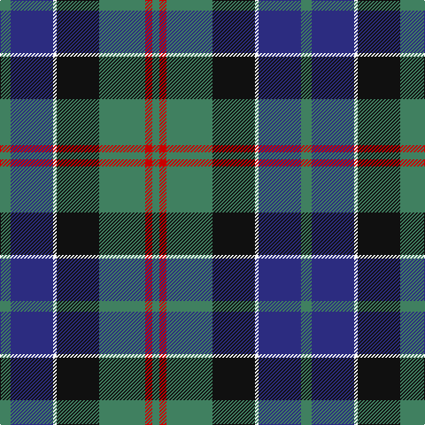

This page is one **sett** — a single exact thread-count. It belongs to the [tartan](/tartans/g3db12w1k12g13r2g2/)
(the same proportion at any scale), whose colour order is pattern [GBWKGRG](/stripes/gbwkgrg/).

Sourced from register-of-tartans.  It is a [7 stripe tartan](/stripes/stripes7/).

Original link https://www.tartanregister.gov.uk/tartanDetails.aspx?ref=2431

## Also known as

This cloth is also recorded under:

- MacFadzean, MacPhedran
- MacFadzean/MacPhedran

2 attestations — the source records this cloth was collapsed from (oldest owns this page)

<ul>
<li>01/01/1945 — MacFadzean/MacPhedran (register-of-tartans, <a href="https://www.tartanregister.gov.uk/tartanDetails.aspx?ref=2431">record</a>)</li>
<li>pre 1945 — MacFadzean/MacPhedran (Clan) (tartans-authority, <a href="http://www.tartansauthority.com/tartan-ferret/display/744/">record</a>)</li>
</ul>

## Register references

External register numbers recorded for this tartan.

- Scottish Register of Tartans: [2431](https://www.tartanregister.gov.uk/tartanDetails.aspx?ref=2431)
- Scottish Tartans Authority (ITI): 744
- Scottish Tartans World Register: 744

## Thread count
G/12 DB48 W4 K48 G52 R8 G/8

## Palette

Palette: <strong>Tartan Register</strong>
<table><thead><tr><th>Colour</th><th>Threads</th><th>Shade</th><th>Base</th><th>OKLCh</th></tr></thead><tbody><tr><td>G/</td><td style="text-align:right;font-variant-numeric:tabular-nums">12</td><td><code style="background-color:#408060;">#408060</code> <small style="color:#888">#408060</small></td><td>G <code style="background-color:#006100;">#006100</code></td><td><small style="color:#888">oklch(54.8% 0.084 160.1)</small></td></tr><tr><td>DB</td><td style="text-align:right;font-variant-numeric:tabular-nums">48</td><td><code style="background-color:#2C2C80;">#2C2C80</code> <small style="color:#888">#2C2C80</small></td><td>B <code style="background-color:#2A418A;">#2A418A</code></td><td><small style="color:#888">oklch(35.0% 0.138 276.6)</small></td></tr><tr><td>W</td><td style="text-align:right;font-variant-numeric:tabular-nums">4</td><td><code style="background-color:#F8F8F8;">#F8F8F8</code> <small style="color:#888">#F8F8F8</small></td><td>W <code style="background-color:#F7F7F7;">#F7F7F7</code></td><td><small style="color:#888">oklch(97.9% 0.000 89.9)</small></td></tr><tr><td>K</td><td style="text-align:right;font-variant-numeric:tabular-nums">48</td><td><code style="background-color:#101010;">#101010</code> <small style="color:#888">#101010</small></td><td>K <code style="background-color:#000000;">#000000</code></td><td><small style="color:#888">oklch(17.3% 0.000 89.9)</small></td></tr><tr><td>G</td><td style="text-align:right;font-variant-numeric:tabular-nums">52</td><td><code style="background-color:#408060;">#408060</code> <small style="color:#888">#408060</small></td><td>G <code style="background-color:#006100;">#006100</code></td><td><small style="color:#888">oklch(54.8% 0.084 160.1)</small></td></tr><tr><td>R</td><td style="text-align:right;font-variant-numeric:tabular-nums">8</td><td><code style="background-color:#C80000;">#C80000</code> <small style="color:#888">#C80000</small></td><td>R <code style="background-color:#CC0000;">#CC0000</code></td><td><small style="color:#888">oklch(52.3% 0.215 29.2)</small></td></tr><tr><td>G/</td><td style="text-align:right;font-variant-numeric:tabular-nums">8</td><td><code style="background-color:#408060;">#408060</code> <small style="color:#888">#408060</small></td><td>G <code style="background-color:#006100;">#006100</code></td><td><small style="color:#888">oklch(54.8% 0.084 160.1)</small></td></tr></tbody></table>

# Sample pattern

## Nearest tartans

The nearest existing variants by ΔTartan distance, with this tartan at the top so the swatches line up against it.

ΔTartan

Tartan

Sett

—

<a href="/ttd/edit/#slug=g3db12w1k12g13r2g2~x4">MacFadzean/MacPhedran</a> <a class="nn-out" href="/setts/s7/g3db12w1k12g13r2g2~x4/" title="open its dictionary page">↗</a>

0.56

<a href="/ttd/edit/#slug=db22w2k10g11r3g4~x2">Paterson Blue (Personal)</a> <a class="nn-out" href="/setts/s6/db22w2k10g11r3g4~x2/" title="open its dictionary page">↗</a>

0.65

<a href="/ttd/edit/#slug=k6g15w2db22r2k4~x2">Leslie, Hebridean</a> <a class="nn-out" href="/setts/s6/k6g15w2db22r2k4~x2/" title="open its dictionary page">↗</a>

0.68

<a href="/ttd/edit/#slug=g3db12w1k12g13r2g2~x2">Paterson (Personal)</a> <a class="nn-out" href="/setts/s7/g3db12w1k12g13r2g2~x2/" title="open its dictionary page">↗</a>

0.75

<a href="/ttd/edit/#slug=w15dg98dt72r25dt8ly15">Afternoon Tea / Darjeeling</a> <a class="nn-out" href="/setts/s6/w15dg98dt72r25dt8ly15/" title="open its dictionary page">↗</a>

0.78

<a href="/ttd/edit/#slug=r1k1g7k5db10k1ly1~x2">MacLeod Small Clan Tartan Tartan Number: 15833. Earliest known date: See products available Copyright © Blair Urquhart, Comrie, 2015</a> <a class="nn-out" href="/setts/s7/r1k1g7k5db10k1ly1~x2/" title="open its dictionary page">↗</a>

0.78

<a href="/ttd/edit/#slug=db10ly3db30ly5k8dg16r4dg16r2~x2">MacMillan Hunting</a> <a class="nn-out" href="/setts/s9/db10ly3db30ly5k8dg16r4dg16r2~x2/" title="open its dictionary page">↗</a>

0.78

<a href="/ttd/edit/#slug=g14k2g4r2g4k14dp15k1w3~x2">MacRae Hunting #2</a> <a class="nn-out" href="/setts/s9/g14k2g4r2g4k14dp15k1w3~x2/" title="open its dictionary page">↗</a>

0.79

<a href="/ttd/edit/#slug=db18k10g6r4g6k1w2~x2">Ferguson - 1830 of Atholl (Clan)</a> <a class="nn-out" href="/setts/s7/db18k10g6r4g6k1w2~x2/" title="open its dictionary page">↗</a>

0.80

<a href="/ttd/edit/#slug=db34dy9ly3dy9y30r3y11r5">Ballantyne (Personal) STWR</a> <a class="nn-out" href="/setts/s8/db34dy9ly3dy9y30r3y11r5/" title="open its dictionary page">↗</a>

0.80

<a href="/ttd/edit/#slug=db20k6lo4db3g20w2~x2">DeLoughery (Personal)</a> <a class="nn-out" href="/setts/s6/db20k6lo4db3g20w2~x2/" title="open its dictionary page">↗</a>

## Neighbour map

Every grey dot is one of 14359 variants placed by the first two principal components of the ΔTartan feature space (44% of its variance). Red is this tartan; blue dots are its nearest — click one to open its page.

<svg viewBox="0 0 640 380" role="img" style="max-width:100%;height:auto;border:1px solid #e0e0e0;border-radius:4px;display:block" xmlns="http://www.w3.org/2000/svg"><image href="/nn/cloud.v1.png" width="640" height="380"/><a href="/setts/s6/db22w2k10g11r3g4~x2/"><circle cx="203.8" cy="205.9" r="4" fill="#3465a4"><title>Paterson Blue (Personal)</title></circle></a><a href="/setts/s6/k6g15w2db22r2k4~x2/"><circle cx="214.4" cy="198.6" r="4" fill="#3465a4"><title>Leslie, Hebridean</title></circle></a><a href="/setts/s7/g3db12w1k12g13r2g2~x2/"><circle cx="200.7" cy="195.4" r="4" fill="#3465a4"><title>Paterson (Personal)</title></circle></a><a href="/setts/s6/w15dg98dt72r25dt8ly15/"><circle cx="205.8" cy="188.5" r="4" fill="#3465a4"><title>Afternoon Tea / Darjeeling</title></circle></a><a href="/setts/s7/r1k1g7k5db10k1ly1~x2/"><circle cx="196.2" cy="195.4" r="4" fill="#3465a4"><title>MacLeod Small Clan Tartan Tartan Number: 15833. Earliest known date: See products available Copyright © Blair Urquhart, Comrie, 2015</title></circle></a><a href="/setts/s9/db10ly3db30ly5k8dg16r4dg16r2~x2/"><circle cx="218.5" cy="178.2" r="4" fill="#3465a4"><title>MacMillan Hunting</title></circle></a><a href="/setts/s9/g14k2g4r2g4k14dp15k1w3~x2/"><circle cx="183.5" cy="166.5" r="4" fill="#3465a4"><title>MacRae Hunting #2</title></circle></a><a href="/setts/s7/db18k10g6r4g6k1w2~x2/"><circle cx="189.4" cy="176.6" r="4" fill="#3465a4"><title>Ferguson - 1830 of Atholl (Clan)</title></circle></a><a href="/setts/s8/db34dy9ly3dy9y30r3y11r5/"><circle cx="186.8" cy="175.1" r="4" fill="#3465a4"><title>Ballantyne (Personal) STWR</title></circle></a><a href="/setts/s6/db20k6lo4db3g20w2~x2/"><circle cx="206.6" cy="204.1" r="4" fill="#3465a4"><title>DeLoughery (Personal)</title></circle></a><circle cx="193.7" cy="188.3" r="5" fill="#c00000"/></svg>

ID: /setts/s7/g3db12w1k12g13r2g2~x4/
