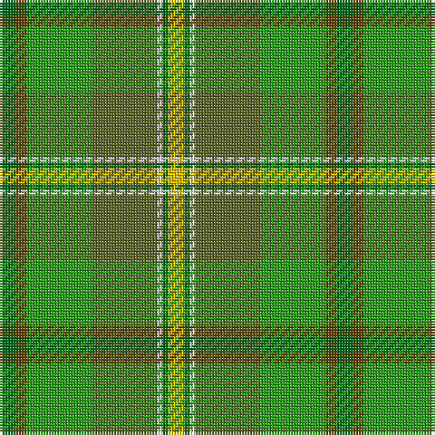

**Bands:** [GGGGWGY](/stripes/ggggwgy/) · **Stripes:** [G DY G Y W G LY](/stripes/stripes7/) G DY G Y W G LY

This was sourced from house-of-tartan.  It is a [7 band tartan](/bands/bands7/).

Original link http://www.house-of-tartan.scotland.net/house/TartanViewjs.asp?colr=Def&tnam=908

## Thread count
G/6 T4 Ga24 Gb24 LN2 G2 Y/6

## Palette
Each colour and its ΔE from the base-6 reference it is a variant of.

| Colour | Shade | Base | ΔE (OKLab) |
|---|---|---|---|
| G | <code style="background-color:#006818;">#006818</code> `#006818` | G <code style="background-color:#006100;">#006100</code> | 0.02 |
| Ga | <code style="background-color:#289C18;">#289C18</code> `#289C18` | G <code style="background-color:#006100;">#006100</code> | 0.19 |
| Gb | <code style="background-color:#5C6428;">#5C6428</code> `#5C6428` | G <code style="background-color:#006100;">#006100</code> | 0.10 |
| LN | <code style="background-color:#E0E0E0;">#E0E0E0</code> `#E0E0E0` | W <code style="background-color:#F7F7F7;">#F7F7F7</code> | 0.07 |
| T | <code style="background-color:#604000;">#604000</code> `#604000` | G <code style="background-color:#006100;">#006100</code> | 0.14 |
| Y | <code style="background-color:#E8C000;">#E8C000</code> `#E8C000` | Y <code style="background-color:#F2BF00;">#F2BF00</code> | 0.02 |

# Sample pattern

## Nearest tartans

The nearest existing variants by ΔTartan distance.

1. [Braemar House](/setts/s7/g3o2g12y12w1g1ly3~x2/) — ΔT 0.87
1. [Shrek](/setts/s12/o4g3o30y12g5lg4g3lg14lg2lg2lg10ly3~x2/) — ΔT 1.55
1. [City of Vancouver (Commemorative)](/setts/s6/g2lo1g12lb6g12r1~x4/) — ΔT 1.61
1. [Keogh (Name?)](/setts/s8/g29k4g6lo4g28lo28k1lb5~x2/) — ΔT 1.65
1. [T.H.E. C.O.G. USA (Corporate)](/setts/s6/lo9g18t9r1w1db1~x4/) — ΔT 1.70
1. [Dalwhinnie](/setts/s9/dg70ly6lr28g56lr5g11lr5g11r12/) — ΔT 1.75
1. [Tomass](/setts/s8/r2dy1dg9y1dy2y6g2y1~x4/) — ΔT 1.76
1. [Glens of Corbie (Corporate)](/setts/s9/k3g30y20o6y3o3y3dt20r2~x2/) — ΔT 1.84
1. [Wagga Wagga (District)](/setts/s11/g16k6g16g32k2dy7ly2dy7ly2dy7b13/) — ΔT 1.94
1. [Braemar House](/setts/s7/dg3y2g12o11w1dg1ly3~x2/) — ΔT 1.98

## Neighbour map

Every grey dot is one of 14313 variants placed by the first two principal components of the ΔTartan feature space (44% of its variance). Red is this tartan; blue dots are its nearest — click one to open its page.

<svg viewBox="0 0 640 380" role="img" style="max-width:100%;height:auto;border:1px solid #e0e0e0;border-radius:4px;display:block" xmlns="http://www.w3.org/2000/svg"><image href="/nn/cloud.v1.png" width="640" height="380"/><a href="/setts/s7/g3o2g12y12w1g1ly3~x2/"><circle cx="224.7" cy="198.5" r="4" fill="#3465a4"><title>Braemar House</title></circle></a><a href="/setts/s12/o4g3o30y12g5lg4g3lg14lg2lg2lg10ly3~x2/"><circle cx="203.1" cy="145.1" r="4" fill="#3465a4"><title>Shrek</title></circle></a><a href="/setts/s6/g2lo1g12lb6g12r1~x4/"><circle cx="246.5" cy="214.4" r="4" fill="#3465a4"><title>City of Vancouver (Commemorative)</title></circle></a><a href="/setts/s8/g29k4g6lo4g28lo28k1lb5~x2/"><circle cx="195.0" cy="140.6" r="4" fill="#3465a4"><title>Keogh (Name?)</title></circle></a><a href="/setts/s6/lo9g18t9r1w1db1~x4/"><circle cx="269.1" cy="171.8" r="4" fill="#3465a4"><title>T.H.E. C.O.G. USA (Corporate)</title></circle></a><a href="/setts/s9/dg70ly6lr28g56lr5g11lr5g11r12/"><circle cx="222.2" cy="170.3" r="4" fill="#3465a4"><title>Dalwhinnie</title></circle></a><a href="/setts/s8/r2dy1dg9y1dy2y6g2y1~x4/"><circle cx="234.2" cy="220.3" r="4" fill="#3465a4"><title>Tomass</title></circle></a><a href="/setts/s9/k3g30y20o6y3o3y3dt20r2~x2/"><circle cx="214.4" cy="178.2" r="4" fill="#3465a4"><title>Glens of Corbie (Corporate)</title></circle></a><a href="/setts/s11/g16k6g16g32k2dy7ly2dy7ly2dy7b13/"><circle cx="138.0" cy="155.4" r="4" fill="#3465a4"><title>Wagga Wagga (District)</title></circle></a><a href="/setts/s7/dg3y2g12o11w1dg1ly3~x2/"><circle cx="158.9" cy="158.3" r="4" fill="#3465a4"><title>Braemar House</title></circle></a><circle cx="206.2" cy="188.4" r="5" fill="#c00000"/></svg>

ID: /setts/s7/g3dy2g12y12w1g1ly3~x2/
