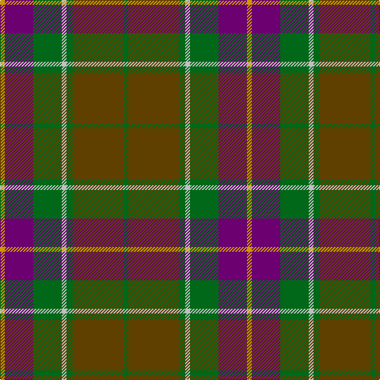

This page is one **sett** — a single exact thread-count. It belongs to the [tartan](/tartans/dy3p18g18n3g4t32g3/)
(the same proportion at any scale), whose colour order is pattern [GGGWGBY](/stripes/gggwgby/).

Sourced from register-of-tartans.  It is a [7 stripe tartan](/stripes/stripes7/).

Original link https://www.tartanregister.gov.uk/tartanDetails.aspx?ref=4563

## Register references

External register numbers recorded for this tartan.

- Scottish Register of Tartans: [4563](https://www.tartanregister.gov.uk/tartanDetails.aspx?ref=4563)
- Scottish Tartans Authority (ITI): 4276

## Thread count
DY/6 P36 G36 N6 G8 T64 G/6

## Palette
Each colour and the base-6 reference it is a variant of.

| Colour | Shade | Base |
|---|---|---|
| DY | <code style="background-color:#D09800;">#D09800</code> `oklch(71.4% 0.147 82.1)` <small>#D09800</small> | Y <code style="background-color:#F2BF00;">#F2BF00</code> |
| G | <code style="background-color:#006818;">#006818</code> `oklch(45.0% 0.142 145.0)` <small>#006818</small> | G <code style="background-color:#006100;">#006100</code> |
| N | <code style="background-color:#C0C0C0;">#C0C0C0</code> `oklch(80.8% 0.000 89.9)` <small>#C0C0C0</small> | W <code style="background-color:#F7F7F7;">#F7F7F7</code> |
| P | <code style="background-color:#6C0070;">#6C0070</code> `oklch(37.6% 0.174 326.5)` <small>#6C0070</small> | B <code style="background-color:#2A418A;">#2A418A</code> |
| T | <code style="background-color:#604000;">#604000</code> `oklch(39.8% 0.083 76.8)` <small>#604000</small> | G <code style="background-color:#006100;">#006100</code> |

# Sample pattern

## Nearest tartans

The nearest existing variants by ΔTartan distance, with this tartan at the top so the swatches line up against it.

ΔTartan

Tartan

Sett

—

<a href="/ttd/edit/#slug=g3dy32g4lb3g18dp18lo3~x2">Wcwm 9275-1410</a> <a class="nn-out" href="/setts/s7/g3dy32g4lb3g18dp18lo3~x2/" title="open its dictionary page">↗</a>

0.79

<a href="/ttd/edit/#slug=r1n12k6ly1do10r1~x4">Andover (Fashion)</a> <a class="nn-out" href="/setts/s6/r1n12k6ly1do10r1~x4/" title="open its dictionary page">↗</a>

0.92

<a href="/ttd/edit/#slug=dt8y4r30g30lo3g4~x2">Hutcheson (Name)</a> <a class="nn-out" href="/setts/s6/dt8y4r30g30lo3g4~x2/" title="open its dictionary page">↗</a>

1.01

<a href="/ttd/edit/#slug=y27dr2y4o15db26k2db6~x2">Bailies of Bennachie Corporate Tartan Tartan Number: 3628. Earliest known date: 2002 The Bailes of Bennachie were founded in 1973 as caretakers of the mountain in Aberdeenshire, with the aim of 'preserving the amenity of the hill'. The tartan was produced on the occasion of the 25th anniversary to help create funds to continue their task. The colours reflect the autumn shades on the hill. See products available Copyright © Blair Urquhart, Comrie, 2015</a> <a class="nn-out" href="/setts/s7/y27dr2y4o15db26k2db6~x2/" title="open its dictionary page">↗</a>

1.01

<a href="/ttd/edit/#slug=r2do22g22do3db12y2~x2">Lisbon</a> <a class="nn-out" href="/setts/s6/r2do22g22do3db12y2~x2/" title="open its dictionary page">↗</a>

1.07

<a href="/ttd/edit/#slug=dy6r3dy34k16ly3dt22r4~x2">Ballantrae (Macnaughtons)</a> <a class="nn-out" href="/setts/s7/dy6r3dy34k16ly3dt22r4~x2/" title="open its dictionary page">↗</a>

1.09

<a href="/ttd/edit/#slug=r2y18k2y3k20dy30w2~x2">Bennett, J P. (Personal)</a> <a class="nn-out" href="/setts/s7/r2y18k2y3k20dy30w2~x2/" title="open its dictionary page">↗</a>

1.13

<a href="/ttd/edit/#slug=db4r11db1g8r2g4k1lo2~x4">Craik of Assington (Personal)</a> <a class="nn-out" href="/setts/s8/db4r11db1g8r2g4k1lo2~x4/" title="open its dictionary page">↗</a>

1.14

<a href="/ttd/edit/#slug=r1n12k6k1do10r1~x4">Andover</a> <a class="nn-out" href="/setts/s6/r1n12k6k1do10r1~x4/" title="open its dictionary page">↗</a>

1.18

<a href="/ttd/edit/#slug=dg6ly3dg26k10n30lb3~x2">Montrose (1983)</a> <a class="nn-out" href="/setts/s6/dg6ly3dg26k10n30lb3~x2/" title="open its dictionary page">↗</a>

1.19

<a href="/ttd/edit/#slug=dg5g32dp5k10dg8r3dg8dp3~x2">Scottish Power (Corporate)</a> <a class="nn-out" href="/setts/s8/dg5g32dp5k10dg8r3dg8dp3~x2/" title="open its dictionary page">↗</a>

## Neighbour map

Every grey dot is one of 14299 variants placed by the first two principal components of the ΔTartan feature space (44% of its variance). Red is this tartan; blue dots are its nearest — click one to open its page.

<svg viewBox="0 0 640 380" role="img" style="max-width:100%;height:auto;border:1px solid #e0e0e0;border-radius:4px;display:block" xmlns="http://www.w3.org/2000/svg"><image href="/nn/cloud.v1.png" width="640" height="380"/><a href="/setts/s6/r1n12k6ly1do10r1~x4/"><circle cx="241.7" cy="208.0" r="4" fill="#3465a4"><title>Andover (Fashion)</title></circle></a><a href="/setts/s6/dt8y4r30g30lo3g4~x2/"><circle cx="256.0" cy="199.9" r="4" fill="#3465a4"><title>Hutcheson (Name)</title></circle></a><a href="/setts/s7/y27dr2y4o15db26k2db6~x2/"><circle cx="261.3" cy="207.1" r="4" fill="#3465a4"><title>Bailies of Bennachie Corporate Tartan Tartan Number: 3628. Earliest known date: 2002 The Bailes of Bennachie were founded in 1973 as caretakers of the mountain in Aberdeenshire, with the aim of 'preserving the amenity of the hill'. The tartan was produced on the occasion of the 25th anniversary to help create funds to continue their task. The colours reflect the autumn shades on the hill. See products available Copyright © Blair Urquhart, Comrie, 2015</title></circle></a><a href="/setts/s6/r2do22g22do3db12y2~x2/"><circle cx="241.0" cy="217.9" r="4" fill="#3465a4"><title>Lisbon</title></circle></a><a href="/setts/s7/dy6r3dy34k16ly3dt22r4~x2/"><circle cx="264.4" cy="204.3" r="4" fill="#3465a4"><title>Ballantrae (Macnaughtons)</title></circle></a><a href="/setts/s7/r2y18k2y3k20dy30w2~x2/"><circle cx="232.2" cy="172.4" r="4" fill="#3465a4"><title>Bennett, J P. (Personal)</title></circle></a><a href="/setts/s8/db4r11db1g8r2g4k1lo2~x4/"><circle cx="209.3" cy="186.8" r="4" fill="#3465a4"><title>Craik of Assington (Personal)</title></circle></a><a href="/setts/s6/r1n12k6k1do10r1~x4/"><circle cx="255.5" cy="216.6" r="4" fill="#3465a4"><title>Andover</title></circle></a><a href="/setts/s6/dg6ly3dg26k10n30lb3~x2/"><circle cx="254.3" cy="228.2" r="4" fill="#3465a4"><title>Montrose (1983)</title></circle></a><a href="/setts/s8/dg5g32dp5k10dg8r3dg8dp3~x2/"><circle cx="243.4" cy="196.9" r="4" fill="#3465a4"><title>Scottish Power (Corporate)</title></circle></a><circle cx="235.7" cy="199.3" r="5" fill="#c00000"/></svg>

ID: /setts/s7/g3dy32g4lb3g18dp18lo3~x2/
