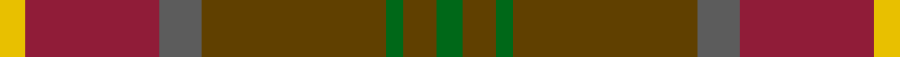

In pattern [GGGGBRY](/stripes/ggggbry/).

This was sourced from tartans-authority.  It is a [7 stripe tartan](/stripes/stripes7/).

Original link http://www.tartansauthority.com/tartan-ferret/display/10668/

## Thread count
Y/6 DR32 N10 T44 G4 T8 G/6

## Palette
Each colour and the base-6 reference it is a variant of.

| Colour | Shade | Base |
|---|---|---|
| DR | <code style="background-color:#901C38;">#901C38</code> `oklch(43.2% 0.150 13.1)` <small>#901C38</small> | R <code style="background-color:#CC0000;">#CC0000</code> |
| G | <code style="background-color:#006818;">#006818</code> `oklch(45.0% 0.142 145.0)` <small>#006818</small> | G <code style="background-color:#006100;">#006100</code> |
| N | <code style="background-color:#5C5C5C;">#5C5C5C</code> `oklch(47.5% 0.000 89.9)` <small>#5C5C5C</small> | B <code style="background-color:#2A418A;">#2A418A</code> |
| T | <code style="background-color:#604000;">#604000</code> `oklch(39.8% 0.083 76.8)` <small>#604000</small> | G <code style="background-color:#006100;">#006100</code> |
| Y | <code style="background-color:#E8C000;">#E8C000</code> `oklch(81.9% 0.168 93.7)` <small>#E8C000</small> | Y <code style="background-color:#F2BF00;">#F2BF00</code> |

# Sample pattern

## Nearest tartans

The nearest existing variants by ΔTartan distance.

1. [Jardine, of Castlemilk](/setts/s8/dr9o9n9r1db1o9db1r1~x4/) — ΔT 1.06
1. [John Muir Way](/setts/s8/dy35dg19r3y8r3dg8r3t3~x2/) — ΔT 1.11
1. [Scottish Crofting Foundation](/setts/s9/do6lg3do18dy2do2dy10y28r2y4~x2/) — ΔT 1.12
1. [John Muir Way](/setts/s8/dy35dg19r3g8r3dg8r3db3~x2/) — ΔT 1.14
1. [Cetoloni Family Tartan Tartan Number: 2049. Earliest known date: November 1991 The Cetoloni tartan was designed with the colours of the Border Hills, 'the sky at its best, the rooftop skyline of Siena and the golden sun of Tuscany'. Franco Cetoloni of Liddlevale was born in Badia Roti Bucine in Arezzo, Italy. Jayne was a designer at Pringle's knitwear in Hawick. Red is Sienna red. See products available Copyright © Blair Urquhart, Comrie, 2015](/setts/s6/db2o22dy11ly2dy11db2~x2/) — ΔT 1.26
1. [Brousseau (Personal)](/setts/s9/y25r2lb2db2lb2r13dy28db2r3~x2/) — ΔT 1.42
1. [Rowardennan](/setts/s6/k3r22dg5dg10do10dg2~x2/) — ΔT 1.44
1. [Loch Rannoch](/setts/s8/dr24g2dr5o14g2o5o17dr2~x2/) — ΔT 1.51
1. [Annan (Fashion)](/setts/s10/y16o2y2o2y2o2y2do6n10y3~x2/) — ΔT 1.58
1. [Windy Meadows](/setts/s6/dy11t2o4ly1o2dt2~x4/) — ΔT 1.58

## Neighbour map

Every grey dot is one of 14299 variants placed by the first two principal components of the ΔTartan feature space (44% of its variance). Red is this tartan; blue dots are its nearest — click one to open its page.

<svg viewBox="0 0 640 380" role="img" style="max-width:100%;height:auto;border:1px solid #e0e0e0;border-radius:4px;display:block" xmlns="http://www.w3.org/2000/svg"><image href="/nn/cloud.v1.png" width="640" height="380"/><a href="/setts/s8/dr9o9n9r1db1o9db1r1~x4/"><circle cx="291.8" cy="233.7" r="4" fill="#3465a4"><title>Jardine, of Castlemilk</title></circle></a><a href="/setts/s8/dy35dg19r3y8r3dg8r3t3~x2/"><circle cx="302.0" cy="206.0" r="4" fill="#3465a4"><title>John Muir Way</title></circle></a><a href="/setts/s9/do6lg3do18dy2do2dy10y28r2y4~x2/"><circle cx="309.8" cy="194.3" r="4" fill="#3465a4"><title>Scottish Crofting Foundation</title></circle></a><a href="/setts/s8/dy35dg19r3g8r3dg8r3db3~x2/"><circle cx="300.4" cy="205.5" r="4" fill="#3465a4"><title>John Muir Way</title></circle></a><a href="/setts/s6/db2o22dy11ly2dy11db2~x2/"><circle cx="357.6" cy="242.8" r="4" fill="#3465a4"><title>Cetoloni Family Tartan Tartan Number: 2049. Earliest known date: November 1991 The Cetoloni tartan was designed with the colours of the Border Hills, 'the sky at its best, the rooftop skyline of Siena and the golden sun of Tuscany'. Franco Cetoloni of Liddlevale was born in Badia Roti Bucine in Arezzo, Italy. Jayne was a designer at Pringle's knitwear in Hawick. Red is Sienna red. See products available Copyright © Blair Urquhart, Comrie, 2015</title></circle></a><a href="/setts/s9/y25r2lb2db2lb2r13dy28db2r3~x2/"><circle cx="269.6" cy="172.5" r="4" fill="#3465a4"><title>Brousseau (Personal)</title></circle></a><a href="/setts/s6/k3r22dg5dg10do10dg2~x2/"><circle cx="297.1" cy="247.1" r="4" fill="#3465a4"><title>Rowardennan</title></circle></a><a href="/setts/s8/dr24g2dr5o14g2o5o17dr2~x2/"><circle cx="292.5" cy="212.4" r="4" fill="#3465a4"><title>Loch Rannoch</title></circle></a><a href="/setts/s10/y16o2y2o2y2o2y2do6n10y3~x2/"><circle cx="348.2" cy="222.5" r="4" fill="#3465a4"><title>Annan (Fashion)</title></circle></a><a href="/setts/s6/dy11t2o4ly1o2dt2~x4/"><circle cx="277.2" cy="189.3" r="4" fill="#3465a4"><title>Windy Meadows</title></circle></a><circle cx="317.1" cy="215.4" r="5" fill="#c00000"/></svg>

ID: /setts/s7/g3dy4g2dy22n5r16ly3~x2/
