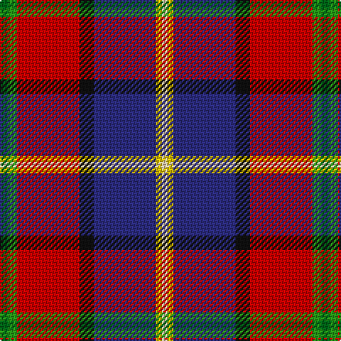

In pattern [GGRKBYW](/stripes/ggrkbyw/).

This was sourced from tartans-authority.  It is a [7 stripe tartan](/stripes/stripes7/).

Original link http://www.tartansauthority.com/tartan-ferret/display/2375/

## Thread count
Ga/6 G6 R44 K10 DB44 Y4 LR/4

## Palette
Each colour and its ΔE from the base-6 reference it is a variant of.

| Colour | Shade | Base | ΔE (OKLab) |
|---|---|---|---|
| DB | <code style="background-color:#2C2C80;">#2C2C80</code> `#2C2C80` | B <code style="background-color:#2A418A;">#2A418A</code> | 0.06 |
| G | <code style="background-color:#289C18;">#289C18</code> `#289C18` | G <code style="background-color:#006100;">#006100</code> | 0.19 |
| Ga | <code style="background-color:#006818;">#006818</code> `#006818` | G <code style="background-color:#006100;">#006100</code> | 0.02 |
| K | <code style="background-color:#101010;">#101010</code> `#101010` | K <code style="background-color:#000000;">#000000</code> | 0.17 |
| LR | <code style="background-color:#F0D0B4;">#F0D0B4</code> `#F0D0B4` | W <code style="background-color:#F7F7F7;">#F7F7F7</code> | 0.11 |
| R | <code style="background-color:#C80000;">#C80000</code> `#C80000` | R <code style="background-color:#CC0000;">#CC0000</code> | 0.01 |
| Y | <code style="background-color:#E8C000;">#E8C000</code> `#E8C000` | Y <code style="background-color:#F2BF00;">#F2BF00</code> | 0.02 |

# Sample pattern

## Nearest tartans

The nearest existing variants by ΔTartan distance.

1. [MacLeod Society of Scotland](/setts/s6/g3g3r22k5db22ly2~x2/) — ΔT 0.99
1. [Loch Etive](/setts/s8/w3g2r21k26db18k2db3ly3~x2/) — ΔT 1.14
1. [MacCreary (Personal)](/setts/s9/k4db12lb3db4g8lo2r24db4r4~x2/) — ΔT 1.16
1. [Loch Etive](/setts/s8/ly3db3k2db18k26r21g2lb3~x2/) — ΔT 1.19
1. [Bombeiros Voluntarios De Galicia (Co](/setts/s7/r3n2r25o12k25w2lb2~x2/) — ΔT 1.19
1. [Asman Red (Personal)](/setts/s10/db4ly3db22o6w2k6w2r26k3r4~x2/) — ΔT 1.22
1. [Wishart Dress (Clan)](/setts/s7/k7db4r31db3ly2db27lb4~x2/) — ΔT 1.24
1. [Crieff Primary School](/setts/s10/k3g1r1db6n2db1n1db1r10w1~x4/) — ΔT 1.25
1. [Walter (Personal)](/setts/s7/r24w3ly4dg18dp18y3t4~x2/) — ΔT 1.27
1. [Walter](/setts/s7/r24w3ly4dg18p18dy3t4~x2/) — ΔT 1.28

## Neighbour map

Every grey dot is one of 14299 variants placed by the first two principal components of the ΔTartan feature space (44% of its variance). Red is this tartan; blue dots are its nearest — click one to open its page.

<svg viewBox="0 0 640 380" role="img" style="max-width:100%;height:auto;border:1px solid #e0e0e0;border-radius:4px;display:block" xmlns="http://www.w3.org/2000/svg"><image href="/nn/cloud.v1.png" width="640" height="380"/><a href="/setts/s6/g3g3r22k5db22ly2~x2/"><circle cx="188.3" cy="157.6" r="4" fill="#3465a4"><title>MacLeod Society of Scotland</title></circle></a><a href="/setts/s8/w3g2r21k26db18k2db3ly3~x2/"><circle cx="153.5" cy="132.2" r="4" fill="#3465a4"><title>Loch Etive</title></circle></a><a href="/setts/s9/k4db12lb3db4g8lo2r24db4r4~x2/"><circle cx="182.7" cy="134.9" r="4" fill="#3465a4"><title>MacCreary (Personal)</title></circle></a><a href="/setts/s8/ly3db3k2db18k26r21g2lb3~x2/"><circle cx="158.4" cy="136.0" r="4" fill="#3465a4"><title>Loch Etive</title></circle></a><a href="/setts/s7/r3n2r25o12k25w2lb2~x2/"><circle cx="186.5" cy="135.3" r="4" fill="#3465a4"><title>Bombeiros Voluntarios De Galicia (Co</title></circle></a><a href="/setts/s10/db4ly3db22o6w2k6w2r26k3r4~x2/"><circle cx="169.1" cy="111.3" r="4" fill="#3465a4"><title>Asman Red (Personal)</title></circle></a><a href="/setts/s7/k7db4r31db3ly2db27lb4~x2/"><circle cx="200.2" cy="126.7" r="4" fill="#3465a4"><title>Wishart Dress (Clan)</title></circle></a><a href="/setts/s10/k3g1r1db6n2db1n1db1r10w1~x4/"><circle cx="179.4" cy="128.6" r="4" fill="#3465a4"><title>Crieff Primary School</title></circle></a><a href="/setts/s7/r24w3ly4dg18dp18y3t4~x2/"><circle cx="94.0" cy="149.9" r="4" fill="#3465a4"><title>Walter (Personal)</title></circle></a><a href="/setts/s7/r24w3ly4dg18p18dy3t4~x2/"><circle cx="95.3" cy="151.1" r="4" fill="#3465a4"><title>Walter</title></circle></a><circle cx="156.6" cy="125.3" r="5" fill="#c00000"/></svg>

ID: /setts/s7/g3g3r22k5db22ly2w2~x2/
