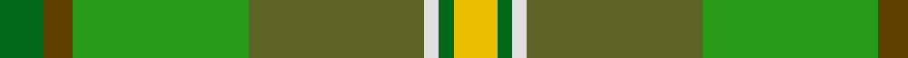
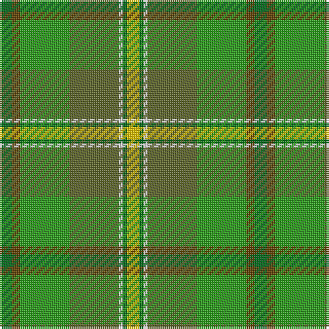

In pattern [GGGGWGY](/patterns/ggggwgy/).

This was sourced from house-of-tartan.  It is a [7 stripes tartan](/stripes/stripes7/).

Original link http://www.house-of-tartan.scotland.net/house/TartanViewjs.asp?colr=Def&tnam=908

## Thread count
G/6 T4 Ga24 Gb24 LN2 G2 Y/6

## Palette
Each colour and its ΔE from the base-6 reference it is a variant of.

| Colour | Shade | Base | ΔE (OKLab) |
|---|---|---|---|
| G | <code style="background-color:#006818;">#006818</code> `#006818` | G <code style="background-color:#006100;">#006100</code> | 0.02 |
| Ga | <code style="background-color:#289C18;">#289C18</code> `#289C18` | G <code style="background-color:#006100;">#006100</code> | 0.19 |
| Gb | <code style="background-color:#5C6428;">#5C6428</code> `#5C6428` | G <code style="background-color:#006100;">#006100</code> | 0.10 |
| LN | <code style="background-color:#E0E0E0;">#E0E0E0</code> `#E0E0E0` | W <code style="background-color:#F7F7F7;">#F7F7F7</code> | 0.07 |
| T | <code style="background-color:#604000;">#604000</code> `#604000` | G <code style="background-color:#006100;">#006100</code> | 0.14 |
| Y | <code style="background-color:#E8C000;">#E8C000</code> `#E8C000` | Y <code style="background-color:#F2BF00;">#F2BF00</code> | 0.02 |

# Sample pattern

## Nearest tartans

The nearest existing variants by ΔTartan distance.

1. [Braemar House](/setts/s7/g3r2ga12gb12w1g1y3~g008000-ga30a010-gb607030-r806050-we0e0e0-yf0c000~x2/) — ΔT 0.87
1. [Shrek](/setts/s12/r4g3r30ga12g5y4g3y14ya2y2ya10yb3~g006438-ga707830-ra87448-y40c440-yaa4cc74-ybbcc41c~x2/) — ΔT 1.55
1. [City of Vancouver (Commemorative)](/setts/s6/g2y1g12w6ga12r1~g006818-ga408060-r880000-wc0c0c0-yd09800~x4/) — ΔT 1.61
1. [Keogh (Name?)](/setts/s8/g29k4ga6y4ga28ya28k1w5~g289c18-ga006818-k101010-w98c8e8-yd87c00-yabc8c00~x2/) — ΔT 1.65
1. [Dalwhinnie (Fashion)](/setts/s9/g70y6ya28ga56ya5ga11ya5ga11r12~g004c00-ga288028-rc80000-ye8c000-yaa0a0a0/) — ΔT 1.67
1. [T.H.E. C.O.G. USA (Corporate)](/setts/s6/y9g18b9r1w1ba1~b5c7888-ba2c2c80-g006818-rc8002c-we0e0e0-ybc8c00~x4/) — ΔT 1.70
1. [Dalwhinnie](/setts/s9/g70y6ya28ga56ya5ga11ya5ga11r12~g004c00-ga288028-rc80000-yffd700-yaa0a0a0/) — ΔT 1.75
1. [Tomass](/setts/s8/r2g1ga9gb1g2gb6gc2gb1~g503c28-ga003800-gb647c00-gc007800-r8c0000~x4/) — ΔT 1.76
1. [Glens of Corbie (Corporate)](/setts/s9/k3g30ga20r6ga3r3ga3b20ra2~b003c64-g006818-ga5c6428-k000000-r94783c-rac80000~x2/) — ΔT 1.83
1. [Wagga Wagga (District)](/setts/s11/g16k6g16ga32k2gb7y2gb7y2gb7b13~b1474b4-g00643c-ga289c18-gb604000-k101010-ye8c000/) — ΔT 1.95

## Neighbour map

Every grey dot is one of 15726 variants placed by the first two principal components of the ΔTartan feature space (44% of its variance). Red is this tartan; blue dots are its nearest — click one to open its page.

<svg viewBox="0 0 640 380" role="img" style="max-width:100%;height:auto;border:1px solid #e0e0e0;border-radius:4px;display:block" xmlns="http://www.w3.org/2000/svg"><image href="/nn/cloud.v1.png" width="640" height="380"/><a href="/setts/s7/g3r2ga12gb12w1g1y3~g008000-ga30a010-gb607030-r806050-we0e0e0-yf0c000~x2/"><circle cx="222.8" cy="185.4" r="4" fill="#3465a4"><title>Braemar House</title></circle></a><a href="/setts/s12/r4g3r30ga12g5y4g3y14ya2y2ya10yb3~g006438-ga707830-ra87448-y40c440-yaa4cc74-ybbcc41c~x2/"><circle cx="201.3" cy="134.1" r="4" fill="#3465a4"><title>Shrek</title></circle></a><a href="/setts/s6/g2y1g12w6ga12r1~g006818-ga408060-r880000-wc0c0c0-yd09800~x4/"><circle cx="244.1" cy="206.6" r="4" fill="#3465a4"><title>City of Vancouver (Commemorative)</title></circle></a><a href="/setts/s8/g29k4ga6y4ga28ya28k1w5~g289c18-ga006818-k101010-w98c8e8-yd87c00-yabc8c00~x2/"><circle cx="192.5" cy="132.5" r="4" fill="#3465a4"><title>Keogh (Name?)</title></circle></a><a href="/setts/s9/g70y6ya28ga56ya5ga11ya5ga11r12~g004c00-ga288028-rc80000-ye8c000-yaa0a0a0/"><circle cx="223.6" cy="165.7" r="4" fill="#3465a4"><title>Dalwhinnie (Fashion)</title></circle></a><a href="/setts/s6/y9g18b9r1w1ba1~b5c7888-ba2c2c80-g006818-rc8002c-we0e0e0-ybc8c00~x4/"><circle cx="267.1" cy="164.6" r="4" fill="#3465a4"><title>T.H.E. C.O.G. USA (Corporate)</title></circle></a><a href="/setts/s9/g70y6ya28ga56ya5ga11ya5ga11r12~g004c00-ga288028-rc80000-yffd700-yaa0a0a0/"><circle cx="219.5" cy="163.9" r="4" fill="#3465a4"><title>Dalwhinnie</title></circle></a><a href="/setts/s8/r2g1ga9gb1g2gb6gc2gb1~g503c28-ga003800-gb647c00-gc007800-r8c0000~x4/"><circle cx="232.1" cy="209.5" r="4" fill="#3465a4"><title>Tomass</title></circle></a><a href="/setts/s9/k3g30ga20r6ga3r3ga3b20ra2~b003c64-g006818-ga5c6428-k000000-r94783c-rac80000~x2/"><circle cx="211.9" cy="165.2" r="4" fill="#3465a4"><title>Glens of Corbie (Corporate)</title></circle></a><a href="/setts/s11/g16k6g16ga32k2gb7y2gb7y2gb7b13~b1474b4-g00643c-ga289c18-gb604000-k101010-ye8c000/"><circle cx="134.8" cy="146.1" r="4" fill="#3465a4"><title>Wagga Wagga (District)</title></circle></a><circle cx="204.0" cy="177.8" r="5" fill="#c00000"/></svg>

ID: /setts/s7/g3ga2gb12gc12w1g1y3~g006818-ga604000-gb289c18-gc5c6428-we0e0e0-ye8c000~x2/
