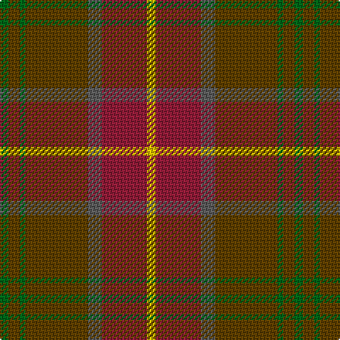

In pattern [GGGGBRY](/patterns/ggggbry/).

This was sourced from tartans-authority.  It is a [7 stripes tartan](/stripes/stripes7/).

Original link http://www.tartansauthority.com/tartan-ferret/display/10668/

## Thread count
G/6 T8 G4 T44 N10 DR32 Y/6

## Palette
Each colour and its ΔE from the base-6 reference it is a variant of.

| Colour | Shade | Base | ΔE (OKLab) |
|---|---|---|---|
| DR | <code style="background-color:#901C38;">#901C38</code> `#901C38` | R <code style="background-color:#CC0000;">#CC0000</code> | 0.13 |
| G | <code style="background-color:#006818;">#006818</code> `#006818` | G <code style="background-color:#006100;">#006100</code> | 0.02 |
| N | <code style="background-color:#5C5C5C;">#5C5C5C</code> `#5C5C5C` | B <code style="background-color:#2A418A;">#2A418A</code> | 0.15 |
| T | <code style="background-color:#604000;">#604000</code> `#604000` | G <code style="background-color:#006100;">#006100</code> | 0.14 |
| Y | <code style="background-color:#E8C000;">#E8C000</code> `#E8C000` | Y <code style="background-color:#F2BF00;">#F2BF00</code> | 0.02 |

# Sample pattern

## Nearest tartans

The nearest existing variants by ΔTartan distance.

1. [Jardine, of Castlemilk](/setts/s8/b9r9ba9ra1bb1r9bb1ra1x4~b401000-ba505050-bb304080-r806050-rac00000/) — ΔT 1.07
1. [John Muir Way](/setts/s8/g35ga19r3gb8r3ga8r3b3x2~b5f749c-g604000-ga003c14-gb767e52-rc80000/) — ΔT 1.11
1. [Scottish Crofting Foundation](/setts/s9/b6y3b18g2b2g10ga28r2ga4x2~b441800-g604000-ga5c6428-r880000-ya0b8a4/) — ΔT 1.11
1. [John Muir Way](/setts/s8/g35ga19r3gb8r3ga8r3b3x2~b2c2c80-g603800-ga003820-gb408060-rc80000/) — ΔT 1.14
1. [Cetoloni Family Tartan Tartan Number: 2049. Earliest known date: November 1991 The Cetoloni tartan was designed with the colours of the Border Hills, 'the sky at its best, the rooftop skyline of Siena and the golden sun of Tuscany'. Franco Cetoloni of Liddlevale was born in Badia Roti Bucine in Arezzo, Italy. Jayne was a designer at Pringle's knitwear in Hawick. Red is Sienna red. See products available Copyright © Blair Urquhart, Comrie, 2015](/setts/s6/b2r22g11y2g11b2x2~b2c2c80-g604000-ra03400-ye8c000/) — ΔT 1.26
1. [Brousseau (Personal)](/setts/s9/g25r2w2b2w2r13ga28b2r3x2~b2c2c80-g5c6428-ga643424-ra00000-we8ccb8/) — ΔT 1.43
1. [Rowardennan](/setts/s6/k3r22g5ga10b10ga2x2~b441800-g344c14-ga002c18-k101010-r880000/) — ΔT 1.43
1. [Loch Rannoch](/setts/s8/b24g2b5r14g2r5ra17b2x2~b401000-g008000-r906030-ra806050/) — ΔT 1.51
1. [Annan (Fashion)](/setts/s10/g16r2g2ra2g2r2g2b6ba10g3x2~b441800-ba5c5c5c-g8c7038-r888888-rab84c00/) — ΔT 1.58
1. [Windy Meadows](/setts/s6/g11b2r4y1ra2ba2x4~b5f749c-ba1e2025-g5d321f-ra32d18-ra905966-yf8e38c/) — ΔT 1.59

## Neighbour map

Every grey dot is one of 15726 variants placed by the first two principal components of the ΔTartan feature space (44% of its variance). Red is this tartan; blue dots are its nearest — click one to open its page.

<svg viewBox="0 0 640 380" role="img" style="max-width:100%;height:auto;border:1px solid #e0e0e0;border-radius:4px;display:block" xmlns="http://www.w3.org/2000/svg"><image href="/nn/cloud.v1.png" width="640" height="380"/><a href="/setts/s8/b9r9ba9ra1bb1r9bb1ra1x4~b401000-ba505050-bb304080-r806050-rac00000/"><circle cx="291.3" cy="222.0" r="4" fill="#3465a4"><title>Jardine, of Castlemilk</title></circle></a><a href="/setts/s8/g35ga19r3gb8r3ga8r3b3x2~b5f749c-g604000-ga003c14-gb767e52-rc80000/"><circle cx="300.9" cy="194.8" r="4" fill="#3465a4"><title>John Muir Way</title></circle></a><a href="/setts/s9/b6y3b18g2b2g10ga28r2ga4x2~b441800-g604000-ga5c6428-r880000-ya0b8a4/"><circle cx="308.9" cy="183.5" r="4" fill="#3465a4"><title>Scottish Crofting Foundation</title></circle></a><a href="/setts/s8/g35ga19r3gb8r3ga8r3b3x2~b2c2c80-g603800-ga003820-gb408060-rc80000/"><circle cx="299.2" cy="194.5" r="4" fill="#3465a4"><title>John Muir Way</title></circle></a><a href="/setts/s6/b2r22g11y2g11b2x2~b2c2c80-g604000-ra03400-ye8c000/"><circle cx="358.1" cy="234.4" r="4" fill="#3465a4"><title>Cetoloni Family Tartan Tartan Number: 2049. Earliest known date: November 1991 The Cetoloni tartan was designed with the colours of the Border Hills, 'the sky at its best, the rooftop skyline of Siena and the golden sun of Tuscany'. Franco Cetoloni of Liddlevale was born in Badia Roti Bucine in Arezzo, Italy. Jayne was a designer at Pringle's knitwear in Hawick. Red is Sienna red. See products available Copyright © Blair Urquhart, Comrie, 2015</title></circle></a><a href="/setts/s9/g25r2w2b2w2r13ga28b2r3x2~b2c2c80-g5c6428-ga643424-ra00000-we8ccb8/"><circle cx="268.9" cy="162.8" r="4" fill="#3465a4"><title>Brousseau (Personal)</title></circle></a><a href="/setts/s6/k3r22g5ga10b10ga2x2~b441800-g344c14-ga002c18-k101010-r880000/"><circle cx="296.8" cy="234.7" r="4" fill="#3465a4"><title>Rowardennan</title></circle></a><a href="/setts/s8/b24g2b5r14g2r5ra17b2x2~b401000-g008000-r906030-ra806050/"><circle cx="291.7" cy="206.2" r="4" fill="#3465a4"><title>Loch Rannoch</title></circle></a><a href="/setts/s10/g16r2g2ra2g2r2g2b6ba10g3x2~b441800-ba5c5c5c-g8c7038-r888888-rab84c00/"><circle cx="348.3" cy="209.6" r="4" fill="#3465a4"><title>Annan (Fashion)</title></circle></a><a href="/setts/s6/g11b2r4y1ra2ba2x4~b5f749c-ba1e2025-g5d321f-ra32d18-ra905966-yf8e38c/"><circle cx="276.7" cy="182.8" r="4" fill="#3465a4"><title>Windy Meadows</title></circle></a><circle cx="317.0" cy="205.7" r="5" fill="#c00000"/></svg>

ID: /setts/s7/g3ga4g2ga22b5r16y3x2~b5c5c5c-g006818-ga604000-r901c38-ye8c000/
