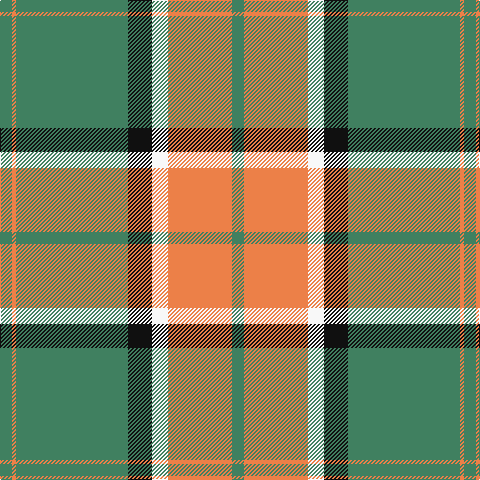

**Bands:** [GYGKWYG](/stripes/gygkwyg/) · **Stripes:** [G LO G K W LO G](/stripes/stripes7/) G LO G K W LO G

This was sourced from register-of-tartans.  It is a [7 band tartan](/bands/bands7/).

Original link https://www.tartanregister.gov.uk/tartanDetails.aspx?ref=3352

## Register references

External register numbers recorded for this tartan.

- Scottish Register of Tartans: [3352](https://www.tartanregister.gov.uk/tartanDetails.aspx?ref=3352)
- Scottish Tartans Authority (ITI): 867
- Scottish Tartans World Register: 867

## Variants

Other setts woven to the same stripe pattern.

- [Pollock (Name)](/setts/s7/g6lo2g32k8w6lo20g5~x2/)

## Thread count
G/12 O4 G112 K24 W16 O64 G/12

## Palette
Each colour and its ΔE from the base-6 reference it is a variant of.

| Colour | Shade | Base | ΔE (OKLab) |
|---|---|---|---|
| G | <code style="background-color:#408060;">#408060</code> `#408060` | G <code style="background-color:#006100;">#006100</code> | 0.14 |
| K | <code style="background-color:#101010;">#101010</code> `#101010` | K <code style="background-color:#000000;">#000000</code> | 0.17 |
| O | <code style="background-color:#EC8048;">#EC8048</code> `#EC8048` | Y <code style="background-color:#F2BF00;">#F2BF00</code> | 0.17 |
| W | <code style="background-color:#F8F8F8;">#F8F8F8</code> `#F8F8F8` | W <code style="background-color:#F7F7F7;">#F7F7F7</code> | 0.00 |

# Sample pattern

## Nearest tartans

The nearest existing variants by ΔTartan distance.

1. [Pollock (Name)](/setts/s7/g6lo2g32k8w6lo20g5~x2/) — ΔT 0.98
1. [Unidentified (ex Tony Murray)](/setts/s7/lb2k2lb2lo36k15lb10r2~x2/) — ΔT 1.28
1. [Livingston (Personal)](/setts/s11/g26r5k1r2k1r5g16r5w16g2w8~x2/) — ΔT 1.31
1. [MacMillan/Isetan](/setts/s6/g68r24g8lo18g3lo18~x2/) — ΔT 1.34
1. [Merrick, Camel](/setts/s7/lb1k1lb1o18k8lb5r1~x4/) — ΔT 1.34
1. [Rice (Welsh Name)](/setts/s10/dt4lo21dt1lo21y8db4y5db4y4dt4/) — ΔT 1.37
1. [Pollock](/setts/s7/g3r16w4k6g28r1g3~x2/) — ΔT 1.37
1. [Machair](/setts/s6/lo72dt16w9dt4w5dt16~x2/) — ΔT 1.42
1. [Inchforth (Personal)](/setts/s9/o4g2o7dt30o8dt7lg5g1w2~x2/) — ΔT 1.42
1. [Evergreen](/setts/s8/w2do30lo10w1lo10do1y10do1~x4/) — ΔT 1.43

## Neighbour map

Every grey dot is one of 14313 variants placed by the first two principal components of the ΔTartan feature space (44% of its variance). Red is this tartan; blue dots are its nearest — click one to open its page.

<svg viewBox="0 0 640 380" role="img" style="max-width:100%;height:auto;border:1px solid #e0e0e0;border-radius:4px;display:block" xmlns="http://www.w3.org/2000/svg"><image href="/nn/cloud.v1.png" width="640" height="380"/><a href="/setts/s7/g6lo2g32k8w6lo20g5~x2/"><circle cx="294.2" cy="174.3" r="4" fill="#3465a4"><title>Pollock (Name)</title></circle></a><a href="/setts/s7/lb2k2lb2lo36k15lb10r2~x2/"><circle cx="292.6" cy="137.9" r="4" fill="#3465a4"><title>Unidentified (ex Tony Murray)</title></circle></a><a href="/setts/s11/g26r5k1r2k1r5g16r5w16g2w8~x2/"><circle cx="272.8" cy="123.4" r="4" fill="#3465a4"><title>Livingston (Personal)</title></circle></a><a href="/setts/s6/g68r24g8lo18g3lo18~x2/"><circle cx="368.2" cy="192.6" r="4" fill="#3465a4"><title>MacMillan/Isetan</title></circle></a><a href="/setts/s7/lb1k1lb1o18k8lb5r1~x4/"><circle cx="295.7" cy="142.9" r="4" fill="#3465a4"><title>Merrick, Camel</title></circle></a><a href="/setts/s10/dt4lo21dt1lo21y8db4y5db4y4dt4/"><circle cx="324.1" cy="160.2" r="4" fill="#3465a4"><title>Rice (Welsh Name)</title></circle></a><a href="/setts/s7/g3r16w4k6g28r1g3~x2/"><circle cx="322.6" cy="141.7" r="4" fill="#3465a4"><title>Pollock</title></circle></a><a href="/setts/s6/lo72dt16w9dt4w5dt16~x2/"><circle cx="382.4" cy="178.8" r="4" fill="#3465a4"><title>Machair</title></circle></a><a href="/setts/s9/o4g2o7dt30o8dt7lg5g1w2~x2/"><circle cx="334.1" cy="120.2" r="4" fill="#3465a4"><title>Inchforth (Personal)</title></circle></a><a href="/setts/s8/w2do30lo10w1lo10do1y10do1~x4/"><circle cx="337.9" cy="147.2" r="4" fill="#3465a4"><title>Evergreen</title></circle></a><circle cx="337.8" cy="145.2" r="5" fill="#c00000"/></svg>

ID: /setts/s7/g3lo16w4k6g28lo1g3~x4/
