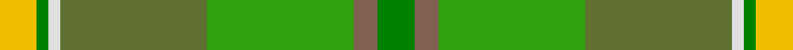

This page is one **sett** — a single exact thread-count. It belongs to the [tartan](/tartans/g3o2g12y12w1g1ly3/)
(the same proportion at any scale), whose colour order is pattern [GRGGWGY](/stripes/grggwgy/).

Sourced from weddslist.  It is a [7 stripe tartan](/stripes/stripes7/).

Original link http://www.weddslist.com/cgi-bin/tartans/pg.pl?source=sts

## Thread count
Y/6 Gb2 LN2 G24 Ga24 LT4 Gb/6

## Palette

Palette: <strong>Tartan Dictionary</strong> <small style="color:#888">(1 of 6 colours)</small>
<table><thead><tr><th>Colour</th><th>Threads</th><th>Shade</th><th>Base</th><th>OKLCh</th></tr></thead><tbody><tr><td>Y/</td><td style="text-align:right;font-variant-numeric:tabular-nums">6</td><td><code style="background-color:#F0C000;">#F0C000</code> <small style="color:#888">#F0C000</small></td><td>Y <code style="background-color:#F2BF00;">#F2BF00</code></td><td><small style="color:#888">oklch(82.7% 0.169 90.5)</small></td></tr><tr><td>Gb</td><td style="text-align:right;font-variant-numeric:tabular-nums">2</td><td><code style="background-color:#008000;">#008000</code> <small style="color:#888">#008000</small></td><td>G <code style="background-color:#006100;">#006100</code></td><td><small style="color:#888">oklch(52.0% 0.177 142.5)</small></td></tr><tr><td>LN</td><td style="text-align:right;font-variant-numeric:tabular-nums">2</td><td><code style="background-color:#E0E0E0;">#E0E0E0</code> <small style="color:#888">#E0E0E0</small></td><td>W <code style="background-color:#F7F7F7;">#F7F7F7</code></td><td><small style="color:#888">oklch(90.7% 0.000 89.9)</small></td></tr><tr><td>G</td><td style="text-align:right;font-variant-numeric:tabular-nums">24</td><td><code style="background-color:#607030;">#607030</code> <small style="color:#888">#607030</small></td><td>G <code style="background-color:#006100;">#006100</code></td><td><small style="color:#888">oklch(51.7% 0.091 121.3)</small></td></tr><tr><td>Ga</td><td style="text-align:right;font-variant-numeric:tabular-nums">24</td><td><code style="background-color:#30A010;">#30A010</code> <small style="color:#888">#30A010</small></td><td>G <code style="background-color:#006100;">#006100</code></td><td><small style="color:#888">oklch(61.9% 0.195 140.5)</small></td></tr><tr><td>LT</td><td style="text-align:right;font-variant-numeric:tabular-nums">4</td><td><code style="background-color:#806050;">#806050</code> <small style="color:#888">#806050</small></td><td>R <code style="background-color:#CC0000;">#CC0000</code></td><td><small style="color:#888">oklch(51.7% 0.049 47.8)</small></td></tr><tr><td>Gb/</td><td style="text-align:right;font-variant-numeric:tabular-nums">6</td><td><code style="background-color:#008000;">#008000</code> <small style="color:#888">#008000</small></td><td>G <code style="background-color:#006100;">#006100</code></td><td><small style="color:#888">oklch(52.0% 0.177 142.5)</small></td></tr></tbody></table>

# Sample pattern

## Nearest tartans

The nearest existing variants by ΔTartan distance, with this tartan at the top so the swatches line up against it.

ΔTartan

Tartan

Sett

—

<a href="/ttd/edit/#slug=g3o2g12y12w1g1ly3~x2">Braemar House</a> <a class="nn-out" href="/setts/s7/g3o2g12y12w1g1ly3~x2/" title="open its dictionary page">↗</a>

0.87

<a href="/ttd/edit/#slug=g3dy2g12y12w1g1ly3~x2">Braemar House Corporate Tartan Tartan Number: 908. Earliest known date: 1987 The Lords Kilmarnock are descended from both the Hays (the Earls of Errol), and the Stewarts and the design incorporates elements from the Hay-Leith tartan (the red section) and the Hunting Stewart (the green section) with minor alterations to each. The representation here follows the count registered with Lord Lyon on 7th March 1956. The Boyd family are closely associated with the town of Kilmarnock in the South West of the Scottish Lowlands. See products available Copyright © Blair Urquhart, Comrie, 2015</a> <a class="nn-out" href="/setts/s7/g3dy2g12y12w1g1ly3~x2/" title="open its dictionary page">↗</a>

1.66

<a href="/ttd/edit/#slug=o4g3o30y12g5lg4g3lg14lg2lg2lg10ly3~x2">Shrek</a> <a class="nn-out" href="/setts/s12/o4g3o30y12g5lg4g3lg14lg2lg2lg10ly3~x2/" title="open its dictionary page">↗</a>

1.93

<a href="/ttd/edit/#slug=lo3g30y20o6y3o3y3dt20r2~x2">Glens of Corbie</a> <a class="nn-out" href="/setts/s9/lo3g30y20o6y3o3y3dt20r2~x2/" title="open its dictionary page">↗</a>

2.08

<a href="/ttd/edit/#slug=g2lo1g12lb6g12r1~x4">City of Vancouver (Commemorative)</a> <a class="nn-out" href="/setts/s6/g2lo1g12lb6g12r1~x4/" title="open its dictionary page">↗</a>

2.08

<a href="/ttd/edit/#slug=k3g30y20o6y3o3y3dt20r2~x2">Glens of Corbie (Corporate)</a> <a class="nn-out" href="/setts/s9/k3g30y20o6y3o3y3dt20r2~x2/" title="open its dictionary page">↗</a>

2.11

<a href="/ttd/edit/#slug=r2dy1dg9y1dy2y6g2y1~x4">Tomass</a> <a class="nn-out" href="/setts/s8/r2dy1dg9y1dy2y6g2y1~x4/" title="open its dictionary page">↗</a>

2.22

<a href="/ttd/edit/#slug=g29k4g6lo4g28lo28k1lb5~x2">Keogh (Name?)</a> <a class="nn-out" href="/setts/s8/g29k4g6lo4g28lo28k1lb5~x2/" title="open its dictionary page">↗</a>

2.22

<a href="/ttd/edit/#slug=g1r7g7n2r1dg15lb1~x4">Ramsay (Green Fashion)</a> <a class="nn-out" href="/setts/s7/g1r7g7n2r1dg15lb1~x4/" title="open its dictionary page">↗</a>

2.25

<a href="/ttd/edit/#slug=g4y52dg4g8dg6dg12g17y7lo4">McAlbourne (Corporate)</a> <a class="nn-out" href="/setts/s9/g4y52dg4g8dg6dg12g17y7lo4/" title="open its dictionary page">↗</a>

2.25

<a href="/ttd/edit/#slug=lo9g18t9r1w1db1~x4">T.H.E. C.O.G. USA (Corporate)</a> <a class="nn-out" href="/setts/s6/lo9g18t9r1w1db1~x4/" title="open its dictionary page">↗</a>

## Neighbour map

Every grey dot is one of 14299 variants placed by the first two principal components of the ΔTartan feature space (44% of its variance). Red is this tartan; blue dots are its nearest — click one to open its page.

<svg viewBox="0 0 640 380" role="img" style="max-width:100%;height:auto;border:1px solid #e0e0e0;border-radius:4px;display:block" xmlns="http://www.w3.org/2000/svg"><image href="/nn/cloud.v1.png" width="640" height="380"/><a href="/setts/s7/g3dy2g12y12w1g1ly3~x2/"><circle cx="206.1" cy="188.6" r="4" fill="#3465a4"><title>Braemar House Corporate Tartan Tartan Number: 908. Earliest known date: 1987 The Lords Kilmarnock are descended from both the Hays (the Earls of Errol), and the Stewarts and the design incorporates elements from the Hay-Leith tartan (the red section) and the Hunting Stewart (the green section) with minor alterations to each. The representation here follows the count registered with Lord Lyon on 7th March 1956. The Boyd family are closely associated with the town of Kilmarnock in the South West of the Scottish Lowlands. See products available Copyright © Blair Urquhart, Comrie, 2015</title></circle></a><a href="/setts/s12/o4g3o30y12g5lg4g3lg14lg2lg2lg10ly3~x2/"><circle cx="202.8" cy="145.4" r="4" fill="#3465a4"><title>Shrek</title></circle></a><a href="/setts/s9/lo3g30y20o6y3o3y3dt20r2~x2/"><circle cx="238.1" cy="190.0" r="4" fill="#3465a4"><title>Glens of Corbie</title></circle></a><a href="/setts/s6/g2lo1g12lb6g12r1~x4/"><circle cx="246.3" cy="214.5" r="4" fill="#3465a4"><title>City of Vancouver (Commemorative)</title></circle></a><a href="/setts/s9/k3g30y20o6y3o3y3dt20r2~x2/"><circle cx="214.4" cy="178.5" r="4" fill="#3465a4"><title>Glens of Corbie (Corporate)</title></circle></a><a href="/setts/s8/r2dy1dg9y1dy2y6g2y1~x4/"><circle cx="234.2" cy="220.5" r="4" fill="#3465a4"><title>Tomass</title></circle></a><a href="/setts/s8/g29k4g6lo4g28lo28k1lb5~x2/"><circle cx="194.8" cy="140.8" r="4" fill="#3465a4"><title>Keogh (Name?)</title></circle></a><a href="/setts/s7/g1r7g7n2r1dg15lb1~x4/"><circle cx="314.2" cy="212.2" r="4" fill="#3465a4"><title>Ramsay (Green Fashion)</title></circle></a><a href="/setts/s9/g4y52dg4g8dg6dg12g17y7lo4/"><circle cx="344.6" cy="197.2" r="4" fill="#3465a4"><title>McAlbourne (Corporate)</title></circle></a><a href="/setts/s6/lo9g18t9r1w1db1~x4/"><circle cx="269.0" cy="171.9" r="4" fill="#3465a4"><title>T.H.E. C.O.G. USA (Corporate)</title></circle></a><circle cx="224.5" cy="198.7" r="5" fill="#c00000"/></svg>

ID: /setts/s7/g3o2g12y12w1g1ly3~x2/
