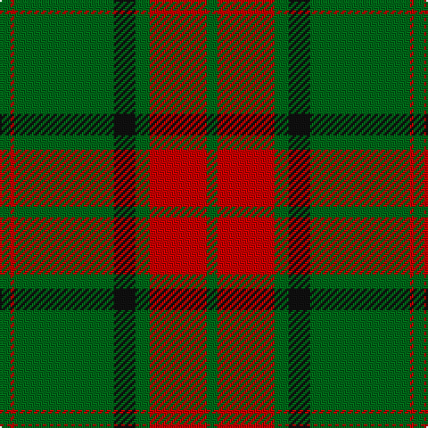

In pattern [GRGKGRG](/patterns/grgkgrg/).

This was sourced from house-of-tartan.  It is a [7 stripes tartan](/stripes/stripes7/).

Original link http://www.house-of-tartan.scotland.net/house/TartanViewjs.asp?colr=Def&tnam=865

## Thread count
G/6 R2 G56 K12 G8 R32 G/6

## Palette
Each colour and its ΔE from the base-6 reference it is a variant of.

| Colour | Shade | Base | ΔE (OKLab) |
|---|---|---|---|
| G | <code style="background-color:#006818;">#006818</code> `#006818` | G <code style="background-color:#006100;">#006100</code> | 0.02 |
| K | <code style="background-color:#101010;">#101010</code> `#101010` | K <code style="background-color:#000000;">#000000</code> | 0.17 |
| R | <code style="background-color:#C80000;">#C80000</code> `#C80000` | R <code style="background-color:#CC0000;">#CC0000</code> | 0.01 |

# Sample pattern

## Nearest tartans

The nearest existing variants by ΔTartan distance.

1. [Maxwell, hunting](/setts/s7/g3r16g4k6g28r1g3x2~g008000-k000000-rc00000/) — ΔT 1.12
1. [Princess Margaret Rose Tartan Tartan Number: 986. Earliest known date: 1930 Colours reversed from MacGregor See products available Copyright © Blair Urquhart, Comrie, 2015](/setts/s6/g36r18g4r6k1w2x2~g006818-k101010-rc80000-we0e0e0/) — ΔT 1.16
1. [MacMillan/Isetan](/setts/s6/g68r24g8y18g3y18x2~g00643c-rc8002c-ye0a126/) — ΔT 1.23
1. [MacMillan/Isetan (Corporate)](/setts/s6/g68r24g8y18g3y18x2~g285800-rc80000-ybc8c00/) — ΔT 1.27
1. [Rothesay #2](/setts/s10/g4r16g4r2g3r2g32w1g1w2x2~g006818-rc80000-wfcfcfc/) — ΔT 1.37
1. [Maxwell Htg (Clan)](/setts/s7/g3r16g4k6g28r2g3x2~g006818-k101010-r880000/) — ΔT 1.41
1. [Logan #4](/setts/s7/g9r4g1r4g15ra4g1x4~g006818-re87878-rac80000/) — ΔT 1.43
1. [MacArthur-Fox 2000 (Personal)](/setts/s10/g5k2g30r2k10g5k2g5k10r2x2~g5c6428-k101010-rc80000/) — ΔT 1.45
1. [Pollock Clan Tartan Tartan Number: 867. Earliest known date: 1980 Based on the Maxwell sett which in turn comes from the Vestiarium Scoticum (1842). Details of the Clan Society's design came from Rhys A Pollock in America. Pollocks were feudal dependents of the Maxwells who lived in the Scottish Lowlands. See products available Copyright © Blair Urquhart, Comrie, 2015](/setts/s7/g3r16w4k6g28r1g3x2~g006818-k101010-rc80000-we0e0e0/) — ΔT 1.45
1. [St. Christopher (Corporate)](/setts/s8/g5r3g3y2g1ya8g24y2x2~g285800-rc80000-ybc8c00-yac4bc68/) — ΔT 1.45

## Neighbour map

Every grey dot is one of 15726 variants placed by the first two principal components of the ΔTartan feature space (44% of its variance). Red is this tartan; blue dots are its nearest — click one to open its page.

<svg viewBox="0 0 640 380" role="img" style="max-width:100%;height:auto;border:1px solid #e0e0e0;border-radius:4px;display:block" xmlns="http://www.w3.org/2000/svg"><image href="/nn/cloud.v1.png" width="640" height="380"/><a href="/setts/s7/g3r16g4k6g28r1g3x2~g008000-k000000-rc00000/"><circle cx="396.3" cy="170.6" r="4" fill="#3465a4"><title>Maxwell, hunting</title></circle></a><a href="/setts/s6/g36r18g4r6k1w2x2~g006818-k101010-rc80000-we0e0e0/"><circle cx="421.2" cy="153.6" r="4" fill="#3465a4"><title>Princess Margaret Rose Tartan Tartan Number: 986. Earliest known date: 1930 Colours reversed from MacGregor See products available Copyright © Blair Urquhart, Comrie, 2015</title></circle></a><a href="/setts/s6/g68r24g8y18g3y18x2~g00643c-rc8002c-ye0a126/"><circle cx="366.8" cy="193.9" r="4" fill="#3465a4"><title>MacMillan/Isetan</title></circle></a><a href="/setts/s6/g68r24g8y18g3y18x2~g285800-rc80000-ybc8c00/"><circle cx="391.9" cy="204.7" r="4" fill="#3465a4"><title>MacMillan/Isetan (Corporate)</title></circle></a><a href="/setts/s10/g4r16g4r2g3r2g32w1g1w2x2~g006818-rc80000-wfcfcfc/"><circle cx="462.1" cy="136.1" r="4" fill="#3465a4"><title>Rothesay #2</title></circle></a><a href="/setts/s7/g3r16g4k6g28r2g3x2~g006818-k101010-r880000/"><circle cx="418.8" cy="220.9" r="4" fill="#3465a4"><title>Maxwell Htg (Clan)</title></circle></a><a href="/setts/s7/g9r4g1r4g15ra4g1x4~g006818-re87878-rac80000/"><circle cx="427.6" cy="218.9" r="4" fill="#3465a4"><title>Logan #4</title></circle></a><a href="/setts/s10/g5k2g30r2k10g5k2g5k10r2x2~g5c6428-k101010-rc80000/"><circle cx="413.2" cy="190.0" r="4" fill="#3465a4"><title>MacArthur-Fox 2000 (Personal)</title></circle></a><a href="/setts/s7/g3r16w4k6g28r1g3x2~g006818-k101010-rc80000-we0e0e0/"><circle cx="339.9" cy="151.4" r="4" fill="#3465a4"><title>Pollock Clan Tartan Tartan Number: 867. Earliest known date: 1980 Based on the Maxwell sett which in turn comes from the Vestiarium Scoticum (1842). Details of the Clan Society's design came from Rhys A Pollock in America. Pollocks were feudal dependents of the Maxwells who lived in the Scottish Lowlands. See products available Copyright © Blair Urquhart, Comrie, 2015</title></circle></a><a href="/setts/s8/g5r3g3y2g1ya8g24y2x2~g285800-rc80000-ybc8c00-yac4bc68/"><circle cx="441.1" cy="158.9" r="4" fill="#3465a4"><title>St. Christopher (Corporate)</title></circle></a><circle cx="428.1" cy="181.8" r="5" fill="#c00000"/></svg>

ID: /setts/s7/g3r16g4k6g28r1g3x2~g006818-k101010-rc80000/
