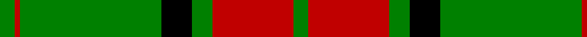
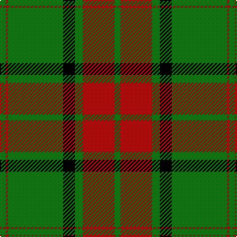

In pattern [GRGKGRG](/patterns/grgkgrg/).

This was sourced from weddslist.  It is a [7 stripes tartan](/stripes/stripes7/).

Original link http://www.weddslist.com/cgi-bin/tartans/pg.pl?source=sts

## Thread count
G/6 R2 G56 K12 G8 R32 G/6

## Palette
Each colour and its ΔE from the base-6 reference it is a variant of.

| Colour | Shade | Base | ΔE (OKLab) |
|---|---|---|---|
| G | <code style="background-color:#008000;">#008000</code> `#008000` | G <code style="background-color:#006100;">#006100</code> | 0.10 |
| K | <code style="background-color:#000000;">#000000</code> `#000000` | K <code style="background-color:#000000;">#000000</code> | 0.00 |
| R | <code style="background-color:#C00000;">#C00000</code> `#C00000` | R <code style="background-color:#CC0000;">#CC0000</code> | 0.03 |

# Sample pattern

## Nearest tartans

The nearest existing variants by ΔTartan distance.

1. [Maxwell Hunting Clan Tartan Tartan Number: 865. Earliest known date: 0 Tartans of the Lowland families were not named until the publication the 'Vestiarium Scoticum' in 1842. The authors, the Sobieski Stuart brothers, enjoyed a popular following amongst the Scottish gentry in the early Victorian era, and in the spirit of the times, added mystery, romance and some spurious historical documentation to the subject of tartans. The Maxwells have, nevertheless, a tartan of at least 150 years antiquity, probably designed by persons of great imagination and flair. The Maxwells come from Glasgow and the S.W. of Scotland. See products available Copyright © Blair Urquhart, Comrie, 2015](/setts/s7/g3r16g4k6g28r1g3~g006818-k101010-rc80000~x2/) — ΔT 1.12
1. [Pollock](/setts/s7/g3r16w4k6g28r1g3~g008000-k000000-rc00000-we0e0e0~x2/) — ΔT 1.29
1. [Pollock Clan Tartan Tartan Number: 867. Earliest known date: 1980 Based on the Maxwell sett which in turn comes from the Vestiarium Scoticum (1842). Details of the Clan Society's design came from Rhys A Pollock in America. Pollocks were feudal dependents of the Maxwells who lived in the Scottish Lowlands. See products available Copyright © Blair Urquhart, Comrie, 2015](/setts/s7/g3r16w4k6g28r1g3~g006818-k101010-rc80000-we0e0e0~x2/) — ΔT 1.40
1. [Rothesay #2](/setts/s10/g4r16g4r2g3r2g32w1g1w2~g006818-rc80000-wfcfcfc~x2/) — ΔT 1.47
1. [MacMillan/Isetan](/setts/s6/g68r24g8y18g3y18~g00643c-rc8002c-ye0a126~x2/) — ΔT 1.50
1. [Sir Billi (Corporate)](/setts/s6/r8g12w5k11g42k3~g347400-k101010-rc80000-wf4f8c8~x2/) — ΔT 1.52
1. [Princess Margaret Rose Tartan Tartan Number: 986. Earliest known date: 1930 Colours reversed from MacGregor See products available Copyright © Blair Urquhart, Comrie, 2015](/setts/s6/g36r18g4r6k1w2~g006818-k101010-rc80000-we0e0e0~x2/) — ΔT 1.54
1. [Big Spruce Brewing](/setts/s6/g11y1g1y6k1y1~g005020-k101010-ye0a126~x4/) — ΔT 1.56
1. [St. Christopher (Corporate)](/setts/s8/g5r3g3y2g1ya8g24y2~g285800-rc80000-ybc8c00-yac4bc68~x2/) — ΔT 1.62
1. [Rothesay Hunting Family Tartan Tartan Number: 984. Earliest known date: 1906 One of the 'Dress' and 'Hunting' versions of clan tartans introduced for the first time in 1906 by H. Whyte's and others, 'The Tartans of the Clans and Septs of Scotland' published by W & A. K. Johnston, Edinburgh. The book contains over 200 tartans and is the fore-runner of Johnston's annual pocket editions. See products available Copyright © Blair Urquhart, Comrie, 2015](/setts/s10/g4r16g4r2g3r2g32w2g2w3~g004810-rc80000-we0e0e0~x2/) — ΔT 1.63

## Neighbour map

Every grey dot is one of 15726 variants placed by the first two principal components of the ΔTartan feature space (44% of its variance). Red is this tartan; blue dots are its nearest — click one to open its page.

<svg viewBox="0 0 640 380" role="img" style="max-width:100%;height:auto;border:1px solid #e0e0e0;border-radius:4px;display:block" xmlns="http://www.w3.org/2000/svg"><image href="/nn/cloud.v1.png" width="640" height="380"/><a href="/setts/s7/g3r16g4k6g28r1g3~g006818-k101010-rc80000~x2/"><circle cx="428.1" cy="181.8" r="4" fill="#3465a4"><title>Maxwell Hunting Clan Tartan Tartan Number: 865. Earliest known date: 0 Tartans of the Lowland families were not named until the publication the 'Vestiarium Scoticum' in 1842. The authors, the Sobieski Stuart brothers, enjoyed a popular following amongst the Scottish gentry in the early Victorian era, and in the spirit of the times, added mystery, romance and some spurious historical documentation to the subject of tartans. The Maxwells have, nevertheless, a tartan of at least 150 years antiquity, probably designed by persons of great imagination and flair. The Maxwells come from Glasgow and the S.W. of Scotland. See products available Copyright © Blair Urquhart, Comrie, 2015</title></circle></a><a href="/setts/s7/g3r16w4k6g28r1g3~g008000-k000000-rc00000-we0e0e0~x2/"><circle cx="320.4" cy="145.0" r="4" fill="#3465a4"><title>Pollock</title></circle></a><a href="/setts/s7/g3r16w4k6g28r1g3~g006818-k101010-rc80000-we0e0e0~x2/"><circle cx="339.9" cy="151.4" r="4" fill="#3465a4"><title>Pollock Clan Tartan Tartan Number: 867. Earliest known date: 1980 Based on the Maxwell sett which in turn comes from the Vestiarium Scoticum (1842). Details of the Clan Society's design came from Rhys A Pollock in America. Pollocks were feudal dependents of the Maxwells who lived in the Scottish Lowlands. See products available Copyright © Blair Urquhart, Comrie, 2015</title></circle></a><a href="/setts/s10/g4r16g4r2g3r2g32w1g1w2~g006818-rc80000-wfcfcfc~x2/"><circle cx="462.1" cy="136.1" r="4" fill="#3465a4"><title>Rothesay #2</title></circle></a><a href="/setts/s6/g68r24g8y18g3y18~g00643c-rc8002c-ye0a126~x2/"><circle cx="366.8" cy="193.9" r="4" fill="#3465a4"><title>MacMillan/Isetan</title></circle></a><a href="/setts/s6/r8g12w5k11g42k3~g347400-k101010-rc80000-wf4f8c8~x2/"><circle cx="371.9" cy="194.9" r="4" fill="#3465a4"><title>Sir Billi (Corporate)</title></circle></a><a href="/setts/s6/g36r18g4r6k1w2~g006818-k101010-rc80000-we0e0e0~x2/"><circle cx="421.2" cy="153.6" r="4" fill="#3465a4"><title>Princess Margaret Rose Tartan Tartan Number: 986. Earliest known date: 1930 Colours reversed from MacGregor See products available Copyright © Blair Urquhart, Comrie, 2015</title></circle></a><a href="/setts/s6/g11y1g1y6k1y1~g005020-k101010-ye0a126~x4/"><circle cx="349.7" cy="204.9" r="4" fill="#3465a4"><title>Big Spruce Brewing</title></circle></a><a href="/setts/s8/g5r3g3y2g1ya8g24y2~g285800-rc80000-ybc8c00-yac4bc68~x2/"><circle cx="441.1" cy="158.9" r="4" fill="#3465a4"><title>St. Christopher (Corporate)</title></circle></a><a href="/setts/s10/g4r16g4r2g3r2g32w2g2w3~g004810-rc80000-we0e0e0~x2/"><circle cx="412.6" cy="161.3" r="4" fill="#3465a4"><title>Rothesay Hunting Family Tartan Tartan Number: 984. Earliest known date: 1906 One of the 'Dress' and 'Hunting' versions of clan tartans introduced for the first time in 1906 by H. Whyte's and others, 'The Tartans of the Clans and Septs of Scotland' published by W &amp; A. K. Johnston, Edinburgh. The book contains over 200 tartans and is the fore-runner of Johnston's annual pocket editions. See products available Copyright © Blair Urquhart, Comrie, 2015</title></circle></a><circle cx="396.3" cy="170.6" r="5" fill="#c00000"/></svg>

ID: /setts/s7/g3r16g4k6g28r1g3~g008000-k000000-rc00000~x2/
