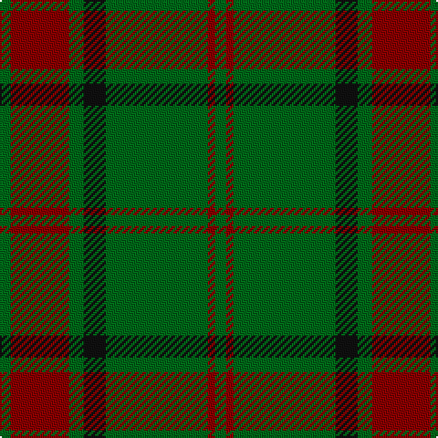

This page is one **sett** — a single exact thread-count. It belongs to the [tartan](/tartans/g3dr16g4k6g28dr2g3/)
(the same proportion at any scale), whose colour order is pattern [GRGKGRG](/stripes/grgkgrg/).

Sourced from tartans-authority.  It is a [7 stripe tartan](/stripes/stripes7/).

Original link http://www.tartansauthority.com/tartan-ferret/display/865/

## Also known as

This cloth is also recorded under:

- Maxwell Hunting

2 attestations — the source records this cloth was collapsed from (oldest owns this page)

<ul>
<li>pre 1980 — Maxwell Htg (Clan) (tartans-authority, <a href="http://www.tartansauthority.com/tartan-ferret/display/865/">record</a>)</li>
<li>01/01/1981 — Maxwell Hunting (register-of-tartans, <a href="https://www.tartanregister.gov.uk/tartanDetails.aspx?ref=2863">record</a>)</li>
</ul>

## Register references

External register numbers recorded for this tartan.

- Scottish Register of Tartans: [2863](https://www.tartanregister.gov.uk/tartanDetails.aspx?ref=2863)
- Scottish Tartans Authority (ITI): 865
- Scottish Tartans World Register: 865

## Thread count
G/6 DR32 G8 K12 G56 DR4 G/6

## Palette
Each colour and the base-6 reference it is a variant of.

| Colour | Shade | Base |
|---|---|---|
| DR | <code style="background-color:#880000;">#880000</code> `oklch(39.4% 0.162 29.2)` <small>#880000</small> | R <code style="background-color:#CC0000;">#CC0000</code> |
| G | <code style="background-color:#006818;">#006818</code> `oklch(45.0% 0.142 145.0)` <small>#006818</small> | G <code style="background-color:#006100;">#006100</code> |
| K | <code style="background-color:#101010;">#101010</code> `oklch(17.3% 0.000 89.9)` <small>#101010</small> | K <code style="background-color:#000000;">#000000</code> |

# Sample pattern

## Nearest tartans

The nearest existing variants by ΔTartan distance, with this tartan at the top so the swatches line up against it.

ΔTartan

Tartan

Sett

—

<a href="/ttd/edit/#slug=g3r16g4k6g28r2g3~x2">Maxwell Htg (Clan)</a> <a class="nn-out" href="/setts/s7/g3r16g4k6g28r2g3~x2/" title="open its dictionary page">↗</a>

0.88

<a href="/ttd/edit/#slug=lo1dg11k6dg3lo1dg1lo1~x4">Angle, Green (Fashion)</a> <a class="nn-out" href="/setts/s7/lo1dg11k6dg3lo1dg1lo1~x4/" title="open its dictionary page">↗</a>

1.08

<a href="/ttd/edit/#slug=dg37o9dg3r9o3~x2">Glen Trool</a> <a class="nn-out" href="/setts/s5/dg37o9dg3r9o3~x2/" title="open its dictionary page">↗</a>

1.11

<a href="/ttd/edit/#slug=dg42o10dg3r10o3~x2">Glen Trool (Fashion)</a> <a class="nn-out" href="/setts/s5/dg42o10dg3r10o3~x2/" title="open its dictionary page">↗</a>

1.16

<a href="/ttd/edit/#slug=r2g2r1g12r3k1~x4">Connell (Personal?)</a> <a class="nn-out" href="/setts/s6/r2g2r1g12r3k1~x4/" title="open its dictionary page">↗</a>

1.20

<a href="/ttd/edit/#slug=dg16ly3dg14r16dg2r2dg3~x2">Scott Autumn (Fashion)</a> <a class="nn-out" href="/setts/s7/dg16ly3dg14r16dg2r2dg3~x2/" title="open its dictionary page">↗</a>

1.22

<a href="/ttd/edit/#slug=y5k2y30r2k10y5k2y5k10r2~x2">MacArthur-Fox 2000 (Personal)</a> <a class="nn-out" href="/setts/s10/y5k2y30r2k10y5k2y5k10r2~x2/" title="open its dictionary page">↗</a>

1.31

<a href="/ttd/edit/#slug=g3k6r2k6g3k2g16k1~x4">Glenbarr</a> <a class="nn-out" href="/setts/s8/g3k6r2k6g3k2g16k1~x4/" title="open its dictionary page">↗</a>

1.33

<a href="/ttd/edit/#slug=r6dg2db2dg17r2~x4">Loton (Personal)</a> <a class="nn-out" href="/setts/s5/r6dg2db2dg17r2~x4/" title="open its dictionary page">↗</a>

1.34

<a href="/ttd/edit/#slug=g24r4g3k14g5r2g10~x2">Northcroft (Personal)</a> <a class="nn-out" href="/setts/s7/g24r4g3k14g5r2g10~x2/" title="open its dictionary page">↗</a>

1.37

<a href="/ttd/edit/#slug=o1g1o5g8lg1g1lg1~x4">O'Neill Pipe Band 1983 (Corporate)</a> <a class="nn-out" href="/setts/s7/o1g1o5g8lg1g1lg1~x4/" title="open its dictionary page">↗</a>

## Neighbour map

Every grey dot is one of 14299 variants placed by the first two principal components of the ΔTartan feature space (44% of its variance). Red is this tartan; blue dots are its nearest — click one to open its page.

<svg viewBox="0 0 640 380" role="img" style="max-width:100%;height:auto;border:1px solid #e0e0e0;border-radius:4px;display:block" xmlns="http://www.w3.org/2000/svg"><image href="/nn/cloud.v1.png" width="640" height="380"/><a href="/setts/s7/lo1dg11k6dg3lo1dg1lo1~x4/"><circle cx="396.8" cy="226.0" r="4" fill="#3465a4"><title>Angle, Green (Fashion)</title></circle></a><a href="/setts/s5/dg37o9dg3r9o3~x2/"><circle cx="441.6" cy="238.4" r="4" fill="#3465a4"><title>Glen Trool</title></circle></a><a href="/setts/s5/dg42o10dg3r10o3~x2/"><circle cx="467.3" cy="240.5" r="4" fill="#3465a4"><title>Glen Trool (Fashion)</title></circle></a><a href="/setts/s6/r2g2r1g12r3k1~x4/"><circle cx="445.8" cy="217.8" r="4" fill="#3465a4"><title>Connell (Personal?)</title></circle></a><a href="/setts/s7/dg16ly3dg14r16dg2r2dg3~x2/"><circle cx="406.4" cy="262.3" r="4" fill="#3465a4"><title>Scott Autumn (Fashion)</title></circle></a><a href="/setts/s10/y5k2y30r2k10y5k2y5k10r2~x2/"><circle cx="414.8" cy="190.3" r="4" fill="#3465a4"><title>MacArthur-Fox 2000 (Personal)</title></circle></a><a href="/setts/s8/g3k6r2k6g3k2g16k1~x4/"><circle cx="376.8" cy="215.1" r="4" fill="#3465a4"><title>Glenbarr</title></circle></a><a href="/setts/s5/r6dg2db2dg17r2~x4/"><circle cx="453.1" cy="267.3" r="4" fill="#3465a4"><title>Loton (Personal)</title></circle></a><a href="/setts/s7/g24r4g3k14g5r2g10~x2/"><circle cx="418.0" cy="239.4" r="4" fill="#3465a4"><title>Northcroft (Personal)</title></circle></a><a href="/setts/s7/o1g1o5g8lg1g1lg1~x4/"><circle cx="369.1" cy="239.5" r="4" fill="#3465a4"><title>O'Neill Pipe Band 1983 (Corporate)</title></circle></a><circle cx="420.1" cy="223.3" r="5" fill="#c00000"/></svg>

ID: /setts/s7/g3r16g4k6g28r2g3~x2/
