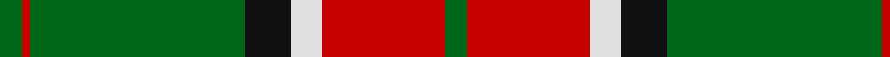
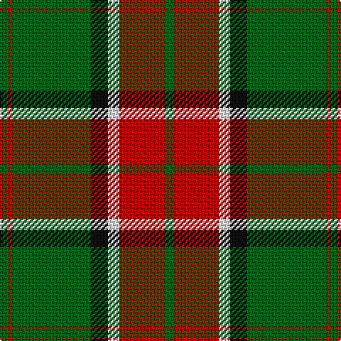

In pattern [GRGKWRG](/patterns/grgkwrg/).

This was sourced from house-of-tartan.  It is a [7 stripes tartan](/stripes/stripes7/).

Original link http://www.house-of-tartan.scotland.net/house/TartanViewjs.asp?colr=Def&tnam=867

## Thread count
G/6 R2 G56 K12 LN8 R32 G/6

## Palette
Each colour and its ΔE from the base-6 reference it is a variant of.

| Colour | Shade | Base | ΔE (OKLab) |
|---|---|---|---|
| G | <code style="background-color:#006818;">#006818</code> `#006818` | G <code style="background-color:#006100;">#006100</code> | 0.02 |
| K | <code style="background-color:#101010;">#101010</code> `#101010` | K <code style="background-color:#000000;">#000000</code> | 0.17 |
| LN | <code style="background-color:#E0E0E0;">#E0E0E0</code> `#E0E0E0` | W <code style="background-color:#F7F7F7;">#F7F7F7</code> | 0.07 |
| R | <code style="background-color:#C80000;">#C80000</code> `#C80000` | R <code style="background-color:#CC0000;">#CC0000</code> | 0.01 |

# Sample pattern

## Nearest tartans

The nearest existing variants by ΔTartan distance.

1. [Pollock](/setts/s7/g3r16w4k6g28r1g3x2~g008000-k000000-rc00000-we0e0e0/) — ΔT 0.74
1. [Pollock](/setts/s7/g3y16w4k6g28y1g3x4~g408060-k101010-wf8f8f8-yec8048/) — ΔT 1.11
1. [Gleneil](/setts/s8/k2r2k2r24g31k1g2y2x2~g008000-k000000-rc00000-yf0c000/) — ΔT 1.14
1. [Princess Margaret Rose Tartan Tartan Number: 986. Earliest known date: 1930 Colours reversed from MacGregor See products available Copyright © Blair Urquhart, Comrie, 2015](/setts/s6/g36r18g4r6k1w2x2~g006818-k101010-rc80000-we0e0e0/) — ΔT 1.22
1. [Kiernan](/setts/s10/w2g4k6r2k2r2k3r2g20w1x2~g287438-k101010-rc80000-we0e0e0/) — ΔT 1.23
1. [Oriel](/setts/s9/r12b2r3g20k4g20r30k2r1x2~b304080-g008000-k000000-rc00000/) — ΔT 1.27
1. [Keirnan Irish Family Tartan Tartan Number: 1800. Earliest known date: 1880 This pattern was recorded by Bill Johnston, Shippak, USA in 1978 along with other patterns extracted from the 'Clan Originaux' at Pendleton Mill. This and other Irish patterns appear to have originated in the former Waterford Mill in Ireland before they arrived at Pendleton in the late 19C See products available Copyright © Blair Urquhart, Comrie, 2015](/setts/s10/w2g4k6r2k2r2k3r2g20w1x2~g006818-k101010-rc80000-we0e0e0/) — ΔT 1.28
1. [MacMillan/Isetan](/setts/s6/g68r24g8y18g3y18x2~g00643c-rc8002c-ye0a126/) — ΔT 1.29
1. [Midpac Tissue (non woven)](/setts/s8/r5k2g1k2r5k2g18y3x2~g285800-k101010-rc80000-ybc8c00/) — ΔT 1.30
1. [Moran (Name)](/setts/s6/g55k17r9k11y2k4x2~g006818-k101010-rc8002c-ye8c000/) — ΔT 1.32

## Neighbour map

Every grey dot is one of 15726 variants placed by the first two principal components of the ΔTartan feature space (44% of its variance). Red is this tartan; blue dots are its nearest — click one to open its page.

<svg viewBox="0 0 640 380" role="img" style="max-width:100%;height:auto;border:1px solid #e0e0e0;border-radius:4px;display:block" xmlns="http://www.w3.org/2000/svg"><image href="/nn/cloud.v1.png" width="640" height="380"/><a href="/setts/s7/g3r16w4k6g28r1g3x2~g008000-k000000-rc00000-we0e0e0/"><circle cx="320.4" cy="145.0" r="4" fill="#3465a4"><title>Pollock</title></circle></a><a href="/setts/s7/g3y16w4k6g28y1g3x4~g408060-k101010-wf8f8f8-yec8048/"><circle cx="335.9" cy="146.7" r="4" fill="#3465a4"><title>Pollock</title></circle></a><a href="/setts/s8/k2r2k2r24g31k1g2y2x2~g008000-k000000-rc00000-yf0c000/"><circle cx="340.1" cy="118.2" r="4" fill="#3465a4"><title>Gleneil</title></circle></a><a href="/setts/s6/g36r18g4r6k1w2x2~g006818-k101010-rc80000-we0e0e0/"><circle cx="421.2" cy="153.6" r="4" fill="#3465a4"><title>Princess Margaret Rose Tartan Tartan Number: 986. Earliest known date: 1930 Colours reversed from MacGregor See products available Copyright © Blair Urquhart, Comrie, 2015</title></circle></a><a href="/setts/s10/w2g4k6r2k2r2k3r2g20w1x2~g287438-k101010-rc80000-we0e0e0/"><circle cx="310.7" cy="137.3" r="4" fill="#3465a4"><title>Kiernan</title></circle></a><a href="/setts/s9/r12b2r3g20k4g20r30k2r1x2~b304080-g008000-k000000-rc00000/"><circle cx="323.9" cy="139.8" r="4" fill="#3465a4"><title>Oriel</title></circle></a><a href="/setts/s10/w2g4k6r2k2r2k3r2g20w1x2~g006818-k101010-rc80000-we0e0e0/"><circle cx="311.5" cy="139.7" r="4" fill="#3465a4"><title>Keirnan Irish Family Tartan Tartan Number: 1800. Earliest known date: 1880 This pattern was recorded by Bill Johnston, Shippak, USA in 1978 along with other patterns extracted from the 'Clan Originaux' at Pendleton Mill. This and other Irish patterns appear to have originated in the former Waterford Mill in Ireland before they arrived at Pendleton in the late 19C See products available Copyright © Blair Urquhart, Comrie, 2015</title></circle></a><a href="/setts/s6/g68r24g8y18g3y18x2~g00643c-rc8002c-ye0a126/"><circle cx="366.8" cy="193.9" r="4" fill="#3465a4"><title>MacMillan/Isetan</title></circle></a><a href="/setts/s8/r5k2g1k2r5k2g18y3x2~g285800-k101010-rc80000-ybc8c00/"><circle cx="307.8" cy="162.9" r="4" fill="#3465a4"><title>Midpac Tissue (non woven)</title></circle></a><a href="/setts/s6/g55k17r9k11y2k4x2~g006818-k101010-rc8002c-ye8c000/"><circle cx="367.5" cy="170.7" r="4" fill="#3465a4"><title>Moran (Name)</title></circle></a><circle cx="339.9" cy="151.4" r="5" fill="#c00000"/></svg>

ID: /setts/s7/g3r16w4k6g28r1g3x2~g006818-k101010-rc80000-we0e0e0/
