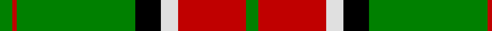
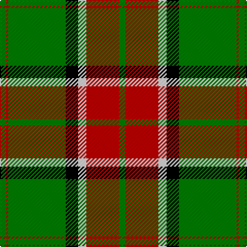

In pattern [GRGKWRG](/patterns/grgkwrg/).

This was sourced from weddslist.  It is a [7 stripes tartan](/stripes/stripes7/).

Original link http://www.weddslist.com/cgi-bin/tartans/pg.pl?source=sts

## Thread count
G/6 R2 G56 K12 LN8 R32 G/6

## Palette
Each colour and its ΔE from the base-6 reference it is a variant of.

| Colour | Shade | Base | ΔE (OKLab) |
|---|---|---|---|
| G | <code style="background-color:#008000;">#008000</code> `#008000` | G <code style="background-color:#006100;">#006100</code> | 0.10 |
| K | <code style="background-color:#000000;">#000000</code> `#000000` | K <code style="background-color:#000000;">#000000</code> | 0.00 |
| LN | <code style="background-color:#E0E0E0;">#E0E0E0</code> `#E0E0E0` | W <code style="background-color:#F7F7F7;">#F7F7F7</code> | 0.07 |
| R | <code style="background-color:#C00000;">#C00000</code> `#C00000` | R <code style="background-color:#CC0000;">#CC0000</code> | 0.03 |

# Sample pattern

## Nearest tartans

The nearest existing variants by ΔTartan distance.

1. [Pollock Clan Tartan Tartan Number: 867. Earliest known date: 1980 Based on the Maxwell sett which in turn comes from the Vestiarium Scoticum (1842). Details of the Clan Society's design came from Rhys A Pollock in America. Pollocks were feudal dependents of the Maxwells who lived in the Scottish Lowlands. See products available Copyright © Blair Urquhart, Comrie, 2015](/setts/s7/g3r16w4k6g28r1g3x2~g006818-k101010-rc80000-we0e0e0/) — ΔT 0.74
1. [Jacobite #2](/setts/s6/y70k30w3g30k3y10~g005020-k101010-we0e0e0-ye8c000/) — ΔT 1.11
1. [Gleneil](/setts/s8/k2r2k2r24g31k1g2y2x2~g008000-k000000-rc00000-yf0c000/) — ΔT 1.20
1. [Maxwell, hunting](/setts/s7/g3r16g4k6g28r1g3x2~g008000-k000000-rc00000/) — ΔT 1.29
1. [Brandon, Manitoba](/setts/s6/g83k35w3ga35k3y10~g908000-ga008000-k000000-we0e0e0-yf0c000/) — ΔT 1.30
1. [Jacobite](/setts/s6/y70k30w3g30k3y10~g008000-k000000-we0e0e0-yf0c000/) — ΔT 1.32
1. [Pollock](/setts/s7/g3y16w4k6g28y1g3x4~g408060-k101010-wf8f8f8-yec8048/) — ΔT 1.37
1. [Limerick County Crest (Fashion)](/setts/s6/w12k3g50w3k13y6x2~g006818-k101010-we0e0e0-ybc8c00/) — ΔT 1.37
1. [Keirnan Irish Family Tartan Tartan Number: 1800. Earliest known date: 1880 This pattern was recorded by Bill Johnston, Shippak, USA in 1978 along with other patterns extracted from the 'Clan Originaux' at Pendleton Mill. This and other Irish patterns appear to have originated in the former Waterford Mill in Ireland before they arrived at Pendleton in the late 19C See products available Copyright © Blair Urquhart, Comrie, 2015](/setts/s10/w2g4k6r2k2r2k3r2g20w1x2~g006818-k101010-rc80000-we0e0e0/) — ΔT 1.39
1. [Kiernan](/setts/s10/w2g4k6r2k2r2k3r2g20w1x2~g287438-k101010-rc80000-we0e0e0/) — ΔT 1.39

## Neighbour map

Every grey dot is one of 15726 variants placed by the first two principal components of the ΔTartan feature space (44% of its variance). Red is this tartan; blue dots are its nearest — click one to open its page.

<svg viewBox="0 0 640 380" role="img" style="max-width:100%;height:auto;border:1px solid #e0e0e0;border-radius:4px;display:block" xmlns="http://www.w3.org/2000/svg"><image href="/nn/cloud.v1.png" width="640" height="380"/><a href="/setts/s7/g3r16w4k6g28r1g3x2~g006818-k101010-rc80000-we0e0e0/"><circle cx="339.9" cy="151.4" r="4" fill="#3465a4"><title>Pollock Clan Tartan Tartan Number: 867. Earliest known date: 1980 Based on the Maxwell sett which in turn comes from the Vestiarium Scoticum (1842). Details of the Clan Society's design came from Rhys A Pollock in America. Pollocks were feudal dependents of the Maxwells who lived in the Scottish Lowlands. See products available Copyright © Blair Urquhart, Comrie, 2015</title></circle></a><a href="/setts/s6/y70k30w3g30k3y10~g005020-k101010-we0e0e0-ye8c000/"><circle cx="286.5" cy="151.5" r="4" fill="#3465a4"><title>Jacobite #2</title></circle></a><a href="/setts/s8/k2r2k2r24g31k1g2y2x2~g008000-k000000-rc00000-yf0c000/"><circle cx="340.1" cy="118.2" r="4" fill="#3465a4"><title>Gleneil</title></circle></a><a href="/setts/s7/g3r16g4k6g28r1g3x2~g008000-k000000-rc00000/"><circle cx="396.3" cy="170.6" r="4" fill="#3465a4"><title>Maxwell, hunting</title></circle></a><a href="/setts/s6/g83k35w3ga35k3y10~g908000-ga008000-k000000-we0e0e0-yf0c000/"><circle cx="247.5" cy="135.9" r="4" fill="#3465a4"><title>Brandon, Manitoba</title></circle></a><a href="/setts/s6/y70k30w3g30k3y10~g008000-k000000-we0e0e0-yf0c000/"><circle cx="278.2" cy="149.0" r="4" fill="#3465a4"><title>Jacobite</title></circle></a><a href="/setts/s7/g3y16w4k6g28y1g3x4~g408060-k101010-wf8f8f8-yec8048/"><circle cx="335.9" cy="146.7" r="4" fill="#3465a4"><title>Pollock</title></circle></a><a href="/setts/s6/w12k3g50w3k13y6x2~g006818-k101010-we0e0e0-ybc8c00/"><circle cx="306.9" cy="168.8" r="4" fill="#3465a4"><title>Limerick County Crest (Fashion)</title></circle></a><a href="/setts/s10/w2g4k6r2k2r2k3r2g20w1x2~g006818-k101010-rc80000-we0e0e0/"><circle cx="311.5" cy="139.7" r="4" fill="#3465a4"><title>Keirnan Irish Family Tartan Tartan Number: 1800. Earliest known date: 1880 This pattern was recorded by Bill Johnston, Shippak, USA in 1978 along with other patterns extracted from the 'Clan Originaux' at Pendleton Mill. This and other Irish patterns appear to have originated in the former Waterford Mill in Ireland before they arrived at Pendleton in the late 19C See products available Copyright © Blair Urquhart, Comrie, 2015</title></circle></a><a href="/setts/s10/w2g4k6r2k2r2k3r2g20w1x2~g287438-k101010-rc80000-we0e0e0/"><circle cx="310.7" cy="137.3" r="4" fill="#3465a4"><title>Kiernan</title></circle></a><circle cx="320.4" cy="145.0" r="5" fill="#c00000"/></svg>

ID: /setts/s7/g3r16w4k6g28r1g3x2~g008000-k000000-rc00000-we0e0e0/
